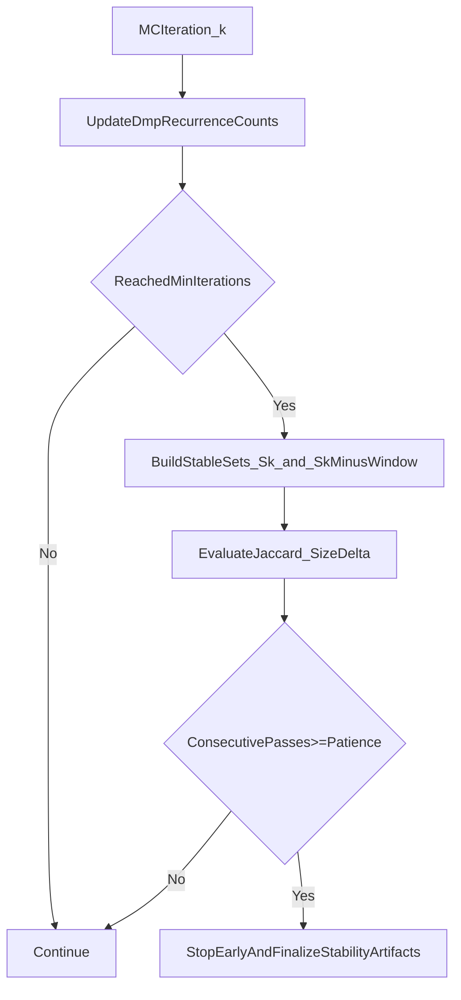

# Adaptive MC Stopping for DMP Stability

## Objective
Add an opt-in stopping criterion to halt Monte Carlo stability runs before `n_iterations` when the selected stable DMP panel has converged.

## Current Baseline
- MC loop is fixed-count in [`/home/ubuntu/MethylPipeline/packages/methylvalidation/methyl_validation/cli.py`](/home/ubuntu/MethylPipeline/packages/methylvalidation/methyl_validation/cli.py).
- Stability panel is computed from recurrence frequencies in [`/home/ubuntu/MethylPipeline/packages/methylvalidation/methyl_validation/stability.py`](/home/ubuntu/MethylPipeline/packages/methylvalidation/methyl_validation/stability.py).
- Config schema lives in [`/home/ubuntu/MethylPipeline/packages/methylvalidation/methyl_validation/config.py`](/home/ubuntu/MethylPipeline/packages/methylvalidation/methyl_validation/config.py).

## Proposed Stopping Method
Use a rolling convergence check on the stable panel:
1. After each accepted iteration (post BA filter), compute current stable set `S_k` where frequency `>= stability_dmp_freq`.
2. Compare with prior checkpoint set `S_(k-w)` using Jaccard similarity.
3. Require all conditions:
   - `k >= min_iterations`
   - `jaccard(S_k, S_(k-w)) >= jaccard_threshold`
   - Relative panel-size change `<= max_size_delta`
   - Conditions hold for `patience` consecutive checkpoints
4. If satisfied, stop MC loop early and run final stability outputs as usual.

This is easy to explain to scientists and aligns with your current frequency-threshold semantics.

## Implementation Steps
- Extend config in [`/home/ubuntu/MethylPipeline/packages/methylvalidation/methyl_validation/config.py`](/home/ubuntu/MethylPipeline/packages/methylvalidation/methyl_validation/config.py):
  - `stability_early_stop_enabled` (bool)
  - `stability_min_iterations` (int)
  - `stability_convergence_window` (int)
  - `stability_convergence_jaccard` (float)
  - `stability_convergence_max_size_delta` (float)
  - `stability_convergence_patience` (int)
- Add convergence helper(s) in [`/home/ubuntu/MethylPipeline/packages/methylvalidation/methyl_validation/stability.py`](/home/ubuntu/MethylPipeline/packages/methylvalidation/methyl_validation/stability.py):
  - Build stable set from cumulative counts at iteration `k`
  - Compute Jaccard, size delta, and pass/fail diagnostics
- Integrate check into the MC loop in [`/home/ubuntu/MethylPipeline/packages/methylvalidation/methyl_validation/cli.py`](/home/ubuntu/MethylPipeline/packages/methylvalidation/methyl_validation/cli.py):
  - Evaluate only after successful iteration outputs exist
  - Maintain consecutive-pass counter
  - Break loop on convergence with clear logging
- Persist diagnostics in stability artifacts (e.g., convergence history entries in `stability_summary.json`) so stopping is auditable.
- Update docs in [`/home/ubuntu/MethylPipeline/packages/methylvalidation/docs/IMPLEMENTATION.md`](/home/ubuntu/MethylPipeline/packages/methylvalidation/docs/IMPLEMENTATION.md) and [`/home/ubuntu/MethylPipeline/packages/methylvalidation/docs/USAGE.md`](/home/ubuntu/MethylPipeline/packages/methylvalidation/docs/USAGE.md):
  - Explain defaults and tuning guidance
  - Clarify interaction with `stability_min_balanced_accuracy`

## Suggested Defaults
- `stability_early_stop_enabled: false` (safe rollout)
- `stability_min_iterations: 20`
- `stability_convergence_window: 5`
- `stability_convergence_jaccard: 0.98`
- `stability_convergence_max_size_delta: 0.02`
- `stability_convergence_patience: 3`

## Validation Plan
- Unit-test convergence math (Jaccard, size delta, patience behavior).
- Integration test with synthetic run counts where convergence is known.
- Regression test: when early stop disabled, behavior matches current fixed-iteration outputs.

## Flow Diagram

## Risks and Mitigations
- Small cohorts can cause noisy panels early: enforce `min_iterations` and `patience`.
- Too-strict thresholds may never trigger: keep max-iteration fallback (`n_iterations`).
- BA filtering can reduce effective run count: report both attempted and qualifying runs in diagnostics.