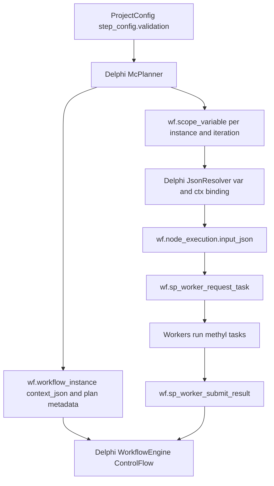

# Delphi-Primary Monte Carlo Workflow Plan

## Confirmed scope
- Planning ownership: **Delphi middle-tier primary**.
- Phase 1 coverage: **binary + multiclass + hierarchical multiclass**.
- Runtime model: Azure SQL (`wf` schema) remains source of workflow state and worker lease/claim APIs; Delphi computes Monte Carlo run plans and task payloads.

## Current flow baseline (what we will mirror)
- MethylValidation currently performs config load -> cohort inference -> stratified splits -> per-run `project.json`/task descriptors in Python:
  - [`packages/methylvalidation/methyl_validation/mc_config_load.py`](packages/methylvalidation/methyl_validation/mc_config_load.py)
  - [`packages/methylvalidation/methyl_validation/cohort_inference.py`](packages/methylvalidation/methyl_validation/cohort_inference.py)
  - [`packages/methylvalidation/methyl_validation/split.py`](packages/methylvalidation/methyl_validation/split.py)
  - [`packages/methylvalidation/methyl_validation/project_gen.py`](packages/methylvalidation/methyl_validation/project_gen.py)
  - [`packages/methylvalidation/methyl_validation/planner.py`](packages/methylvalidation/methyl_validation/planner.py)
  - [`packages/methylvalidation/methyl_validation/task_schema.py`](packages/methylvalidation/methyl_validation/task_schema.py)
- Delphi workflow runtime already resolves action input before claim:
  - [`workflow_engine/delphi/src/WfEngine.ControlFlow.pas`](workflow_engine/delphi/src/WfEngine.ControlFlow.pas) (`ActivateAction` -> `ResolveInputForAction` -> persist `input_json`).
- SQL runtime already provides worker orchestration and control flow primitives:
  - [`workflow_engine/sql_mssql/MethylPipelineDB_Script.sql`](workflow_engine/sql_mssql/MethylPipelineDB_Script.sql) (`wf.sp_start_workflow_instance`, `wf.sp_worker_request_task`, `wf.sp_worker_submit_result`).

## Target architecture

## SQL changes (Azure wf schema)
- Extend SQL worker/runtime support to align with Delphi scope model and future SQL observability:
  - Update placeholder/token path to support scope-backed variable semantics where needed (`${var.*}` parity target).
  - Ensure IF/SWITCH can branch from variable-driven state (`condition_var`/`switch_var`) consistently with Delphi behavior.
  - Add minimal metadata persistence for Monte Carlo planning snapshots and iteration records (either columns/JSON blob or dedicated `wf` tables).
- Primary SQL touchpoints:
  - [`workflow_engine/sql_mssql/MethylPipelineDB_Script.sql`](workflow_engine/sql_mssql/MethylPipelineDB_Script.sql)
  - [`workflow_engine/sql_mssql/wf_scope_variables.sql`](workflow_engine/sql_mssql/wf_scope_variables.sql)
  - New migration script for MC metadata tables/procs under [`workflow_engine/sql`](workflow_engine/sql)

## Delphi middle-tier changes
- Add a dedicated Monte Carlo planner service to port Python planning behavior for all layouts:
  - New units:
    - [`workflow_engine/delphi/src/WfEngine.McTypes.pas`](workflow_engine/delphi/src/WfEngine.McTypes.pas)
    - [`workflow_engine/delphi/src/WfEngine.McPlanner.pas`](workflow_engine/delphi/src/WfEngine.McPlanner.pas)
- Extend engine and repository contracts:
  - [`workflow_engine/delphi/src/WfEngine.Interfaces.pas`](workflow_engine/delphi/src/WfEngine.Interfaces.pas): add planner interface and repository methods for MC plan persistence/query.
  - [`workflow_engine/delphi/src/WfEngine.Repository.pas`](workflow_engine/delphi/src/WfEngine.Repository.pas): implement plan metadata and iteration scope writes/reads.
  - [`workflow_engine/delphi/src/WfEngine.Scheduler.pas`](workflow_engine/delphi/src/WfEngine.Scheduler.pas): add `PrepareMonteCarloInstance` / `CreateAndStartMonteCarloInstance` orchestration.
- Integrate with runtime variable and input resolution:
  - [`workflow_engine/delphi/src/WfEngine.Scope.pas`](workflow_engine/delphi/src/WfEngine.Scope.pas): seed instance-level and iteration-level MC variables.
  - [`workflow_engine/delphi/src/WfEngine.JsonResolver.pas`](workflow_engine/delphi/src/WfEngine.JsonResolver.pas): ensure task payload assembly can emit full per-run config from MC scope entries.
  - [`workflow_engine/delphi/src/WfEngine.ControlFlow.pas`](workflow_engine/delphi/src/WfEngine.ControlFlow.pas): keep scheduling generic; invoke planner only at controlled engine entry points.
- Keep worker adapter thin:
  - [`workflow_engine/delphi/src/WfEngine.WorkerApiAdapter.pas`](workflow_engine/delphi/src/WfEngine.WorkerApiAdapter.pas) remains claim/submit bridge, not planner.

## Workflow definition and seed strategy
- Add/adjust workflow seed scripts so MC workflow is explicit and reusable in Azure SQL:
  - Plan node (engine-side or worker-side), iteration loop node, discovery task node, aggregate node.
  - Include all layout routing fields in input JSON schema.
- Update and align example scripts/docs:
  - [`workflow_engine/sql_mssql/workflow_tree_seed_example.sql`](workflow_engine/sql_mssql/workflow_tree_seed_example.sql)
  - [`workflow_engine/sql_mssql/workflow_tree_run_example.sql`](workflow_engine/sql_mssql/workflow_tree_run_example.sql)
  - [`workflow_engine/WORKFLOW_ENGINE_DELPHI.md`](workflow_engine/WORKFLOW_ENGINE_DELPHI.md)

## Validation and parity checks
- Add deterministic parity tests against Python behavior (same seed/cohorts -> same split counts and iteration IDs) for:
  - binary
  - multiclass
  - hierarchical multiclass
- Verify worker contract compatibility:
  - `node_execution.input_json` fields map to existing worker expectations.
  - submit/result propagation updates downstream scope values and branch conditions.
- Run end-to-end SQL simulation script with registered worker credentials and inspect execution trace.

## Delivery sequence
1. Introduce MC domain types + Delphi planner skeleton.
2. Add repository persistence APIs and SQL migration objects.
3. Implement split/cohort/layout parity logic in Delphi planner.
4. Wire planner into engine instance startup and scope seeding.
5. Expand input resolution for full task config materialization.
6. Add/update workflow seed/run SQL scripts and docs.
7. Validate with deterministic parity and end-to-end run traces.