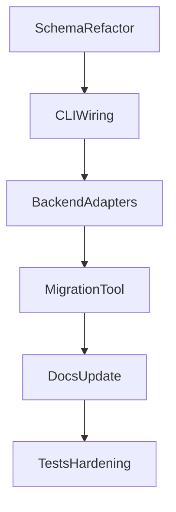

# Strict Backend-Profile Refactor Plan

## Objective
Move `step_config.validation` backend settings to a single canonical `backend_profiles` format for `ecdf`, `tabular_sklearn`, and `generative_hybrid`, with **no backward-compatible runtime parsing** of legacy flat keys.

## Final Behavior (Target)
- `step_config.validation.backend_profiles` is the only accepted backend config source.
- Legacy flat backend keys (e.g., `model_backend`, `tabular_model_type`, `tabular_methods`, `generative_*`, etc.) are rejected with explicit validation errors.
- `--model-mc-all` runs **only** backends with `enabled: true` in `backend_profiles`.
- Add a migration utility to rewrite old project configs into new format before use.

## Schema Design
Add explicit profile models in [`/home/ubuntu/MethylPipeline/packages/methylvalidation/methyl_validation/config.py`](/home/ubuntu/MethylPipeline/packages/methylvalidation/methyl_validation/config.py):
- `BackendProfilesConfig`
  - `ecdf: EcdfBackendProfile`
  - `tabular_sklearn: TabularBackendProfile`
  - `generative_hybrid: GenerativeBackendProfile`
- Each profile includes:
  - `enabled: bool`
  - `params: ...` backend-specific typed config
- Keep global validation controls (`n_iterations`, split controls, rollout thresholds, etc.) at `validation` root.

### Non-goals
- No dual parsing of old/new backend keys at runtime.
- No hidden fallback to `model_backend` or synthesized `tabular_methods`.

## Code Changes

### 1) Configuration models and validation
Update [`/home/ubuntu/MethylPipeline/packages/methylvalidation/methyl_validation/config.py`](/home/ubuntu/MethylPipeline/packages/methylvalidation/methyl_validation/config.py):
- Remove legacy backend fields from `MonteCarloConfig` (or mark them forbidden via model validator path).
- Add new typed `backend_profiles` field.
- Add strict validator that fails if any deprecated backend keys are present in `step_config.validation`.
- Add helper methods:
  - `get_enabled_backends()`
  - `get_backend_params(backend_name)`

Essential behavior to encode:
```python
# conceptual
if args.model_mc_all:
    backends = config.get_enabled_backends()
else:
    backends = [args.model_backend or first_enabled_backend]
```

### 2) CLI/backend selection plumbing
Update [`/home/ubuntu/MethylPipeline/packages/methylvalidation/methyl_validation/cli.py`](/home/ubuntu/MethylPipeline/packages/methylvalidation/methyl_validation/cli.py):
- Replace `model_backend` defaulting logic with profile-driven selection.
- `--model-mc-all`:
  - load enabled backend list from config
  - hard-fail if none enabled
- For single-backend modes (`--model`, `--post-model-validation`, `--model-mc` without `--model-mc-all`):
  - explicit CLI backend override must exist in profile and be enabled (or document exact override semantics and enforce consistently)
- Remove paths that rely on legacy backend fields.

### 3) Loader / override layer
Update [`/home/ubuntu/MethylPipeline/packages/methylvalidation/methyl_validation/mc_config_load.py`](/home/ubuntu/MethylPipeline/packages/methylvalidation/methyl_validation/mc_config_load.py):
- Route CLI overrides into `backend_profiles.<name>.params`.
- Remove legacy mutation that synthesizes `tabular_methods` from `tabular_model_type`.
- Keep CLI UX but map strictly to new schema.

### 4) Backend execution adapters
Update backend consumers to use profile params instead of flat fields:
- [`/home/ubuntu/MethylPipeline/packages/methylvalidation/methyl_validation/trainer_api.py`](/home/ubuntu/MethylPipeline/packages/methylvalidation/methyl_validation/trainer_api.py)
- [`/home/ubuntu/MethylPipeline/packages/methylvalidation/methyl_validation/tabular_backend.py`](/home/ubuntu/MethylPipeline/packages/methylvalidation/methyl_validation/tabular_backend.py)
- Any generative/ecdf runners currently reading flat `config.*` backend attributes.

## Migration Utility (Required)
Create a dedicated script/CLI to rewrite old configs:
- Suggested location: [`/home/ubuntu/MethylPipeline/packages/methylvalidation/methyl_validation/utils/`](/home/ubuntu/MethylPipeline/packages/methylvalidation/methyl_validation/utils/)
- Suggested command: `methyl-validation-migrate-backend-config`
- Features:
  - input project JSON path
  - transform legacy backend keys into `backend_profiles`
  - optional `--in-place` and `--output`
  - dry-run summary of key moves/removals
  - validation pass after migration

## Documentation Updates
Update docs to describe strict new format and migration workflow:
- [`/home/ubuntu/MethylPipeline/packages/methylvalidation/docs/USAGE.md`](/home/ubuntu/MethylPipeline/packages/methylvalidation/docs/USAGE.md)
- [`/home/ubuntu/MethylPipeline/packages/methylvalidation/docs/IMPLEMENTATION.md`](/home/ubuntu/MethylPipeline/packages/methylvalidation/docs/IMPLEMENTATION.md)
- [`/home/ubuntu/MethylPipeline/packages/methylvalidation/docs/THEORY.md`](/home/ubuntu/MethylPipeline/packages/methylvalidation/docs/THEORY.md)
- [`/home/ubuntu/MethylPipeline/docs/theory/chapters/14-user-guide.qmd`](/home/ubuntu/MethylPipeline/docs/theory/chapters/14-user-guide.qmd)
- [`/home/ubuntu/MethylPipeline/docs/user-manual/06-stage-model.qmd`](/home/ubuntu/MethylPipeline/docs/user-manual/06-stage-model.qmd)

Include:
- canonical `backend_profiles` examples
- explicit note that legacy keys are rejected
- migration command examples
- `--model-mc-all` enabled-only semantics

## Tests
Add/adjust tests in [`/home/ubuntu/MethylPipeline/packages/methylvalidation/tests/`](/home/ubuntu/MethylPipeline/packages/methylvalidation/tests/):
- Config validation:
  - accepts new schema
  - rejects legacy keys with clear messages
- CLI behavior:
  - `--model-mc-all` runs only enabled profiles
  - errors when no backend enabled
- Migration tool:
  - converts legacy -> new schema correctly
  - preserves non-backend settings
  - idempotent on already-migrated files

## Rollout Sequence


## Acceptance Criteria
- New configs with `backend_profiles` run all model-related modes successfully.
- Any config using deprecated backend keys fails fast with actionable message.
- Migration utility converts existing project configs into valid new schema.
- `--model-mc-all` behavior matches: enabled profiles only.
- Updated docs and tests reflect and enforce the new contract.