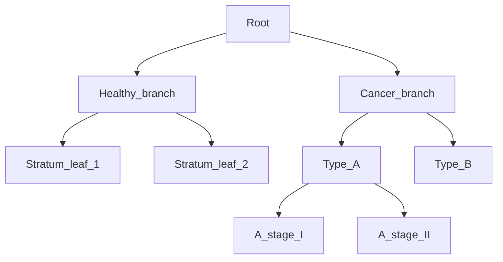
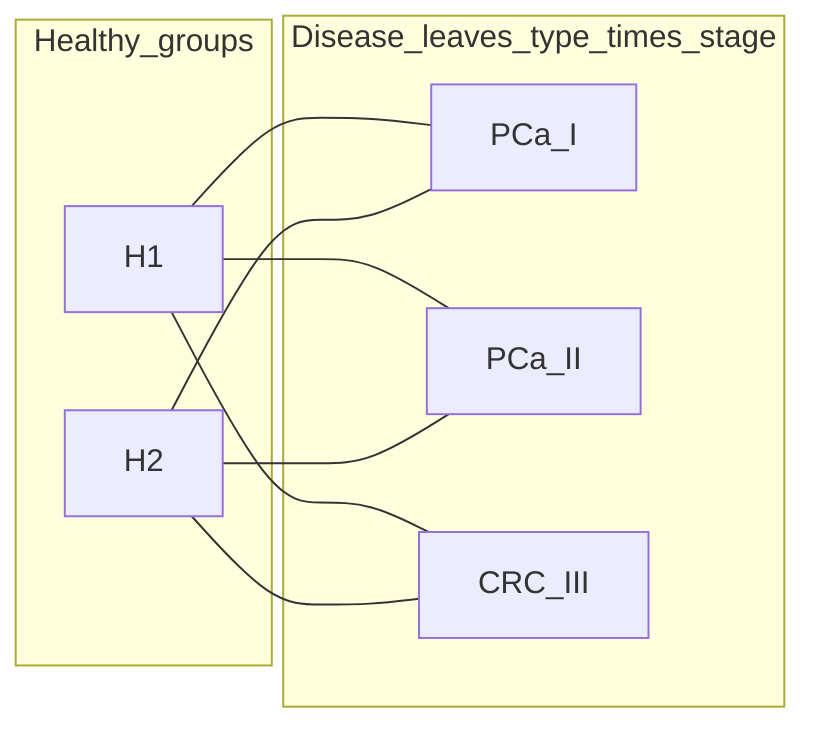
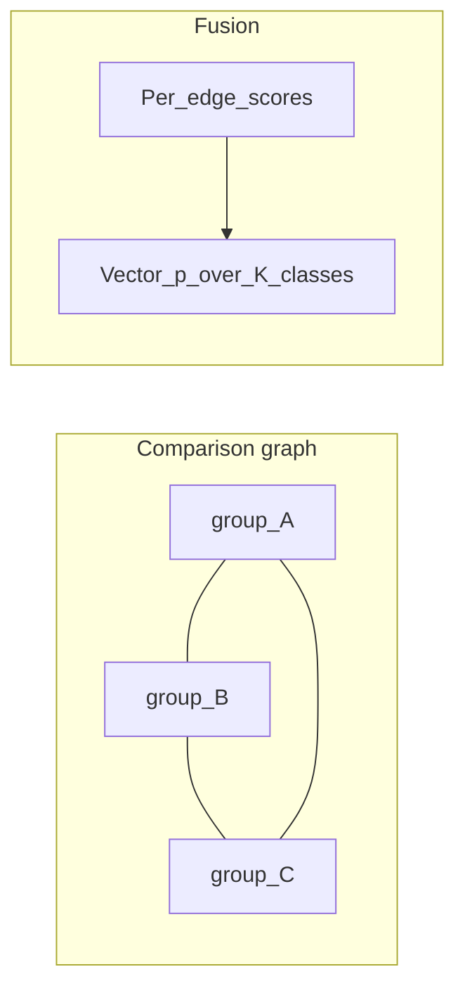

# Hierarchical cohorts, pairwise detectors, validation, and blind prediction

## Strategic priority (project goal)

The **primary deliverable** is a **good MethylPredictor** (blind and labeled reports clinicians trust). Work should bias toward **H4 — classifier / fusion / export** once the **minimal cohort shape** exists: that is what produces a correct **`model_path`** and **class ordering** the predictor consumes.

**Source-of-truth chain (no shortcuts):** every multiclass score must be **traceable** to **MethylCentroid** (per-group reference methylation) and **MethylDetector** (per-comparison binary multi-chromosome experts). **MethylClassifier** only **fuses** those pairwise artifacts into one export; **MethylPredictor** reads the fused PKL (+ optional hierarchy sidecar). Do not introduce parallel classification paths that bypass centroid/detector training.

**Minimal reasonable hierarchy:** intentionally **a small number of control groups** (strata you care to distinguish) and **diseases structured as type → stage** so leaves are scientifically meaningful without over-growing the bipartite comparison grid.

**Robustness via MethylValidation:** a model is not “validated” for production if some cohorts never appear in train/val across resamples. **MethylValidation must be extended** so that **every population defined in the project** (every control stratum and every disease-stage leaf with samples) is **represented in Monte Carlo**: stratified holdouts per label, iteration-level accounting, and **metrics split by population** as well as pooled. That is how you stress-test the fused classifier the predictor ships—not a nice-to-have afterthought.

---

## Target scenario (your stated “most realistic” case)

- **Controls** are not a single blob: they are **stratified** (e.g. sex × ethnicity × BMI band × age band → **leaf strata**).
- **Diseases** are **typed and staged** (e.g. cancer type × stage → **leaf** diagnoses).
- **Scientific question:** for a **blind** sample, report **P(healthy)** vs **P(cancer)**, then among positives the **best subtype/stage** and **full competing probabilities** for other leaves (and optionally marginals at coarser nodes: e.g. P(this cancer family) regardless of stage).

That implies two artifacts:

1. **Model / fusion** that respects the **tree** (or DAG), not only a flat softmax over a single list of labels.
2. **Validation** that **resamples per leaf** and **covers every available population** in the config (no silent omission), so rare strata are not collapsed, variance across MC is interpretable, and metrics are summarized **per population**, **per path** (e.g. healthy vs disease branch), and **pooled**.

---

## Minimal hierarchy v1 (simplest concrete step)

**Problem with today’s config:** `controls.groups` and `diseases.groups` are **single-level lists**. That is enough for one healthy bucket and flat disease labels, but not for **disease type** and **stage** as distinct levels.

**Target v1 (as you specified):**

| Side | Structure |
|------|-----------|
| **Controls (healthy)** | **Few groups** at one level—each group is a **stratum** you want detectors to respect (not an exhaustive cross-product grid). A single “healthy” pool remains valid if you collapse strata. No second level required for v1 unless nested healthy strata become necessary. |
| **Diseases** | **Two levels:** (1) **disease type** / family, (2) **stage** (or other within-type axis). **Leaves** for centroids, detectors, and MC are **(type, stage)** combinations. |
| **Comparisons** | Keep **simple:** assume a detector for **each healthy group × each disease-stage leaf** (full bipartite). Each row is still one **binary** pairwise (that stratum’s centroid vs that stage’s centroid). |

**Multiclass / blind interpretation:** the **named classes** for a single exported OvR (or flat) model are typically **all healthy strata + all disease leaves** (or healthy aggregate + disease leaves—product choice). The bipartite pairwises **feed** the OvR assembly you already use (per-disease-leaf folder + aggregate control head per healthy pool, or a future multi-stratum extension).

**Not locked in as “the end”:** v1 does **not** forbid later additions, for example:

- Third level (subtype under stage), or multiple cancer families with different stage sets.
- **Sparse** comparisons (subset of bipartite) if some strata × stage cells are empty or scientifically redundant.
- **OvO** among disease stages within a type (extra edges) if calibration demands it.

Config and resolvers should treat **v1 as the default expansion path** but keep **optional explicit `comparisons`** for when the full bipartite is too large.

---

## Pairwise-only multi-chromosome detectors in a hierarchy

Each **comparison** in config still produces a **binary** multi-chromosome ECDF package for **two centroids** (two nodes or two **aggregates** of nodes). The **hierarchy constrains which pairwises are scientifically meaningful**:

- **V1 default:** **bipartite** edges—**each healthy group × each disease-stage leaf** (full cross unless `comparisons` is explicit).
- **Typical edges (general):** parent-vs-child (e.g. “any cancer” vs “type A”), or **reference pooled healthy** vs each disease leaf, or **OvO** among siblings at the same depth.
- **Fusion options:**
  - **Hierarchical factorization:** at each node, a binary (or small softmax) model; **leaf probability** = product of conditional branch probabilities along the path (with normalization so the root distribution sums to 1 over mutually exclusive leaves). This matches “first healthy vs cancer, then best subtype.”
  - **Flat OvR / OvO + coupling** over **all leaves** (today’s flat PKL pattern): still usable if you **enumerate leaves** as `class_names`, but the **report** should **group** probabilities by tree for clinicians.

There is still **no single “best”** without choosing a generative story (hierarchical vs flat coupling); the hierarchy is the **prior structure** for both **which pairwises to train** and **how to combine scores**.

---

## MethylValidation: Monte Carlo at each leaf (current vs needed)

**Today** ([`packages/methylvalidation/methyl_validation/project_gen.py`](packages/methylvalidation/methyl_validation/project_gen.py)):

- Multiclass MC expects a **flat** base project: top-level `groups` with **K cohorts**, one CSV per cohort label; each iteration does stratified train/val **per cohort** and writes `val_test_groups.json` for the predictor.
- There is **no** first-class **tree**; “strata” only appear if you **flatten** them into distinct `groups[].label` values (each leaf = one group).

**Needed for hierarchical MC:**

1. **Cohort config** that lists **leaves** (and optionally internal nodes used only for aggregation), with CSVs **per leaf** (same as today but K = number of leaves, or K = leaves + explicit pooled nodes if you validate those separately).
2. **Every population sampled:** each MC iteration must draw train/val in a way that **every non-empty leaf** still contributes (stratified splits; fail fast or warn loudly if a label has too few samples to stratify). Do not drop entire populations from the validation design.
3. **Stratified split per leaf** (already the pattern: `train_by_label` / `val_by_label` keyed by label)—**minimum samples per leaf** rules; optional **merge small leaves** only when explicitly chosen (documented), not silent collapse.
4. **Reporting:** metrics **per population/leaf**, **by branch** (e.g. collapsed healthy vs any cancer), and **pooled**; include **dispersion across MC iterations** (e.g. distribution of accuracy/AUC per stratum) so robustness is visible, not a single lucky split.
5. **Optional:** nested MC (first split healthy/cancer holding out whole patients) if leakage across strata is a concern—product decision.

**Blind-only predictor** remains **out of scope** for MC runs (existing policy in [`predictor_policy.py`](packages/methylvalidation/methyl_validation/predictor_policy.py)); hierarchical **blind** scoring stays in **methyl-predictor** with `predictor.blind` and a saved hierarchical or flat PKL.

---

## MethylPredictor: “consider that structure”

**Today:** multiclass runs produce `prob_class0..K-1` aligned with flat `class_names`; blind JSON has a flat `probabilities` map.

**Needed for hierarchy-aware reporting (without breaking flat mode):**

1. **Metadata** in the saved classifier or sidecar JSON: `hierarchy` = list of nodes with `{id, parent, depth, label}` and mapping **leaf_id → index** in the flat probability vector (if the underlying model is still flat OvR).
2. **Derived outputs** for blind (and optional labeled):
   - **Marginal** P(node) for internal nodes = sum of P(leaf) over descendants.
   - **Conditional** P(child | parent) = P(child)/P(parent) when P(parent)>0.
   - **Best path** = argmax leaf + reported **top-k** leaves and **entropy** at cancer subtree.
3. If the model is **explicitly hierarchical** (cascade of binary PKLs), `model_path` might become a **small bundle** (ordered list of PKLs + tree spec)—larger design change; **phase 1** can stay **one flat PKL + tree spec for reporting only**.

---

## What exists in code vs what you would add (updated)

| Capability | Today |
|------------|--------|
| Flat multiclass MC per cohort | Yes (`generate_run_project_multiclass`, flat `groups`) |
| MC guarantees every defined population appears across iterations | Partial / needs extension for sparse leaves + explicit reporting |
| Hierarchical cohort schema in project JSON | No |
| MC summaries by tree path / internal node | No |
| Predictor hierarchical marginals / path report | No (flat probs only) |
| Flat OvR PKL + blind probs over K leaves | Yes (if leaves are flattened into `class_names`) |

---

## Implementation phases (suggested — predictor-first)

1. **H1 – Schema & docs (v1):** Nested **diseases** (type → stages); **few control** groups. **Auto-generate** bipartite `comparisons` (healthy × disease leaves) or explicit overrides. Document flattening: **disease leaves = flat labels** for centroid/detector/classifier until a full `cohort_tree` exists.
2. **H4 – Classifier / resolver / export (do early):** Extend **OvR path** (or chosen fusion) so **multi-control × multi–disease-stage** bipartite outputs **one multiclass PKL** with **stable `class_names`** aligned to flattened leaves. This unblocks blind prediction; it is the **main engineering risk** after schema. Optional later: hierarchical PKL **bundle** if flat OvR is insufficient—still built **only** from centroid/detector outputs.
3. **H3 – MethylPredictor:** Optional `hierarchy` metadata + **marginals / best path** in `prediction_report.json` on top of the H4 artifact (flat vector + tree map).
4. **H2 – MethylValidation (robustness):** Extend MC so **every defined population** is included in stratified resampling across iterations, with **per-population and pooled metrics** (and MC dispersion). **Sequencing:** implement after H4 stabilizes the multiclass artifact you validate, but treat this as **required for trustworthy claims** about model robustness—not an optional appendix.

---

## Prior sections (flat graph viewpoint)

The following still applies when **leaves are enumerated as a flat K**; hierarchical reporting sits on top.

## What you actually have

Each **comparison** `(group_i, group_j)` yields a **MethylDetector** output folder: a **binary** multi-chromosome ECDF package trained on **two centroids** (two classes). The score for a new sample is a **2-way** split (e.g. column 0 vs 1), not a direct statement about unrelated groups.

So the **comparisons** section defines a **graph**:

- **Nodes** = subgroup labels you care about (controls + diseases).
- **Edges** = pairwises you actually ran detection for.
- **Edge weight / score** = output of that pairwise classifier (logit or calibrated prob difference).

Blind prediction needs a map from **scores on edges** to a **probability vector on all nodes** (simplex of size K).

There is **no unique “best possible”** classifier from pairwises alone without extra assumptions: different couplings optimize different objectives (e.g. max-entropy subject to moment constraints, least squares on logits, Bradley–Terry, etc.). What you can do is **choose a principled coupling** and optionally **validate** on held-out data.

---

## Strategy families (pairwise-only, multi-chrom)

### 1. One-vs-rest style (what you ship today for control + many diseases)

- **Idea:** K classes, K heads; head k contrasts class k against “everything else.”
- **Pairwise reality:** You rarely have a detector trained on “k vs union of all others.” You **proxy** with available control-vs-disease pairwises and an **aggregate control head** (e.g. geometric mean of P(control) across pairwises), as in `[OvrPairwiseControlAggregateExpert](packages/methylclassifier/methyl_classifier/core/multiclass_ovr.py)` + per-disease pairwise folders.
- **Pros:** One saved PKL, single union DMP table, already integrated with `[MethylClassifier._predict_proba_ovr](packages/methylclassifier/methyl_classifier/core/classifier.py)` and MethylPredictor blind via `model_path`.
- **Cons:** Disease heads are “vs reference control,” not true OvR for subtype; interpretability is approximate.

**When it fits:** One primary reference healthy arm + several disease subtypes (your Healthy vs PCa1–4 pattern).

### 2. One-vs-one (OvO) over a subset or full matrix

- **Idea:** For every unordered pair `{i,j}` you care about, train `i vs j` (you already can via `comparisons`). Collect score `s_{ij}` (e.g. log-odds for j vs i).
- **Coupling to p:** Standard options:
  - **Voting / average ranks** (simple, not probabilistic).
  - **Pairwise coupling / least squares** on logits (e.g. Wu–Lin–Wainwright-style fitting of class potentials so implied pair marginals match observed scores).
  - **Bradley–Terry** if you treat each edge as win probability (needs calibration / symmetry choices).

**Pros:** Uses exactly the comparisons you listed; natural if `comparisons` is dense (near full matrix).

**Cons:** **Union DMP set** grows with number of edges; implementation is **not** in the repo today as a first-class export. Blind would need either many sequential loads or a **new bundled format** (multiple pairwise experts + fusion code in `MethylClassifier` or a thin wrapper).

### 3. Structured / hierarchical graphs

- **Idea:** If biology implies a tree (e.g. healthy → cancer → subtype), use **hierarchical classifiers** or only pairwises along tree edges, then multiply conditional probabilities (with care for double counting).

**Pros:** Fewer edges than full matrix; often more stable.

**Cons:** Requires an explicit hierarchy; comparisons JSON would need to align with it.

### 4. “Best” in practice = pick objective + calibrate

Whatever fusion you pick:

1. **Define K** and **label order** used everywhere (centroids, comparisons, predictor `class_names`).
2. **Ensure graph connectivity** (every class should be reachable via edges you train, or you cannot identify that class relative to others).
3. **Hold-out validation:** optimize fusion hyperparameters (temperature, coupling weights) on labeled samples; for blind, report **uncertainty** (entropy) not just argmax.
4. **Optional:** train a **small calibrator** on top of fused logits (vector in → K probs out) using validation data—still “built from pairwises” at the base.

---

## Relation to “full squared matrix” comparisons

A **complete** comparison set between **K** groups implies **K(K−1)/2** undirected pairwises (or twice that if directed). That is:

- **Computationally heavy** (many detector runs, huge union DMP if you merge for one tensor).
- **Statistically redundant**; fusion should **shrink** or **weight** edges (e.g. trust high-effect comparisons more).

The pipeline’s `[comparisons](configs/project_Healthy_vs_PCa1-4.json)` today drives **per-comparison** classifier jobs and, for OvR export, a **specific** mapping (currently: one control family + disease list + optional aggregate control). A **general graph** would need **new resolver rules**: which edges feed which fusion module, and how `class_names` are ordered.

---

## What exists in code vs what you would add

| Capability                                 | Today                                                                                                                                                                                                                                                                    |
| ------------------------------------------ | ------------------------------------------------------------------------------------------------------------------------------------------------------------------------------------------------------------------------------------------------------------------------ |
| Multi-chrom per comparison                 | Yes (`model_dir` / per-folder `classifier-*.pkl`)                                                                                                                                                                                                                        |
| Single PKL blind multiclass (5-way probs)  | Yes: `ecdf_one_vs_rest` OvR + aggregate control (`[project_resolver.expand_ovr_paths_from_comparisons](packages/methylclassifier/methyl_classifier/project_resolver.py)`, `[_get_multiclass_model_path](packages/methylpredictor/methyl_predictor/project_resolver.py)`) |
| Arbitrary graph of pairwises → K-way PKL   | No first-class design; would need new bundle schema + fusion                                                                                                                                                                                                             |
| Multiple control subgroups in OvR expander | Limited (resolver assumes one control group for that shortcut)                                                                                                                                                                                                           |

---

## Recommended direction (conceptual)

For this repo’s goal, treat **MethylPredictor + correct `model_path`** as the target and **H4 fusion** as the early hard dependency after v1 schema.

1. **Decide the target:** K classes and whether you need a **single simplex** over all subgroups or a **hierarchical** report.
2. **Choose graph:** minimal **connected** edge set (often bipartite healthy×disease or OvO among diseases + one healthy anchor).
3. **Pick fusion:**
  - **OvR-style** (current code path) when one reference control + many diseases is the right science.  
  - **OvO + coupling** when many controls/diseases are symmetric and comparisons are rich.
4. **Export one artifact for blind** (like today’s multiclass PKL) so MethylPredictor keeps using `**model_path`** only.
5. **Validate with full population coverage:** MethylValidation MC must exercise **every** cohort leaf you define; report per-population and pooled behavior so robustness is evidence-based.

---

## If you want this implemented next

**Preferred order for the project goal (MethylPredictor):**

- **H1 – Schema:** v1 nested diseases + few controls + bipartite comparison generation (docs + Pydantic where loaded).
- **H4 – Classifier:** extend OvR/resolver/export for **multiple control strata** × **disease-stage leaves**; single **`model_path`** for the predictor. Heavier options (hierarchical PKL bundle, graph coupling) stay **H4 variants** but still sourced from centroids/detectors only.
- **H3 – MethylPredictor:** hierarchy metadata + **marginals / best path** once H4 produces the right PKL.
- **H2 – MethylValidation:** **full-population MC** + stratified metrics for **robustness**; follows H4 so the validated object matches shipped `model_path`. Not required for a **first developer smoke** blind run, but **required** before treating the stack as production-robust.

**H4 variants** (choose by science + graph density):

- **A)** OvR expansion for **multiple control labels** + explicit comparison→class index (matches v1 bipartite).  
- **B)** `pairwise_graph` bundle + coupling for dense or non-bipartite graphs.  
- **C)** Docs-only for fusion tradeoffs in [CONFIG_FILE_GUIDE.md](packages/methylclassifier/CONFIG_FILE_GUIDE.md) and [methylpredictor/docs/IMPLEMENTATION.md](packages/methylpredictor/docs/IMPLEMENTATION.md).

**Phase-1 deliverable:** **H1 + H4** end-to-end (centroids → detectors → fused PKL → blind predictor), then **H3**; **H2** as the **robustness gate**—sample **every** configured population, report stratified + pooled MC outcomes—before strong claims about generalization.