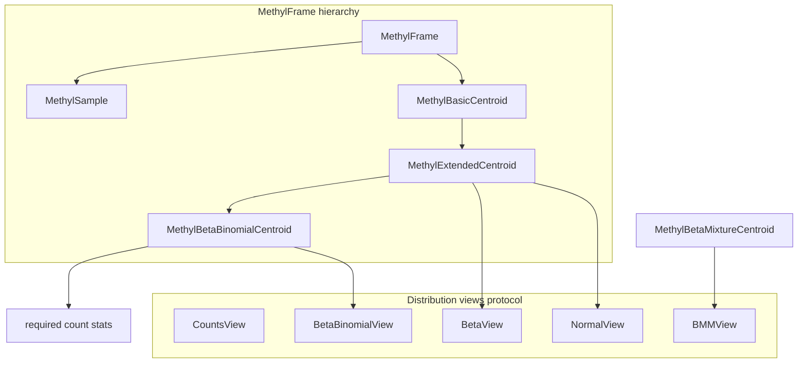

# Centroid distribution classes and probability options

## Current state

- **[methyl_frame.py](packages/methylutils/methyl_utils/core/methyl_frame.py)**: `MethylSample` (pos, mC, uC, tnc); `MethylBasicCentroid` (+ N, mean = mC/coverage); `MethylExtendedCentroid` (+ Sx, Sx2, log_x_sum, log_1_minus_x_sum, alpha/beta via MLE only — no count-based columns); `MethylBetaBinomialCentroid` (subclass that adds required count stats). **Design**: The optional columns (sum_mC, sum_uC, sum_cov, sum_cov2, sum_mC2, sum_uC2, Sx3, Sx4, count_zero, count_one) are **not** part of MethylExtendedCentroid; they belong exclusively to MethylBetaBinomialCentroid because they are necessary for Beta-Binomial but not for Beta/Normal. Edge cases: proportions clipped to `[eps, 1-eps]` for log; count_zero/count_one live only in MethylBetaBinomialCentroid.
- **[methyl_mixture_centroid.py](packages/methylutils/methyl_utils/core/methyl_mixture_centroid.py)**: `MethylBetaMixtureCentroid` stores per-position BMM (position, context, k, weights, alphas, betas, n_samples, converged, bic, loglik). **To add**: virtual properties `mean` and `overlap(other)` as in the plan below.
- **[methyl_centroid_pair.py](packages/methylutils/methyl_utils/methyl_centroid_pair.py)**: Uses `overlap_mode` (beta, normal, auto, legacy), `dist_mode` (normal, beta, beta_binomial, beta_mixture), and `log_beta_binomial_pmf` for Beta-Binomial; overlap is Bhattacharyya (Beta) or Normal approximation.
- **[beta_analytics.py](packages/methylutils/methyl_utils/beta_analytics.py)**: `log_beta_binomial_pmf(k, n, a, b)`, `compute_bhattacharyya_coefficient`, `beta_log_pdf`, `compute_beta_mean`/`compute_beta_variance`. `log_beta_binomial_pmf` clips `a,b >= MIN_BETA_PARAM`; no explicit 0/1 handling for k=0 or k=n.
- **[metrics_core.py](packages/methylutils/methyl_utils/metrics_core.py)**: `compute_distribution_overlap(alpha1, beta1, alpha2, beta2)` returns overlap (Bhattacharyya-style).

---

## 1. MethylBetaBinomialCentroid

**Placement**: Subclass of `MethylExtendedCentroid` that **owns** the count-based columns. Those columns are **not** in MethylExtendedCentroid — they are required only for MethylBetaBinomialCentroid and are not needed for Beta (or Normal) distributions.

- **Required columns** (in addition to `MethylExtendedCentroid`’s): `sum_mC`, `sum_uC`, `sum_cov`, and (as needed for dispersion/consistency) `sum_cov2`, `sum_mC2`, `sum_uC2`, `Sx3`, `Sx4`, `count_zero`, `count_one`. These move **out of** MethylExtendedCentroid (remove from its schema and from its `add_sample`/`remove_sample`/`to_numpy`/`save_to_h5`) and become **required** only in MethylBetaBinomialCentroid.
- **New properties**:
  - **Parameters**: `alpha_bb`, `beta_bb` — Beta-Binomial parameters at each position (from MLE on proportions and/or counts as appropriate).
  - **Virtual mean**: `mean` = α/(α+β), with safe handling when α+β → 0.
  - **Virtual overlap**: `overlap(other)` — e.g. Bhattacharyya of the two Beta(α,β) distributions.
- **Construction**: MethylCentroidBuilder (or equivalent) when building a **Beta-Binomial** centroid must add the count columns and return `MethylBetaBinomialCentroid`; when building a **Beta-only** centroid it returns `MethylExtendedCentroid` with only pos, mC, uC, tnc, N, Sx, Sx2, log_x_sum, log_1_minus_x_sum.
- **IO**: When loading from HDF5, if count columns are present, instantiate `MethylBetaBinomialCentroid`; otherwise `MethylExtendedCentroid`.

**Edge cases (0/1)**:

- When `sum_mC == 0` or `sum_uC == 0` (all-zero or all-one methylation across samples), α or β can be 0 or very small. Use the same bounded MLE/fallbacks as in `_estimate_beta_params_bounded` and clip parameters to a minimum (e.g. `MIN_BETA_PARAM`). Mean 0 or 1 then corresponds to α→0 or β→0 with the other parameter large; overlap with other distributions still computed with clipped params.

---

## 2. MethylBetaMixtureCentroid (extend with mean and overlap)

**Purpose**: “Contains additional information about a set of positions with a BMM for each included position.”

- **Relationship to MethylBetaMixtureCentroid**: The existing class already stores BMM per position (weights, alphas, betas, k, etc.). Options: (A) Use **MethylBetaMixtureCentroid** (no new MethylBetaMixtureModel class); add virtual `mean` and `overlap(other)` to the existing class. To add:
  - **Parameters**: Per-position BMM (k, weights, alphas, betas) — already in the DataFrame.
  - **Virtual mean**: Per-position mean = weighted sum of component means (α_j/(α_j+β_j)) for each component j.
  - **Virtual overlap**: `overlap(other)` — when `other` is Beta (single component), use existing Bhattacharyya or mixture-vs-Beta logic (e.g. from `beta_mixture.py` or `methyl_centroid_pair.py`); when `other` is also a MethylBetaMixtureCentroid, use mixture-vs-mixture overlap (e.g. estimate overlap from samples or use a closed-form approximation if available).
- **Where**: Same module ([methyl_mixture_centroid.py](packages/methylutils/methyl_utils/core/methyl_mixture_centroid.py)), or a new small module if you want to separate “storage” vs “model with mean/overlap”.

**Edge cases (0/1)**:

- Components with α→0 or β→0: compute weighted mean with clipped α, β so that component means are in [0,1]. Use the same clipping in overlap / `beta_log_pdf` / Bhattacharyya.

---

## 3. Probability-of-sample-belonging and unified interface

**Goal**: Five ways to compute “probability of a sample belonging to a centroid”: Counts, Normal, Beta, Beta-Binomial, Beta Mixture Model. Each representation exposes:

- **Parameters** (as properties),
- **mean** (virtual),
- **overlap** (virtual; with another distribution, e.g. sample or second centroid).

**Design options**:

- **Option A — Strategy per position**: For each position, choose a “distribution view” (Counts / Normal / Beta / Beta-Binomial / BMM). Each view is a small object or tuple with `.parameters`, `.mean`, `.overlap(other)`.
- **Option B — Centroid-level API**: Centroid (or a wrapper) has a method like `probability_mode(sample, mode="beta")` returning log-P(sample | centroid) per position, and separately the centroid exposes `get_mean(mode)` and `overlap(other, mode)`.

Recommended: **Protocol + per-type implementations**.

- **Protocol** (e.g. `MethylDistributionView` or `CentroidProbabilityModel`):
  - `parameters`: dict or named tuple of distribution parameters (e.g. alpha, beta; or mu, sigma; or weights, alphas, betas for BMM).
  - `mean`: scalar or array (per-position mean).
  - `overlap(other)`: overlap with `other` (same type or compatible), returning scalar or array in [0,1].
- **Five implementations**:
  1. **Counts**: Parameters = (mC, uC) or (proportion, coverage). Mean = mC/(mC+uC) with 0/1 handled (e.g. 0 when mC=0, 1 when uC=0). Overlap: e.g. 1 - |p1-p2| for two proportions, or overlap of two Beta(prior + counts).
  2. **Normal**: Parameters = (μ, σ²) from Sx, Sx2, N. Mean = μ. Overlap = Bhattacharyya for Normal (closed form).
  3. **Beta**: Parameters = (α, β). Mean = α/(α+β). Overlap = `compute_bhattacharyya_coefficient` (existing).
  4. **Beta-Binomial**: Parameters = (α, β, n) or (α, β) with n from sample. Mean = α/(α+β). Overlap = Bhattacharyya of the two Beta(α,β) (same as Beta).
  5. **Beta Mixture Model**: Parameters = (weights, alphas, betas) per position. Mean = weighted mean of component means. Overlap = mixture vs Beta or mixture vs mixture (reuse/adapt `mixture_logpdf` and overlap logic in methyl_centroid_pair).

**Where to implement**:

- **Centroid side**: `MethylExtendedCentroid` exposes alpha, beta, mean (and adaptive_mean) and supports modes Counts, Normal, Beta only. `MethylBetaBinomialCentroid` adds count stats and supports Beta-Binomial; BMM is provided by `MethylBetaMixtureCentroid` (with its new mean and overlap). Add e.g. `get_distribution_view(mode, positions=None)` that returns an object implementing the protocol (count stats / BMM only where the centroid type provides them).
- **Sample-vs-centroid probability**: A function or method such as `log_probability_sample_given_centroid(sample, centroid, mode)` that:
  - For **Counts**: compare counts/proportions (e.g. log likelihood of sample counts under centroid proportion or under a Beta-Binomial with centroid’s α, β).
  - **Normal**: log P(sample mean | N(μ, σ²)).
  - **Beta**: log P(sample mean | Beta(α, β)) using `beta_log_pdf` (sample mean clipped).
  - **Beta-Binomial**: log P(sample mC | n, α, β) using `log_beta_binomial_pmf(sample_mC, sample_cov, centroid_alpha, centroid_beta)`.
  - **Beta Mixture**: use mixture log-PDF for sample mean (or counts) under centroid’s BMM.

**Overlap semantics**:

- For “overlap” between two centroids (or centroid vs sample): use the same mode (Beta, Normal, etc.) to get two distributions and compute overlap (Bhattacharyya or mode-specific). Expose as `overlap(other, mode)` on the view or on the centroid.

---

## 4. Edge cases (methylation 0 and 1) across all distributions

- **Counts**: Mean 0 when mC=0, mean 1 when uC=0; no log. For overlap/probability, avoid log(0) (e.g. use pseudo-counts or clipped proportions when computing Beta/Beta-Binomial).
- **Normal**: Sx/Sx2 already average over samples; if some samples have 0/1, the mean is still in [0,1]. Variance can be 0; guard division and use a small ε for overlap.
- **Beta**: Already: `beta_mle_estimation` and `_estimate_beta_params_bounded` clip/fallback; use the same for 0/1. `beta_log_pdf`: clip x to [ε, 1-ε] (already in code). For α or β → 0, clip to MIN_BETA_PARAM before overlap/mean.
- **Beta-Binomial**: `log_beta_binomial_pmf`: when k=0 or k=n, the formula is valid; ensure α, β are clipped (e.g. MIN_BETA_PARAM) so betaln is finite. When centroid has all 0 or all 1 at a position, α or β may be very small — clip before use.
- **BMM**: Clip each component’s α, β when computing component mean and in overlap/PDF.

**Central place**: Add a short “edge case” section in a shared util (e.g. in statistical_tests or a new `methyl_distribution_utils.py`): e.g. `clip_beta_params_for_bounds(alpha, beta, min_param=1e-6)` and use it everywhere we compute mean/overlap/PDF for Beta/Beta-Binomial/BMM.

---

## 5. Implementation order and files

| Step | Task                                                                                                                                                                                                                                                                                                                        | Files                                                                                                                                                    |
| ---- | --------------------------------------------------------------------------------------------------------------------------------------------------------------------------------------------------------------------------------------------------------------------------------------------------------------------------- | -------------------------------------------------------------------------------------------------------------------------------------------------------- |
| 1a   | **Remove** optional count columns from `MethylExtendedCentroid`: drop from `_required_cols`/optional handling, `add_sample`/`remove_sample`, `to_numpy`, `save_to_h5`. MethylExtendedCentroid keeps only pos, mC, uC, tnc, N, Sx, Sx2, log_x_sum, log_1_minus_x_sum.                                                        | [methyl_frame.py](packages/methylutils/methyl_utils/core/methyl_frame.py)                                                                                |
| 1b   | Add `MethylBetaBinomialCentroid` subclass with **required** count columns (sum_mC, sum_uC, sum_cov, sum_cov2, sum_mC2, sum_uC2, Sx3, Sx4, count_zero, count_one); implement add_sample/remove_sample for these; add `alpha_bb`/`beta_bb`, `mean`, `overlap(other)`; handle 0/1.                                             | [methyl_frame.py](packages/methylutils/methyl_utils/core/methyl_frame.py)                                                                                |
| 1c   | Update MethylCentroidBuilder: when building Beta-only centroid, do not add count columns and return MethylExtendedCentroid; when building Beta-Binomial centroid, add count columns and return MethylBetaBinomialCentroid. Update io.load_from_h5 to instantiate MethylBetaBinomialCentroid when count columns are present. | [centroid_builder.py](packages/methylutils/methyl_utils/core/centroid_builder.py), [io.py](packages/methylutils/methyl_utils/core/io.py)                 |
| 2    | Add protocol and five distribution views (Counts, Normal, Beta, Beta-Binomial, BMM) with parameters, mean, overlap; ensure 0/1 safe.                                                                                                                                                                                        | New module e.g. `methyl_utils/core/distribution_views.py`                                                                                                |
| 3    | Add virtual `mean` and `overlap(other)` to **MethylBetaMixtureCentroid** (keep existing class name and storage).                                                                                                                                                                                                            | [methyl_mixture_centroid.py](packages/methylutils/methyl_utils/core/methyl_mixture_centroid.py)                                                          |
| 4    | Implement `log_probability_sample_given_centroid(sample, centroid, mode)` and overlap(mode) for centroid vs centroid.                                                                                                                                                                                                       | [methyl_centroid_pair.py](packages/methylutils/methyl_utils/methyl_centroid_pair.py) or new `probability_models.py`                                      |
| 5    | Shared `clip_beta_params_for_bounds` and 0/1 handling in beta_analytics, statistical_tests, and new code.                                                                                                                                                                                                                   | [beta_analytics.py](packages/methylutils/methyl_utils/beta_analytics.py), [statistical_tests.py](packages/methylutils/methyl_utils/statistical_tests.py) |
| 6    | Export new classes/functions; update `__init__.py` and callers to use new probability mode and overlap API.                                                                                                                                                                                                                 | **[init**.py](packages/methylutils/methyl_utils/__init__.py), [methyl_centroid_pair.py](packages/methylutils/methyl_utils/methyl_centroid_pair.py)       |

---

## 6. Diagram (conceptual)

---

## 7. Open decisions

- **MethylBetaBinomialCentroid**: Which of sum_cov2, sum_mC2, sum_uC2, Sx3, Sx4 are strictly required vs optional within MethylBetaBinomialCentroid (minimum: sum_mC, sum_uC, sum_cov; add others as needed for dispersion/MLE).
- **Overlap(other)**: For a single centroid, “overlap” is only defined relative to another distribution. So the API should be `view.overlap(other_view)` or `centroid.overlap(other_centroid, mode)`; the plan assumes this.

