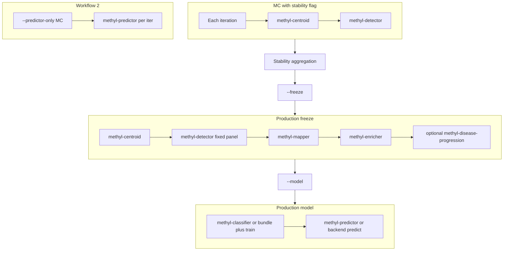

# Clarify `--stability` / `--freeze` / `--model` package mapping

## Code verification (authoritative)

Implementation lives in `[packages/methylvalidation/methyl_validation/pipeline_runner.py](packages/methylvalidation/methyl_validation/pipeline_runner.py)` and `[packages/methylvalidation/methyl_validation/cli.py](packages/methylvalidation/methyl_validation/cli.py)`.


| User claim                                                         | Verdict                                                                                                                                                                                                                                                                                                                                                                                                                                                                                                                                |
| ------------------------------------------------------------------ | -------------------------------------------------------------------------------------------------------------------------------------------------------------------------------------------------------------------------------------------------------------------------------------------------------------------------------------------------------------------------------------------------------------------------------------------------------------------------------------------------------------------------------------- |
| `**--stability` uses Monte Carlo runs of centroid + detector**     | **Correct** for the Monte Carlo body: each iteration runs `methyl-centroid` (possibly split into group1/group2) then `methyl-detector` via `run_pipeline_for_iteration` / `run_pipeline_for_iteration_multiclass`. The `--stability` flag also sets `run_stability` so that **after** the loop, `run_stability_analysis()` aggregates discovery DMPs (and genes only if enricher outputs exist from some path).                                                                                                                        |
| `**--freeze` uses mapper, enricher, disease progression**          | **Incomplete**: `run_pipeline_for_production` runs `**methyl-centroid` → `methyl-detector` (fixed panel)** → `methyl-mapper` → `methyl-enricher`, then optionally `methyl-disease-progression` when `step_config.progression.enabled=true`. Centroid + fixed-panel detector are easy to omit when describing freeze.                                                                                                                                                                                                                   |
| `**--model` uses detector, classifier, and Monte Carlo predictor** | **Incorrect on two points**: `build_production_model` → `run_pipeline_for_model` **does not** invoke `methyl-detector`. For default `model_backend=ecdf`, steps are `**methyl-classifier` → `methyl-predictor`** (one validation orchestration pass; predictor may run **per comparison** inside its CLI, which is not the same as methyl-validation’s **Monte Carlo** loop). **Monte Carlo runs of `methyl-predictor`** are `**[--predictor-only](packages/methylvalidation/methyl_validation/cli.py)**` (Workflow 2), not `--model`. |
| **Alternate `--model` backends**                                   | For `tabular_sklearn` and `generative_hybrid`, steps are **model bundle → train → predict** in Python (`model_bundle`, `tabular-*` / `generative-*` step names in timings), not the ecdf classifier CLI + methyl-predictor CLI sequence. The bundle **consumes detector outputs already produced by `--freeze`**; it does not re-run the `methyl-detector` subprocess.                                                                                                                                                                 |


Reference snippets:

```449:478:packages/methylvalidation/methyl_validation/pipeline_runner.py
def run_pipeline_for_production(
    ...
    steps = [
        ("methyl-centroid", lambda: run_centroid(project_json, centroid_step_overrides=None)),
        ("methyl-detector", lambda: run_detector(project_json, per_cancer_group=False)),
        ("methyl-mapper", lambda: run_mapper(project_json, per_cancer_group=False)),
    ]
    ...
    if not skip_enricher:
        steps.append(("methyl-enricher", lambda: run_enricher(...)))
        if progression_enabled:
            steps.append(("methyl-disease-progression", lambda: run_progression(project_json)))
```

```723:730:packages/methylvalidation/methyl_validation/pipeline_runner.py
    else:
        steps = [
            ("methyl-classifier", lambda: run_classifier(project_json, per_cancer_group=per_cancer_group)),
            ("methyl-predictor", lambda: run_predictor_from_project(project_json, predictor_output_dir)),
        ]
```

The theory book `[docs/theory/chapters/12-two-workflows.qmd](docs/theory/chapters/12-two-workflows.qmd)` already states freeze as centroid → detector(fixed) → mapper → enricher and `--model` as classifier → predictor; the gap is **discoverability** (CLI table / overview lines) and **disambiguation** from MC predictor (`--predictor-only`) and non-ecdf backends.

## Proposed documentation changes (no code changes required)

1. `**[packages/methylvalidation/docs/USAGE.md](packages/methylvalidation/docs/USAGE.md)`**
  - Add a short subsection **“Which steps run (CLI packages)”** with a compact table:
    - **MC + `--stability`**: per iteration `methyl-centroid` + `methyl-detector`; after loop, stability aggregation (not a third package).
    - `**--freeze**`: `methyl-centroid` + `methyl-detector` (fixed panel) + `methyl-mapper` + `methyl-enricher` + optional `methyl-disease-progression`.
    - `**--model**`: default ecdf → `methyl-classifier` + `methyl-predictor`; note tabular/generative bundle path; explicitly **no** `methyl-detector`.
    - `**--predictor-only`**: MC iterations, each `methyl-predictor` only (frozen artifacts).
  - Optionally expand the **CLI Flags** table with a second column “Main subprocesses” (one line each) to match user mental model (MethylCentroid ↔ `methyl-centroid`, etc.).
2. `**[packages/methylvalidation/docs/IMPLEMENTATION.md](packages/methylvalidation/docs/IMPLEMENTATION.md)`** (if present and used as dev reference)
  - Mirror the same bullet list and point to `run_pipeline_for_iteration`, `run_pipeline_for_production`, `run_pipeline_for_model` for maintainers.
3. `**[docs/theory/chapters/14-user-guide.qmd](docs/theory/chapters/14-user-guide.qmd)**` (stage-oriented checklist)
  - Add one sentence under each stage explicitly naming **CLI** tools (or “in-process bundle/train/predict” for non-ecdf `--model`) so readers who skip Chapter 12 still see the mapping.
4. **Optional micro-tweak** `[packages/methylvalidation/methyl_validation/cli.py](packages/methylvalidation/methyl_validation/cli.py)` `--help` strings for `--freeze` / `--model` if you want the binary’s help to match the docs (still accurate: freeze already mentions centroid→detector; model could add “no detector; not MC—use --predictor-only for repeated predictor runs”).

## Diagram (mental model)




No tests are required unless CLI help text changes and you snapshot `--help` in CI (unlikely).