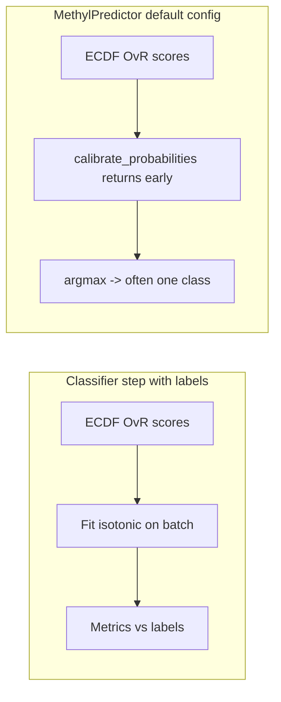

# Classifier overfitting and collapsed predictions

## What is going wrong

### 1. Metrics are not out-of-sample

Several steps **fit** parameters using the same labels you then use to compute accuracy / balanced accuracy / sensitivity / specificity:

- **Isotonic calibration** (`[calibrate_probabilities](packages/methylclassifier/methyl_classifier/core/classifier.py)`) — when `expected_classes` is passed, sklearn `IsotonicRegression` is fit **per class on the current batch**, then probabilities are renormalized. That can drive in-batch predictions toward perfect separation.

```1465:1491:packages/methylclassifier/methyl_classifier/core/classifier.py
    def calibrate_probabilities(self, probas: np.ndarray, expected_classes: Optional[np.ndarray] = None) -> np.ndarray:
        """Apply Isotonic Regression calibration to probabilities."""
        if not getattr(self.config, 'use_isotonic_calibration', False):
            return probas

        if expected_classes is not None:
            # We are fitting
            from sklearn.isotonic import IsotonicRegression
            calibrators = []
            calibrated_probas = np.zeros_like(probas)
            ...
            self.metadata['isotonic_calibrators_'] = calibrators
            return calibrated_probas
```

(Your project sets `[use_isotonic_calibration: true](configs/project_Healthy_vs_PCa1-4-CG.json)` under `step_config.classifier`.)

- **Chromosome weight stacking** — with `[weight_method: "linear_fitted"](configs/project_Healthy_vs_PCa1-4-CG.json)`, `[use_elasticnet_stacking: true](configs/project_Healthy_vs_PCa1-4-CG.json)`, and labeled samples, `[_classify_multi_chromosome_samples](packages/methylclassifier/methyl_classifier/cli/main.py)` fits regression weights on **per-chromosome probabilities vs. labels on that same list** (see the block around `fit_chromosome_weights` when `expected_classes` is set).

So “1.0 everywhere” on **trained data** is expected under this design: you are measuring **resubstitution error**, not generalization.

### 2. Train / serve mismatch for isotonic (high impact)

`[run_prediction](packages/methylpredictor/methyl_predictor/core/predictor.py)` constructs a **minimal** `ClassifierConfig` and **does not** pass `use_isotonic_calibration` (or project `temperature` / weight flags):

```561:568:packages/methylpredictor/methyl_predictor/core/predictor.py
    classifier_config = ClassifierConfig(
        model_path=config.model_path,
        model_dir=config.model_dir,
        temperature=1.0,
        enable_platt_calibration=False,
        trimmed_percentile_low=0.10,
        trimmed_percentile_high=0.01,
    )
```

`ClassifierConfig.use_isotonic_calibration` defaults to `**False**` (`[config.py](packages/methylclassifier/methyl_classifier/models/config.py)`). Because `calibrate_probabilities` returns immediately when that flag is off, **saved `metadata['isotonic_calibrators_']` is never applied** on new runs — even though `_export_ovr_package_dict` copies metadata (including calibrators) into the saved bundle.

Resulting behavior:


| Stage                                   | Isotonic                                          |
| --------------------------------------- | ------------------------------------------------- |
| Classifier step (labeled training list) | On → fit on batch → metrics look perfect          |
| MethylPredictor on new samples          | Off → **raw ECDF / OvR fused probabilities only** |


If raw scores are shifted on a new batch (coverage, lab, normalization, cohort shift), **argmax can collapse to a single class** for everyone, while your training report still looked flawless.




### 3. Model capacity vs. independent validation

- ECDFs are built from **discovery cohort centroids** (see [methyldetector IMPLEMENTATION](packages/methyldetector/docs/IMPLEMENTATION.md)); DMPs are chosen from that comparison. A **large panel** (`[max_dmps_for_classifier: 15000](configs/project_Healthy_vs_PCa1-4-CG.json)`, strong `[effect_size_weight_power](configs/project_Healthy_vs_PCa1-4-CG.json)`) increases capacity to separate the reference cohort without guaranteeing transportability.
- Honest estimates require **held-out samples** (or repeated splits). The repo already documents this for DMP count tuning: `[methyl_validation/prediction_branch.py](packages/methylvalidation/methyl_validation/prediction_branch.py)` notes that `featurecuts_validation` optimizes on configured validation samples but is not full nested CV over centroid rebuilds.

---

## Recommended directions (code + workflow)

### A. Fix train/serve alignment (code)

1. **Propagate classifier inference flags into MethylPredictor** — When resolving the predictor from the project, merge relevant fields from `step_config.classifier` (at minimum `use_isotonic_calibration`, `temperature`; optionally weight-related fields if they affect runtime) into the `ClassifierConfig` used in `run_prediction`. Alternatively, **if `metadata['isotonic_calibrators_']` exists, apply transform regardless of the flag** (document that the flag means “fit when labels present” vs “apply when loading”). Pick one behavior and document it in `[methylpredictor` docs](packages/methylpredictor/docs/IMPLEMENTATION.md).
2. **Optional: add a warning** when the loaded model contains `isotonic_calibrators_` but `use_isotonic_calibration` is False, to catch this mismatch early.

### B. Honest calibration and stacking (code or procedure)

1. **Fit isotonic (and chromosome stacking) only on a training fold**, evaluate on a **disjoint** validation fold; persist calibrators fit **only** on training. That matches standard practice and stops “1.0 on the same list” from being interpreted as generalization.
2. **Monte Carlo splits** — Keep `train_fraction` / `n_iterations` under `[step_config.validation](configs/project_Healthy_vs_PCa1-4-CG.json)` for **centroid/detector** work inside stability iterations. **Discrimination metrics** after the workflow refactor belong to the **final model** step (MethylClassifier + MethylPredictor on declared train/test) and/or `**--predictor-only`** on a frozen artifact—not to resubstitution on the full production cohort.

### D. Target workflow: stability → freeze (biology) → gated final model

**Intent (user specification):** separate **DMP stability / discovery** and **biology interpretation** from **learned classifier training** (isotonic, chromosome stacking, OvR assembly in MethylClassifier).


| Phase           | Steps to run                                                                                                                                                                                                                                                                                                                                                                                              | Purpose                                                                                                                                                                                                                                                           |
| --------------- | --------------------------------------------------------------------------------------------------------------------------------------------------------------------------------------------------------------------------------------------------------------------------------------------------------------------------------------------------------------------------------------------------------- | ----------------------------------------------------------------------------------------------------------------------------------------------------------------------------------------------------------------------------------------------------------------- |
| **Stability**   | **MethylCentroid** for each group; **MethylDetector** for each group pair (comparison). Detector exports include an **ECDF classifier** built from centroids and selected DMPs—this is the “classifier” outcome of the comparison, **without** the MethylClassifier training pass. **Do not** run MethylClassifier or MethylPredictor here.                                                               | Repeated splits: assess **which DMPs recur** (`stability_dmp_freq`) from discovery exports; optionally use **detector-internal validation** where implemented. Avoids conflating DMP stability with **in-sample** MethylClassifier / isotonic / stacking metrics. |
| **Freeze**      | Form **stable DMP panel** from stability outputs; run **MethylMapper** and **MethylEnricher** on that panel → genes, pathways, modules. **Expert review** to confirm biological plausibility and alignment with **disease evolution**. For **staged** disease groups, a **disease progression report** (automated from enrichment across stages) is a sensible future deliverable to support that review. | Locks interpretable biology before any “production” learning pass; experts sign off on mechanism, not on ML scores.                                                                                                                                               |
| **Final model** | **Only after** biological confirmation: **MethylClassifier** (train/assemble OvR, optional calibration/stacking) and **MethylPredictor** (validate on held-out or configured test lists).                                                                                                                                                                                                                 | This is where **isotonic / ElasticNet** and **train/serve alignment** matter; metrics here should use **explicit train/test** cohorts, not the same list used to fit calibration.                                                                                 |


**Optional fourth mode:** `**--predictor-only`** — repeated holdouts using an **already frozen** `.pkl` to estimate BA distribution without retraining (still valid once the frozen model exists).

### E. Implementation gap (current code vs target)

`**pipeline_runner.py` is the single place that defines step order** for orchestrated runs; it must be updated first so Monte Carlo, freeze, and model phases stay consistent and faster MC iterations actually reflect “stability only.”

Today, each MC iteration in `[pipeline_runner.py](packages/methylvalidation/methyl_validation/pipeline_runner.py)` runs **centroid → detector → methyl-classifier → methyl-predictor** (`run_pipeline_for_iteration`, lines 171–187; `run_pipeline_for_iteration_multiclass`, lines 384–395). Optional `**run_mapper_and_enricher`** still inserts mapper/enricher **inside** the MC loop (lines 189–192, 398–402), which belongs to **freeze**, not stability. `--stability` post-analysis uses **predictor** `validation_metrics.json` when present (`[stability.py](packages/methylvalidation/methyl_validation/stability.py)`). That **contradicts** the target: stability = centroid + detector only.

`[build_production_model](packages/methylvalidation/methyl_validation/stability.py)` calls `**run_pipeline_for_model`**, which is **not defined** in `pipeline_runner.py` today—the `--model` path needs that function implemented as **methyl-classifier → methyl-predictor** on the production `project.json`.

**Align implementation by:**

1. **Edit `[pipeline_runner.py](packages/methylvalidation/methyl_validation/pipeline_runner.py)`:** MC functions stop after **methyl-detector**; remove classifier and predictor from the default iteration pipeline; **do not** run mapper/enricher in MC by default (freeze-only). Add `**run_pipeline_for_model`** for the final model step.
2. **Edit `[cli.py](packages/methylvalidation/methyl_validation/cli.py)`** MC loop to use the updated runners (paths/args for predictor may become unused during MC until model/predictor-only).
3. **Edit `[stability.py](packages/methylvalidation/methyl_validation/stability.py)`:** stability summaries from **discovery DMP CSVs** / detector outputs (and detector validation artifacts if any), not **MethylPredictor** metrics.
4. **Docs:** `[USAGE.md](packages/methylvalidation/docs/USAGE.md)`, `[IMPLEMENTATION.md](packages/methylvalidation/docs/IMPLEMENTATION.md)`, `[cli.py](packages/methylvalidation/methyl_validation/cli.py)` `--stability` help string.

**Relation to overfitting:** moving **MethylClassifier** out of MC prevents **isotonic/stacking resubstitution** from masquerading as “stability”; **classification** metrics belong to `**--model`** and `**--predictor-only`** on a frozen artifact.

### F. `pipeline_runner.py` contract (acceptance checklist)


| Runner                                       | Intended steps                               | Notes                                                                                                                                                                         |
| -------------------------------------------- | -------------------------------------------- | ----------------------------------------------------------------------------------------------------------------------------------------------------------------------------- |
| `**run_pipeline_for_iteration**` (binary MC) | **methyl-centroid** → **methyl-detector**    | No classifier/predictor/mapper/enricher in default MC. Saves wall-clock on large `n_iterations`.                                                                              |
| `**run_pipeline_for_iteration_multiclass`**  | Same                                         | Same.                                                                                                                                                                         |
| `**run_pipeline_for_production`**            | centroid → detector → mapper → enricher      | Already matches **freeze**; keep as-is (optional `skip_enricher` via config if needed elsewhere).                                                                             |
| `**run_pipeline_for_model`** (new)           | **methyl-classifier** → **methyl-predictor** | Satisfy `[build_production_model](packages/methylvalidation/methyl_validation/stability.py)` import; production `project.json` must carry predictor test lists / model paths. |
| `**run_predictor_only_`***                   | methyl-predictor only                        | Unchanged; use after a frozen `.pkl` exists.                                                                                                                                  |


### C. Modeling / config levers (workflow; no code required)

1. **Ablate** to isolate causes: run with `use_isotonic_calibration: false` and simpler weights (`weight_method: effect_size` or fixed `chromosome_weights`, `use_elasticnet_stacking: false`) and compare **held-out** BA — not training-list metrics.
2. **Check new-cohort feature quality** in `predictions.csv`: low `dmps_used` or coverage can push many samples to similar scores (see existing warnings in `[_print_validation_report](packages/methylclassifier/methyl_classifier/cli/main.py)`).
3. **Consider** `classifier_dmp_selection: featurecuts_validation` (with real validation sample paths in detector config) if the panel is overfitting the discovery cohort — see [prediction_branch.py](packages/methylvalidation/methyl_validation/prediction_branch.py).

---

## Summary

The pipeline is not “lying” in code — it reports metrics **after** fitting calibration and stacking on the **same labeled batch**, which is inherently optimistic. **MethylPredictor** can also **skip isotonic** if `ClassifierConfig` omits the flag, causing **train/serve skew**. **Process fix:** run **stability** as **centroid + detector only**; use **freeze** for **mapper/enricher** and **expert review**; run **MethylClassifier + MethylPredictor** only in a **gated final model** step with real train/test. **Code fix:** implement the **pipeline_runner.py** contract (Section F) first—separates goals and speeds MC—then **config propagation** and **holdout calibration** as above. **Future:** optional **automated disease progression report** from stage-stratified enrichment to support expert sign-off.