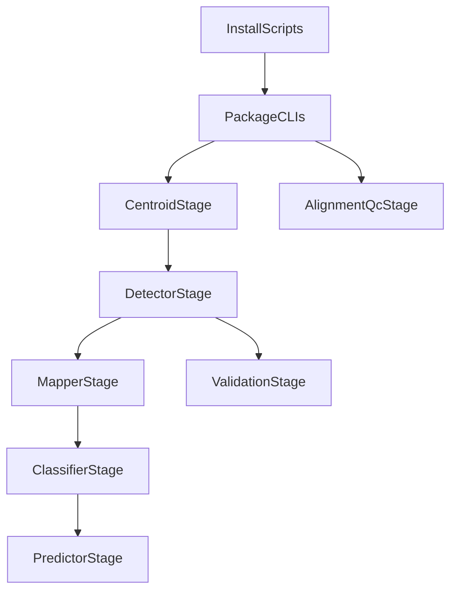

# Code-First Documentation Discovery Plan

## Scope Locked
- Deliverable for this phase: **analysis report only** (no full docs rewrite yet).
- Future canonical docs target: **single root document**.
- `MethylCluster` handling: **exclude from main workflow**; only note as deprecated appendix material later.

## Outcomes
- Create a comprehensive, code-derived analysis report that will drive phase-2 documentation authoring.
- Build an evidence-backed inventory of:
  - Current architecture and package responsibilities
  - Installation, upgrade, and execution paths actually supported by code/scripts
  - Theoretical/modeling foundations implemented in code
  - Likely unused code and useless/superseded parameters (with confidence + validation notes)

## Primary Evidence Sources (Code/Config First)
- Monorepo/test/tooling baseline: [`/home/ubuntu/MethylPipeline/pyproject.toml`](/home/ubuntu/MethylPipeline/pyproject.toml)
- Install orchestration: [`/home/ubuntu/MethylPipeline/scripts/install_all.sh`](/home/ubuntu/MethylPipeline/scripts/install_all.sh)
- Canonical test execution entry: [`/home/ubuntu/MethylPipeline/scripts/run_tests.sh`](/home/ubuntu/MethylPipeline/scripts/run_tests.sh)
- Detector CLI/package contract: [`/home/ubuntu/MethylPipeline/packages/methyldetector/pyproject.toml`](/home/ubuntu/MethylPipeline/packages/methyldetector/pyproject.toml)
- Predictor CLI/package contract: [`/home/ubuntu/MethylPipeline/packages/methylpredictor/pyproject.toml`](/home/ubuntu/MethylPipeline/packages/methylpredictor/pyproject.toml)
- Core modeling/utility sources for theory extraction:
  - [`/home/ubuntu/MethylPipeline/packages/methylutils/methyl_utils/ecdf_classifier.py`](/home/ubuntu/MethylPipeline/packages/methylutils/methyl_utils/ecdf_classifier.py)
  - [`/home/ubuntu/MethylPipeline/packages/methylutils/methyl_utils/statistical_tests.py`](/home/ubuntu/MethylPipeline/packages/methylutils/methyl_utils/statistical_tests.py)
  - [`/home/ubuntu/MethylPipeline/packages/methylclassifier/methyl_classifier/core/classifier.py`](/home/ubuntu/MethylPipeline/packages/methylclassifier/methyl_classifier/core/classifier.py)
  - [`/home/ubuntu/MethylPipeline/packages/methyldetector/methyl_detector/core/methyldetector.py`](/home/ubuntu/MethylPipeline/packages/methyldetector/methyl_detector/core/methyldetector.py)

## Analysis Workstreams
1. **Deprecated-doc impact scan**
- Enumerate all current references to `MethylCluster`/`methylcluster` in user-facing docs and classify each as: remove, move-to-appendix, or retain for compatibility note.
- Flag stale/broken references (for example references to removed chapter files) as phase-2 cleanup prerequisites.

2. **Code-derived architecture and execution mapping**
- Derive package dependency and execution path from package metadata + scripts (not prior prose docs).
- Build a stepwise operational map covering:
  - installation
  - upgrades/version constraints
  - full project execution
  - step-by-step execution by major CLI boundaries

3. **Theory extraction from implementation**
- Extract implemented theory blocks directly from source (ECDF/Bayesian/statistical testing/calibration/model selection).
- Trace where each theoretical concept appears in runnable code paths and artifacts.

4. **Unused code / useless parameter audit**
- Produce a triaged table with confidence levels:
  - high-confidence orphan modules
  - medium-confidence superseded fields/flags
  - low-confidence legacy compatibility shims
- For each finding, include evidence path(s), why it appears unused/superseded, and concrete validation action before deletion.

5. **Phase-2 doc blueprint (single-root canonical)**
- Deliver a section-by-section outline for the future root document:
  - Theoretical Foundations
  - Implementation
  - Usage (installation, upgrades, full run, step-by-step)
  - Strategy playbooks (initial research, disease characterization, model creation, final prediction from best model)
- Mark each section with exact code sources to cite in writing.

## Draft Architecture View (for report)

## Acceptance Criteria for This Phase
- A single analysis report exists with:
  - complete deprecated-reference inventory for `MethylCluster`
  - code-backed architecture and execution map
  - theory-to-code traceability matrix
  - unused/superseded code+parameter triage with validation steps
  - finalized blueprint for phase-2 canonical root documentation
- No