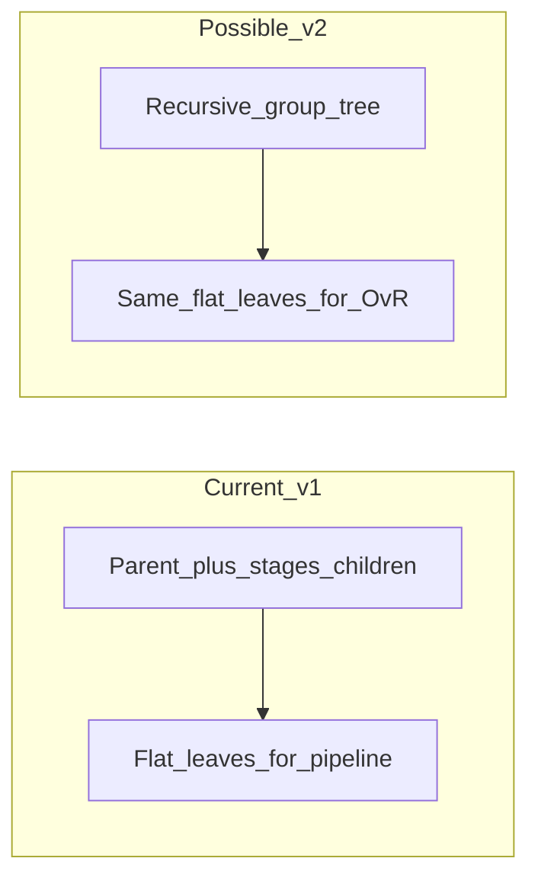

# Cohort tree depth: recommendation

## What you have today (v1)

In `[packages/methylutils/methyl_utils/pipeline_config.py](packages/methylutils/methyl_utils/pipeline_config.py)`, `**GroupConfig.stages**` is explicitly a **single extra level**: children must carry `sample_paths`, and **nested `stages` under a stage are rejected** (“not supported in v1”). Resolved **centroid / comparison / multiclass labels** are a **flat list of leaves** (e.g. `pca_pca1`). `**cohort_hierarchy`** autofill assumes **disease families** shaped as **one parent + a list of stage-like children**—good for “cancer type × stage”, awkward for “breast: receptor-defined subtypes” if you force those into fake “stages.”

So the v1 mistake is not “two levels” in the abstract; it is **over-interpreting the second level as always “stage.”** Biologically, the second axis can be stage, molecular subtype, grade band, or something else—you can still use `stages` in JSON as “children of this disease family” with labels like `HR_pos_HER2_neg` even though the key is named `stages`. The **semantics** are in your labels and science, not in the field name.

## Stratified trees and “biggest differences first”

In study design, you order stratification by **factors that drive confounding or heterogeneity** (and sample size). In **methylation classification**, the pipeline’s tree is mainly used to:

- Decide **which pairwise detectors exist** (bipartite healthy×leaf or explicit `comparisons`)
- Name **leaves** for centroids and the **exported OvR PKL**
- Drive **reporting** (marginals over families in MethylPredictor when `cohort_hierarchy` is present)

The tree does **not** automatically learn that “level 1 is more different than level 2”; that’s your **choice of which splits become separate cohorts** (separate CSVs / leaves). So “unknown depth” is not required to respect “big differences first”—you encode that by **where you cut** the population into leaves.

## Two trees of unknown depth: tradeoffs

**Pros:** One schema for controls and diseases; natural for nested strata (e.g. site → ancestry → age band) and nested oncology (cancer → subtype → stage).

**Cons (large):**

- **Comparison graph:** Full bipartite **healthy strata × disease leaves** grows fast; sparse `comparisons` becomes mandatory more often.
- **Code surface:** Recursive expansion, `cohort_hierarchy` / `cohort_tree_dict`, MethylValidation MC layout, centroid/detector/classifier/predictor resolvers all need consistent rules for **path → leaf label** and **internal nodes vs leaves**.
- **OvR story:** Still ends in a **flat `class_names` simplex** unless you add a true hierarchical PKL bundle—so arbitrary depth helps **organization and reporting** more than it changes the core fusion math.

## Recommendation

1. **Keep v1 as the default engineering shape for now** (flat leaves + optional shallow nesting): it matches implemented behavior and ships a single multiclass PKL for MethylPredictor.
2. **Do not force “stage” for every disease family.** Use one parent per **disease family** and children that are whatever scientifically meaningful **mutually exclusive enrollment bins** you have (stage, subtype, or both represented as separate families if the cross-classification is too sparse).
3. **Defer “arbitrary depth” until** you have (a) a concrete multi-cancer config with real labels, (b) a written **comparison policy** (full bipartite vs sparse), and (c) appetite to extend Pydantic + resolvers + docs in `[pipeline_config.py](packages/methylutils/methyl_utils/pipeline_config.py)` and dependents.
4. **If you need depth > 2 later**, prefer a **recursive `children` (or recursive `GroupConfig`)** with a single rule: **only leaves have `sample_paths`**; internal nodes are grouping only—then flatten to leaves for detectors/OvR. Generalize `cohort_hierarchy` to a small **adjacency list or nested JSON** rather than hard-coding `disease_families` + `stage_labels`.

## When migration is worth it

Migrate toward recursive trees when you **regularly** need:

- More than **two** meaningful axes for the same family (e.g. subtype **and** stage as nested, not a single cross-product label), or
- **Symmetric nested controls** (not just “few flat strata”), and you want hierarchy-aware reporting without hand-maintaining `cohort_hierarchy`.

Until then, **multiple disease siblings** at the top level (`diseases.groups[]`), each with its own `stages` (or flat leaves), often covers “breast vs prostate” with different child semantics without new schema.