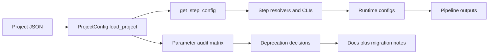

# Configuration Revision Plan (Active Components)

## Objective

Create a reliable, code-backed revision of shared project configuration (`project_*.json`) across active packages (excluding `methylcluster`), then remove or deprecate unused/redundant parameters safely.

## Scope

In scope packages and key config entry points:

- [packages/methylutils/methyl_utils/pipeline_config.py](packages/methylutils/methyl_utils/pipeline_config.py)
- [packages/methylcentroid/methyl_centroid/config.py](packages/methylcentroid/methyl_centroid/config.py)
- [packages/methyldetector/methyl_detector/models/config.py](packages/methyldetector/methyl_detector/models/config.py)
- [packages/methylclassifier/methyl_classifier/models/config_schema.py](packages/methylclassifier/methyl_classifier/models/config_schema.py)
- [packages/methylpredictor/methyl_predictor/models/config.py](packages/methylpredictor/methyl_predictor/models/config.py)
- [packages/methylmapper/methyl_mapper/config.py](packages/methylmapper/methyl_mapper/config.py)
- [packages/methylenricher/methyl_enricher/config.py](packages/methylenricher/methyl_enricher/config.py)
- [packages/methylvalidation/methyl_validation/config.py](packages/methylvalidation/methyl_validation/config.py)
- [packages/methylalignmentqc/methyl_alignment_qc/models/config.py](packages/methylalignmentqc/methyl_alignment_qc/models/config.py)
- [packages/methyldiseaseprogression/methyl_disease_progression/progression.py](packages/methyldiseaseprogression/methyl_disease_progression/progression.py)

## Current high-confidence redundancy candidates

Use these as initial targets, with verification tests before any removal:

- `step_config.validator` alias of `step_config.predictor` in [packages/methylutils/methyl_utils/pipeline_config.py](packages/methylutils/methyl_utils/pipeline_config.py)
- Enricher duplicate keys (`input`/`input_file`, `outdir`/`output_dir`) in [packages/methylenricher/methyl_enricher/project_resolver.py](packages/methylenricher/methyl_enricher/project_resolver.py)
- Detector legacy ECDF aliases (`ecdf_overlap_grid_size`, `ecdf_ks_grid_size`) in [packages/methyldetector/methyl_detector/models/config.py](packages/methyldetector/methyl_detector/models/config.py)
- Unused API compatibility args in MC runners documented in [packages/methylvalidation/methyl_validation/pipeline_runner.py](packages/methylvalidation/methyl_validation/pipeline_runner.py)
- Unused `disease_subdir` parameter in detector per-group resolver in [packages/methyldetector/methyl_detector/utils/project_resolver.py](packages/methyldetector/methyl_detector/utils/project_resolver.py)

## Execution phases

### Phase 1 — Build a parameter source-of-truth matrix (no behavior changes)

- Extract all declared fields (name, type, default, constraints) from each package config model.
- Extract all actually-consumed fields from resolvers/CLI merge paths.
- Produce a single matrix: `declared`, `consumed`, `inherited`, `alias`, `legacy`, `unused_candidate`, `confidence`, `evidence_file`.
- Store under docs (e.g. `docs/reference/configuration-reference.qmd` companion section + package docs links).

### Phase 2 — Classify and triage

- Classify each candidate as:
  - **A: dead/unused** (safe remove),
  - **B: alias compatibility** (deprecate with warning),
  - **C: context-dependent** (keep, improve docs),
  - **D: behavior bug/drift** (fix logic).
- Prioritize by risk and migration cost.

### Phase 3 — Introduce deprecation policy and warnings

- Add uniform deprecation warnings at project load/step resolution boundaries.
- Prefer one canonical key per semantic slot.
- Add migration notes in docs with "deprecated since" and planned removal window.

### Phase 4 — Remove or simplify low-risk redundancies

- Remove dead parameters/arguments with high-confidence no-op behavior.
- Keep aliases only where needed for backward compatibility and tests.
- Update docs and examples (`project_*.json`) to canonical keys only.

### Phase 5 — Validate and ship

- Add/extend tests for config normalization, alias mapping, and failure messages.
- Run package test suites impacted by config loading and workflow orchestration.
- Regenerate docs and ensure examples match runtime behavior.

## Data flow to keep during revision

## Deliverables

- Parameter matrix with evidence and confidence levels.
- Ranked list of unused/redundant parameters with disposition (remove/deprecate/keep).
- Code changes for selected low-risk removals + compatibility warnings.
- Updated docs and canonical project examples.
- Regression tests proving no workflow breakage for active components.

