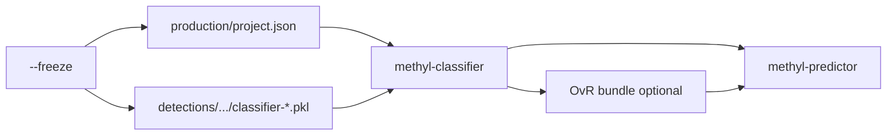

# Confirming `methyl-validation --model` after `--freeze`

## What `--model` actually runs

- CLI: `[packages/methylvalidation/methyl_validation/cli.py](packages/methylvalidation/methyl_validation/cli.py)` calls `build_production_model()`, which requires `[monte_carlo_runs/production/project.json](packages/methylvalidation/methyl_validation/stability.py)` and then invokes `[run_pipeline_for_model()](packages/methylvalidation/methyl_validation/pipeline_runner.py)`:
  1. `**methyl-classifier --project <production/project.json>**`
  2. `**methyl-predictor --project <production/project.json> --output-dir <production>/predictors**`

So **incorrect mapper `dmps-*-discovery.csv` globs do not affect `--model`** directly; they only mattered for mapper during `--freeze` (addressed elsewhere with unified-export fallback in `[packages/methylutils/methyl_utils/dmp_export_paths.py](packages/methylutils/methyl_utils/dmp_export_paths.py)` + `[packages/methylmapper/methyl_mapper/bedtools_mapper.py](packages/methylmapper/methyl_mapper/bedtools_mapper.py)`).

## Preconditions that must be true for `--model` to succeed

1. **Production project exists**
  `build_production_model` raises if `production/project.json` is missing (`[stability.py](packages/methylvalidation/methyl_validation/stability.py)` ~815–816).
2. **Biological review gate (only if enabled)**
  If `step_config.validation.require_biological_review_for_model` is `true`, you must set `biological_review_confirmed: true` or `--model` exits via `[assert_production_model_build_allowed](packages/methylvalidation/methyl_validation/config.py)`. Your `[configs/project_Healthy_vs_PCa1-4-CG.json](configs/project_Healthy_vs_PCa1-4-CG.json)` does **not** set these; defaults keep the gate **off**.
3. **Per-comparison detector pickles from freeze**
  For control/disease projects, **methyl-classifier auto-enables per-comparison mode** when `uses_control_disease()` (`[main.py](packages/methylclassifier/methyl_classifier/cli/main.py)` ~1822–1826). Each comparison uses `model_dir = get_detection_output_dir(control, disease)` (`[project_resolver.py](packages/methylclassifier/methyl_classifier/project_resolver.py)` ~305–316)—i.e. under `production/detections/all/pca_pca`*.
   You need **all** `classifier-{chrom}-{contexts}.pkl` files that the classifier expects (e.g. `classifier-1-CG.pkl` … `classifier-Y-CG.pkl` for CG-only) **present for every comparison** you care about. The earlier ECDF build failure would have **skipped** saving pickles for affected chromosomes; with the **centroid intersection subset** fix in `[methyldetector.py](packages/methyldetector/methyl_detector/core/methyldetector.py)`, re-run freeze (or at least detector) so pickles exist.
4. **OvR bundle step (your project)**
  `[project_Healthy_vs_PCa1-4-CG.json](configs/project_Healthy_vs_PCa1-4-CG.json)` sets `"ovr_binary_pickles_from_comparisons": true`. After the per-comparison loop, classifier runs multiclass OvR export, which **verifies** detector artifacts per comparison (`[expand_ovr_paths_from_comparisons](packages/methylclassifier/methyl_classifier/project_resolver.py)` / `_verify_det_dir`). If **any** comparison is missing the expected pickle basename under its detection dir, **classifier exits non-zero** and `--model` stops before predictor.
5. **methyl-predictor inputs**
  Predictor resolves test samples from `step_config.predictor` and project cohorts (`[resolve_predictor_config_per_comparison](packages/methylpredictor/methyl_predictor/project_resolver.py)`). Typical production run uses the **same training cohort paths** as evaluation unless you configured separate test paths. Ensure `samples_base_path` and any CSV path lists still resolve on the machine that runs `--model` (and `path_remap` if you use it).

## Relation to earlier errors

| Issue                                                                | Affects `--model`?                                                                 |
| -------------------------------------------------------------------- | ---------------------------------------------------------------------------------- |
| Mapper `dmps-*-discovery.csv` vs unified `dmps-{chr}.csv`            | **No** (mapper only in `--freeze`)                                                 |
| Fixed panel positions not in both centroids / ECDF build failure     | **Yes**—must produce `classifier-*.pkl` per chrom; fixed by subsetting before save |
| Wrong `centroid1_dir` / `centroid2_dir` in production `project.json` | **Yes** for classifier calibration and predictor feature extraction                |

## Practical verification before running `--model`

Without executing the full pipeline, you can confirm readiness:

- `production/project.json` exists under `.../monte_carlo_runs/production/`.
- For each comparison directory under `production/detections/all/pca_pca*/`, spot-check: `ls classifier-*-CG.pkl | wc -l` matches chromosome count (24 + X + Y as configured).
- If classifier step completed once, check for the multiclass bundle path under `production/classifiers/` (exact filename follows `ovr_bundle_filename` or default from `[predicted_multiclass_ovr_bundle_path](packages/methylclassifier/methyl_classifier/project_resolver.py)`).
- Grep production `project.json` for `require_biological_review_for_model` if you ever add it.

## Optional follow-up (only if you want code/docs hardening)

- Add a small **read-only “preflight”** in `build_production_model` that checks per-comparison `classifier-`* counts and prints a clear message (not required for your immediate run if manual checks pass).
- Align **docs** (`[USAGE.md](packages/methylvalidation/docs/USAGE.md)`) with “mapper pattern irrelevant to `--model`” if users keep conflating the two steps.

