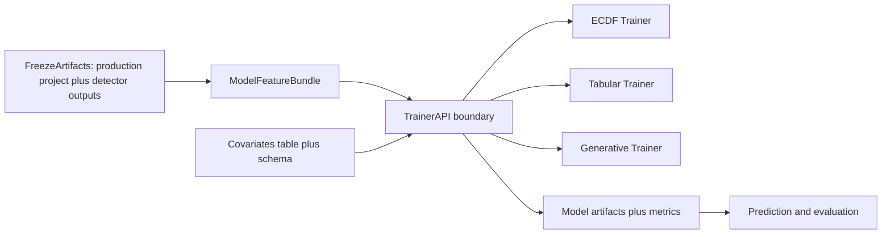

# Covariate Extension and Trainer Architecture

## Recommendation

Use **MethylValidation as the integration point now**, and define a **trainer interface boundary** that can be extracted later into `methylmodeltrainer` without changing user workflows.

Why this is the best extension path:
- `methylvalidation --model` already dispatches backend-specific training/evaluation and supports covariate parameters in config/CLI.
- `tabular_backend.py` and `generative_backend.py` already concatenate covariates with DMP features, so the core capability exists.
- Splitting immediately into a new package would add orchestration complexity before data contracts (bundle schema, covariate typing, calibration) are finalized.

## Current confirmed state (code)

- Bayesian ECDF path is DMP-centric in MethylClassifier (detector-derived methylation features):
  - [`/home/ubuntu/MethylPipeline/packages/methylclassifier/methyl_classifier/core/classifier.py`](/home/ubuntu/MethylPipeline/packages/methylclassifier/methyl_classifier/core/classifier.py)
- Multi-backend model stage lives in MethylValidation:
  - [`/home/ubuntu/MethylPipeline/packages/methylvalidation/methyl_validation/pipeline_runner.py`](/home/ubuntu/MethylPipeline/packages/methylvalidation/methyl_validation/pipeline_runner.py)
  - [`/home/ubuntu/MethylPipeline/packages/methylvalidation/methyl_validation/config.py`](/home/ubuntu/MethylPipeline/packages/methylvalidation/methyl_validation/config.py)
- Covariates are already supported in tabular and generative backends:
  - [`/home/ubuntu/MethylPipeline/packages/methylvalidation/methyl_validation/tabular_backend.py`](/home/ubuntu/MethylPipeline/packages/methylvalidation/methyl_validation/tabular_backend.py)
  - [`/home/ubuntu/MethylPipeline/packages/methylvalidation/methyl_validation/generative_backend.py`](/home/ubuntu/MethylPipeline/packages/methylvalidation/methyl_validation/generative_backend.py)

## Target architecture (phased)

## Phase 1 (now): strengthen inside MethylValidation

1. **Formalize covariate contract** in docs + validation:
- required ID column semantics (`sample basename` join),
- numeric vs categorical handling,
- missingness policy (`strict` vs non-strict),
- train/inference schema consistency checks.

2. **Add a covariate preprocessing layer** reusable by tabular + generative:
- numeric imputation + scaling,
- categorical encoding (one-hot with frozen vocab),
- artifact persistence (preprocessor metadata serialized with model).

3. **Preserve Bayesian/ECDF baseline unchanged**:
- keep ECDF path as DMP-only reference model,
- document that covariate fusion is backend-specific (`tabular_sklearn`, `generative_hybrid`).

4. **Evaluation extension**:
- report metrics with and without covariates,
- add metadata fields to capture covariate columns used and preprocessing version.

Primary files for Phase 1:
- [`/home/ubuntu/MethylPipeline/packages/methylvalidation/methyl_validation/config.py`](/home/ubuntu/MethylPipeline/packages/methylvalidation/methyl_validation/config.py)
- [`/home/ubuntu/MethylPipeline/packages/methylvalidation/methyl_validation/cli.py`](/home/ubuntu/MethylPipeline/packages/methylvalidation/methyl_validation/cli.py)
- [`/home/ubuntu/MethylPipeline/packages/methylvalidation/methyl_validation/tabular_backend.py`](/home/ubuntu/MethylPipeline/packages/methylvalidation/methyl_validation/tabular_backend.py)
- [`/home/ubuntu/MethylPipeline/packages/methylvalidation/methyl_validation/generative_backend.py`](/home/ubuntu/MethylPipeline/packages/methylvalidation/methyl_validation/generative_backend.py)
- [`/home/ubuntu/MethylPipeline/packages/methylvalidation/methyl_validation/model_bundle.py`](/home/ubuntu/MethylPipeline/packages/methylvalidation/methyl_validation/model_bundle.py)
- [`/home/ubuntu/MethylPipeline/packages/methylvalidation/docs/USAGE.md`](/home/ubuntu/MethylPipeline/packages/methylvalidation/docs/USAGE.md)

## Phase 2 (extract when stable): introduce MethylModelTrainer

Create `packages/methylmodeltrainer` only after the above contract is stable for 1-2 release cycles.

Extraction boundary:
- move backend training/prediction orchestration from MethylValidation to a trainer package API,
- keep MethylValidation as workflow orchestrator (`--stability`, `--freeze`, `--model`) calling trainer API,
- optionally allow MethylClassifier invocation as one backend adapter (ECDF/Bayesian adapter) rather than replacing MethylClassifier.

Success criteria before extraction:
- stable bundle schema,
- stable covariate schema/preprocessor artifacts,
- no backend-specific path assumptions in MethylValidation.

## Decision on “after or instead of MethylClassifier”

- **Near term:** not instead of MethylClassifier.
- **Best design:** `MethylModelTrainer` (future) should act as an orchestrator with adapters:
  - ECDF/Bayesian adapter can invoke or wrap MethylClassifier behavior,
  - tabular and generative adapters remain separate trainers,
  - predictor/evaluation stays downstream and model-backend aware.

This preserves backward compatibility and avoids forcing Bayesian internals into a generic trainer too early.