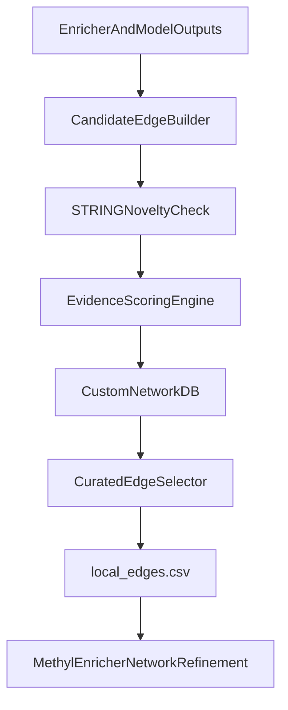

# Custom Network Discovery Plan

## Objective
Build a repeatable post-enrichment workflow that:
- discovers candidate PPI-like edges/modules not covered by STRING,
- tracks evidence and novelty in a local database,
- exports curated edges for reuse in `network_refinement.source=local_edges`.
- stores the SQLite knowledge base under `step_config.enricher.methyl_enricher_home` (default `/work/cache/methyl_enricher`) for consistency with existing cache conventions.

## Current Integration Points
- Existing PPI refinement and edge ingestion are in [`/home/ubuntu/MethylPipeline/packages/methylenricher/methyl_enricher/ppi_network.py`](/home/ubuntu/MethylPipeline/packages/methylenricher/methyl_enricher/ppi_network.py).
- End-to-end module orchestration is in [`/home/ubuntu/MethylPipeline/packages/methylenricher/methyl_enricher/module_pipeline.py`](/home/ubuntu/MethylPipeline/packages/methylenricher/methyl_enricher/module_pipeline.py).
- Enricher home/cache config is in project `step_config.enricher.methyl_enricher_home`; discovery DB path should derive from this root.
- Current PPI outputs available for mining are documented in [`/home/ubuntu/MethylPipeline/packages/methylenricher/docs/IMPLEMENTATION.md`](/home/ubuntu/MethylPipeline/packages/methylenricher/docs/IMPLEMENTATION.md):
  - `ppi_network_edges.csv`
  - `ppi_node_metrics.csv`
  - `ppi_hubs.csv`
  - `ppi_module_coherence.csv`

## Storage Location Contract
- **DB root:** `step_config.enricher.methyl_enricher_home`
- **Default root:** `/work/cache/methyl_enricher`
- **Proposed SQLite path:** `<methyl_enricher_home>/network_discovery/custom_network.sqlite`
- **Proposed exports path:** `<methyl_enricher_home>/network_discovery/exports/local_edges.csv`
- **Reasoning:** keeps MethylMapper/MethylEnricher style cache locality, supports shared reuse across runs, and avoids scattering state under run-specific output folders.

## Architecture

## Implementation Phases
- **Phase 1: External discovery job (no methylenricher code changes)***
  - Create a standalone script (new package utility) that reads run artifacts and emits candidate edges + evidence.
  - Compare candidates against STRING (cached lookups) to mark `in_string`, `string_score`, and `novelty_status`.
  - Store results in SQLite under `step_config.enricher.methyl_enricher_home` (optional Postgres later if needed).
  - Export accepted edges to `source,target,score` CSV for current `local_edges` path.

- **Phase 2: Harden scoring + recurrence criteria**
  - Add composite confidence scoring from multiple evidence channels:
    - cross-run recurrence,
    - co-membership/module support,
    - coherence uplift (`ppi_module_coherence` deltas where available),
    - optional co-methylation/correlation metrics.
  - Add configurable thresholds for promotion from `candidate` to `accepted`.

- **Phase 3: Optional methylenricher integration**
  - Add optional `network_refinement.source=hybrid` mode to combine STRING + curated DB edges.
  - Preserve backward compatibility with existing `string_api` and `local_edges` modes.

## Data Model (Minimum)
- **`network_snapshot`**
  - snapshot metadata (`snapshot_id`, timestamp, project, config hash, run window)
- **`network_edge`**
  - canonical edge (`gene_a`, `gene_b`, `custom_score`, `in_string`, `string_score`, `status`)
- **`edge_evidence`**
  - per-evidence channel records (`edge_id`, evidence_type, value, source_run)
- **`module_membership`**
  - discovered module support per snapshot (`module_id`, gene, support)

## Operational Flow
- Run stability/model MC as usual.
- Execute discovery job on the finished run root.
- Review promoted `accepted` edges.
- Export to `local_edges.csv` and re-run enrichment/model workflows using local refinement.
- Version snapshots so each production run is traceable to a specific curated edge set.

## Validation Strategy
- Unit tests for edge canonicalization, STRING novelty labeling, and score computation.
- Integration test with synthetic runs to ensure DB writes + CSV export format compatibility with `load_local_edges`.
- Regression check that existing `string_api` and `local_edges` behavior remains unchanged when discovery features are disabled.

## Deliverables
- Discovery script + config schema.
- Local DB schema migration/init SQL.
- CSV exporter compatible with current `local_edges` ingestion.
- Path-resolution contract: derive DB/export paths from `step_config.enricher.methyl_enricher_home` with fallback `/work/cache/methyl_enricher`.
- Documentation for:
  - novelty definition,
  - score thresholds,
  - curation lifecycle (`candidate` -> `accepted`/`rejected`),
  - recommended rerun workflow.