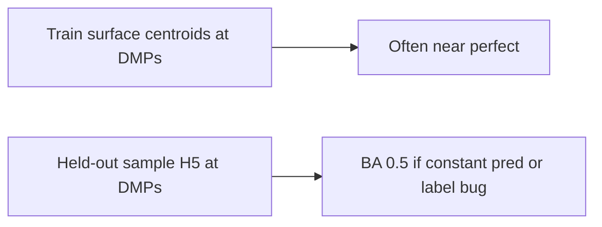

# Investigate 100% train BA vs ~50% test BA

## Interpret the metrics correctly

- **“Training” near 100%** in this stack is often **not** k-fold accuracy on individual training samples. `[MethylClassifier` CLI](packages/methylclassifier/methyl_classifier/cli/main.py) and detector flows frequently validate by classifying **centroids** or **group mean profiles** at DMP positions—those are expected to separate cleanly (see notes around centroid samples and “training centroid” in the same file). Treat that number as a **sanity check on the panel + centroids**, not generalization.
- **Test balanced accuracy ≈ 0.5** for a **binary, class-balanced** test set is a strong hint of **collapsed predictions**: e.g. sklearn `balanced_accuracy` is 0.5 if the model always predicts the same class (sensitivity 1 and specificity 0, or the reverse). Confirm by inspecting the **prediction column** in `predictions.csv`, not only the scalar BA.

## Confirmed evidence (Monte Carlo `run_0001` / `predictions.csv`)

User-provided excerpt shows:

- `**prediction` is always `0`** and `**predicted_class` is always `centroid1**` (in this stack that is the **class-0 / first-class** name from the ECDF package—typically aligned with **control / centroid1**, not “false” in the sense of a bug column).
- `**prob_class0` ~0.73–0.76** and `**prob_class1` ~0.24–0.27** for **both** `expected_class == 0` (healthy) and `expected_class == 1` (disease): the model assigns almost the **same** posterior to every sample, always favoring class 0.
- `**dmps_used` is substantial** (e.g. 2.6k–12.6k of 22,638): this is **not** “no data / all NaN”; it is **weak or mis-oriented discrimination** (or wrong mapping from log-likelihoods to the two labels).
- **Implication**: BA ≈ 0.5 here is “**always predict healthy**” on a balanced test set (all disease wrong, all control right), not label noise or random guessing.

**Refined hypotheses to check next** (in order):

1. `**class_names` / probability column order**: Confirm in the saved classifier metadata that **column 0 = healthy (centroid1)** and **column 1 = disease (centroid2)**. If training inverted vs predictor `expected_class`, you would see healthy wrong and disease right—here everyone is class 0, so inversion alone is less likely unless probs are swapped when writing CSV (quick check: one disease sample should have higher `prob_class1` if the model “meant” cancer—here it does not).
2. **Multi-chromosome + fitted weights** (`weight_method: linear_fitted`, etc.): a bad weight vector can **drown** disease signal and pull the fused score toward the healthy expert every time; inspect per-chromosome logits with `--debug` on one healthy and one disease sample.
3. **Centroid train vs individual test**: The panel is chosen to separate **group centroids**; individual samples can sit in a overlapping bulk while all logits still land on the healthy side if the ECDF template is too rigid or coverage patterns differ by cohort.
4. **Same comparison / same pickles as training**: Ensure this MC iteration’s `project.json` and `classifiers/` outputs correspond to **healthy vs pca_pca1** (or your intended pair), not an OvR bundle whose fusion expects a different geometry.

## Phase 1 — Read artifacts (no code changes)

**Status:** Step 1 is partially done—`predictions.csv` shows uniform class-0 predictions and stable probabilities; still read `validation_metrics.json` for the confusion matrix line.

1. **Open the predictor output** under the run’s `output_dir`:
  - `[predictions.csv](packages/methylpredictor/methyl_predictor/core/predictor.py)`: check `prediction`, `expected_class`, and any **DMP coverage / availability** columns (printed summaries reference `dmps_used` / coverage in `[classify_samples_from_list](packages/methylclassifier/methyl_classifier/cli/main.py)`).
  - `validation_metrics.json`: confirm `balanced_accuracy`, confusion matrix, per-class counts.
2. **If every test row has the same `prediction`**, focus on **feature availability** and **model mode** (next phases), not re-tuning weights.
3. **Confirm test lists**: for MC, holdout CSVs come from `[generate_run_project](packages/methylvalidation/methyl_validation/project_gen.py)` + `[_patch_step_config_predictor_binary_holdouts](packages/methylvalidation/methyl_validation/project_gen.py)`. For manual runs, verify `step_config.predictor` (or `test_group_paths`) points at **validation** directories that actually contain `{chrom}-CG.h5` (for CG-only models).

## Phase 2 — Label and cohort alignment

1. **Binary `test_group_paths` / `class_index`**: `[_build_samples_and_expected](packages/methylvalidation/methyl_validation/../methylpredictor/methyl_predictor/core/predictor.py)` assigns `class_index` from each entry (default `j`). Wrong order vs `MethylClassifier`’s `class_names` produces **systematic mislabeling** or apparent chance performance. Compare predictor cohort order to the saved model’s class order (metadata / CLI load logs).
2. **Monte Carlo binary runs**: the flattened run `project.json` uses `control_group` / `disease_group` from `[_first_control_and_disease_labels](packages/methylvalidation/methyl_validation/project_gen.py)` and explicit `comparisons`. Ensure the **classifier and predictor** both target the **same** comparison output dir (no stale multiclass `multiclass-classifier.pkl` picked up when you expect a binary bundle).
3. **Multiclass / OvR**: If `n_classes > 2` but metrics are interpreted as binary, or `test_group_paths` only defines two groups while the model is OvR-native, behavior can look degenerate. Log `n_classes` and `class_names` at predictor start (`[run_prediction](packages/methylpredictor/methyl_predictor/core/predictor.py)` already prints multiclass info).

## Phase 3 — Data / feature path (most common “50%” cause)

1. **CG-only models**: If `model_contexts == ['CG']`, the loader only reads `*-CG.h5` (`[classify_samples_from_list](packages/methylclassifier/methyl_classifier/cli/main.py)`). Missing or misnamed files → empty or wrong features → constant logits.
2. **DMP positions vs sample chromosomes**: `required_chromosomes` + `dmp_positions_by_chrom` in `[run_prediction](packages/methylpredictor/methyl_predictor/core/predictor.py)` restrict what is loaded. Samples missing whole chromosomes used by the model yield low coverage; watch CLI warnings about skipped chromosomes.
3. **Sample load order vs `expected_classes`**: When samples fail to load, `[load_samples_from_list](packages/methylclassifier/methyl_classifier/utils/data_loader.py)` returns `loaded_indices`; `[classify_samples_from_list](packages/methylclassifier/methyl_classifier/cli/main.py)` **filters** `expected_classes` by those indices. If many paths are bad, you can end up with **unbalanced** remaining labels or silent drops—compare “Loading N samples” vs rows in `predictions.csv`.

## Phase 4 — Model / panel configuration regressions

1. **Dual-branch DMP exports**: Classifier must load pickles built from `**dmps-*-classifier.csv` / classifier panel**, while discovery CSVs are wider. If an old script merges or points the classifier at **discovery** positions by mistake, train (centroid) checks can still look fine while **samples** misalign—verify per-comparison `classifier-*.pkl` and detection dir contents match the run.
2. `**ovr_binary_pickles_from_comparisons`**: For a **single** binary comparison, OvR aggregation is unnecessary; `[project_Healthy_vs_PCa1_only_CG.json](configs/project_Healthy_vs_PCa1_only_CG.json)` sets this to `false`. A full multi-comparison project with `true` builds a different decision surface—compare against your **previous** binary-only project if that is what “used to work.”
3. **Panel / hierarchical readout**: Panel fusion (`[panel_fusion](packages/methylclassifier/methyl_classifier/core/panel_fusion.py)`) affects **reported** columns; ensure you are reading **raw `prediction`** for BA, not a panel-derived column.

## Phase 5 — Targeted experiments (isolate the fault)

1. **Single test sample**: Run `methyl-predictor` (or classifier CLI) on **one known healthy** and **one known disease** path with `--debug`; inspect probabilities and per-chromosome contributions.
2. **Swap labels intentionally**: If BA stays 0.5 but confusion matrix **flips**, you have a **label inversion**; if unchanged, predictions are **constant** or labels are wrong for another reason.
3. **Reproduce on training sample paths** (not centroids): classify a few **training** sample directories that were in the centroid build. If those are also ~50%, the issue is **features/paths/model load**; if train samples are perfect but val not, suspect **holdout paths, MC patching, or domain shift**.

## Optional code-side improvements (after root cause)

- Add a one-line warning in `[run_prediction](packages/methylpredictor/methyl_predictor/core/predictor.py)` when `len(unique(y_pred)) < n_classes` for labeled evaluation.
- Log **min/median DMP coverage** next to BA in `validation_metrics.json` for faster triage.

No code changes are required to **start**; Phases 1–3 usually identify the issue within one run directory.