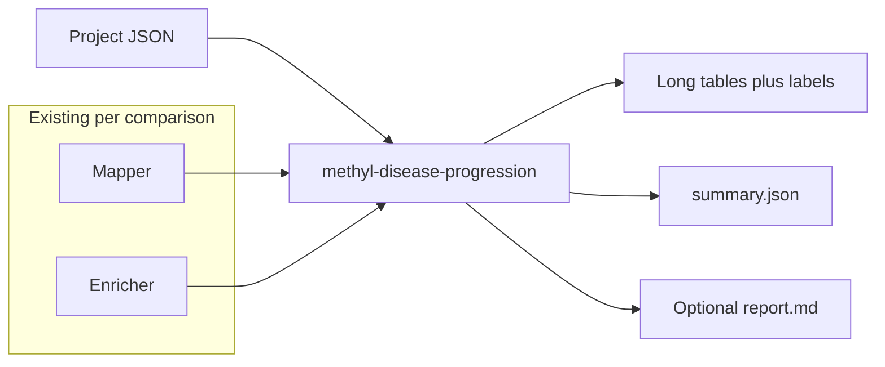

# Disease progression report (MethylDiseaseProgression)

## Goal

After **all** comparisons for a staged disease design have run **MethylMapper** and **MethylEnricher**, produce a **cross-stage synthesis**: genes, pathways, and (when present) modules ranked along progression order—without re-calling Enrichr or remapping DMPs.

Reference project: [configs/project_Healthy_vs_PCa1-4-CG.json](configs/project_Healthy_vs_PCa1-4-CG.json) (`comparisons: "control_vs_each_disease"`, nested `diseases.groups[].stages` for `pca1`…`pca4`).

## Architecture

- **New package** (suggested): `packages/methyldiseaseprogression/` with `methyl_disease_progression` and CLI entry point `**methyl-disease-progression`** (matches `methyl-enricher` / `methyl-mapper` naming).
- **Dependencies**: `pandas`, existing `[load_project](packages/methylutils/methyl_utils/pipeline_config.py)` / `ProjectConfig.get_comparisons()`, and the same path conventions as [packages/methylenricher/methyl_enricher/project_resolver.py](packages/methylenricher/methyl_enricher/project_resolver.py) (`get_enricher_output_dir`, `EnricherStepPaths` pattern).

## Stage ordering

- **Default:** Derive ordered comparison list from project structure: for `control_vs_each_disease`, use the **order of expanded disease leaves** as produced by `get_comparisons()` (should match JSON `stages` order for nested stages).
- **Override:** `step_config.progression.ordered_comparison_labels` (or `ordered_disease_groups`) — explicit list of `disease_group` values matching `ComparisonSpec.disease_group` when order must differ from JSON or when multiple disease families exist.

## Inputs (read-only)

Per ordered stage, resolve enricher (and optionally mapper) directories via project helpers—reuse or mirror logic from `resolve_enricher_paths_per_cancer_group`:

- Enricher: primary pathway result files and, if present, [modules_ranked.csv](packages/methylenricher/methyl_enricher/module_pipeline.py) from the module pipeline.
- Mapper (optional v1 or v1.1): combined gene CSV name from enricher step config (e.g. `combined_csv_name` / `all-gene_name-combined.csv`) under mapper output for that comparison.

**Validation:** Fail with a clear error if a required file for an expected stage is missing (or emit `summary.json` with `status: partial` and non-zero exit—pick one policy and document it).

## Outputs (under project root, suggested)

e.g. `{output_base}/{project_name}/progression/`:

- `genes_long.csv` — gene × stage metrics (presence, rank, weight column TBD from chosen source).
- `pathways_long.csv` — pathway ID × stage (p-value, score, rank columns as available from enricher exports).
- `modules_long.csv` — only if `modules_ranked.csv` exists for that stage.
- `entities_progression_labels.csv` (or split by entity type) — derived tags: e.g. `early_only`, `late_only`, `monotonic_up`, `stable_across_stages`, `stage_specific` (rule-based on long tables for v1).
- `summary.json` — ordered stages, resolved paths, row counts, missing inputs, tool version.
- Optional `report.md` — short human-readable summary and top-N tables for lab review.

## Pipeline integration (optional)

- Add `step_config.progression.enabled` (default `false`).
- In [packages/methylvalidation/methyl_validation/pipeline_runner.py](packages/methylvalidation/methyl_validation/pipeline_runner.py), after a successful **methyl-enricher** step in `run_pipeline_for_production`, call a thin `run_progression(project_json, config)` if enabled. If `skip_enricher` is true, skip progression (nothing to aggregate).
- Do **not** add progression to Monte Carlo iteration runners by default (stability scope stays centroid+detector).

## Documentation

- New package `README` or `docs/IMPLEMENTATION.md` (minimal): CLI, config keys, output schema, dependency on prior mapper/enricher.
- Update [packages/methylvalidation/docs/USAGE.md](packages/methylvalidation/docs/USAGE.md) or [IMPLEMENTATION.md](packages/methylvalidation/docs/IMPLEMENTATION.md) when freeze hook is added.

## Tests

- Unit tests with **fixture CSVs** (small synthetic pathway/module tables) and a **minimal project JSON** mirroring staged disease: assert correct merge order, long-table shape, and label rules.
- Test explicit `ordered_comparison_labels` override vs default order.

## Relationship to existing plan

The classifier overfitting plan item **progression-report** in [.cursor/plans/classifier_overfitting_diagnosis_a5c3b5fb.plan.md](.cursor/plans/classifier_overfitting_diagnosis_a5c3b5fb.plan.md) should be marked **completed** (or superseded-by-link) once this plan is executed; this document is the implementation spec for that work.