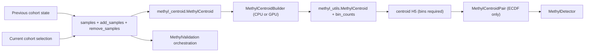

# MethylCentroid Contract Alignment

## Goal

Implement and document the contract you specified:

1. `MethylCentroid` must support both `add_samples` and `remove_samples`
2. ECDF is the only supported centroid-comparison distribution
3. ECDF bins are required and no longer optional
4. MethylValidation can drive centroid updates through the add/remove workflow

The documentation refresh remains part of the work, but only after the code-backed contract matches the intended behavior.

## Code-Backed Anchors

- [`packages/methylcentroid/methyl_centroid/methyl_centroid.py`](packages/methylcentroid/methyl_centroid/methyl_centroid.py) is the user-facing runner/orchestrator. It already accepts `remove_samples`, but the live build path still uses only `self.samples + self.add_samples`, so removal intent is modeled but not applied.
- [`packages/methylutils/methyl_utils/core/methyl_frame.py`](packages/methylutils/methyl_utils/core/methyl_frame.py) already provides low-level `MethylCentroid.add_sample(sample)` and `MethylCentroid.remove_sample(sample)` operations plus derived ECDF-ready centroid statistics.
- [`packages/methylutils/methyl_utils/core/centroid_builder.py`](packages/methylutils/methyl_utils/core/centroid_builder.py) is the real CPU/GPU builder. It already accumulates `N`, `Sx`, `Sx2`, `Sm`, `Su`, `Sc2`, `Swx2`, and `bin_counts`, but still accepts zero-width or inconsistent bin defaults at the public contract boundary.
- [`packages/methylutils/methyl_utils/core/io.py`](packages/methylutils/methyl_utils/core/io.py) and [`packages/methyldetector/methyl_detector/core/methyldetector.py`](packages/methyldetector/methyl_detector/core/methyldetector.py) already behave as if bins are mandatory: load and detector startup fail without `bins` and `bin_counts`.
- [`packages/methylutils/methyl_utils/methyl_centroid_pair.py`](packages/methylutils/methyl_utils/methyl_centroid_pair.py) and [`packages/methyldetector/methyl_detector/models/config.py`](packages/methyldetector/methyl_detector/models/config.py) still expose legacy distribution-selection logic that conflicts with the ECDF-only contract.
- [`packages/methylvalidation/methyl_validation/project_gen.py`](packages/methylvalidation/methyl_validation/project_gen.py) and [`packages/methylvalidation/methyl_validation/pipeline_runner.py`](packages/methylvalidation/methyl_validation/pipeline_runner.py) are the main integration points if validation runs are going to pass cohort deltas into centroid builds.

## Target Flow

## Current Gaps To Close

- `remove_samples` exists in config, constructor plumbing, and docs, but `build_centroid()` and `calculate_centroid()` do not consume it.
- The active centroid comparison path is mostly ECDF in practice, but `MethylCentroidPair` and detector config still expose Beta, Normal, and Beta-Mixture distribution knobs and exports.
- Bins are already effectively mandatory at save, load, and detector boundaries, but config, runner, builder, and docs still present them as optional or allow `binned_stats_bins=0`.
- MethylValidation currently rebuilds each run from generated train CSVs and does not yet emit or pass add/remove deltas.

## Planned Implementation Work

### 1. Make sample updates real

- In [`packages/methylcentroid/methyl_centroid/methyl_centroid.py`](packages/methylcentroid/methyl_centroid/methyl_centroid.py), implement a canonical cohort-update path that applies `remove_samples` as well as `add_samples`.
- Use the existing low-level `add_sample()` and `remove_sample()` methods from [`packages/methylutils/methyl_utils/core/methyl_frame.py`](packages/methylutils/methyl_utils/core/methyl_frame.py) where possible, or fall back to deterministic rebuild semantics when prior centroid state is unavailable.
- Reapply `min_coverage` and `min_samples` after removals so updated centroids match full-rebuild behavior.
- Ensure the final active cohort is written consistently to both centroid metadata (`samples_used`) and `{chrom}-{ctx}_config.json`.

### 2. Make MethylValidation able to use deltas

- In [`packages/methylvalidation/methyl_validation/project_gen.py`](packages/methylvalidation/methyl_validation/project_gen.py), add support for generating centroid inputs that carry forward prior cohort membership plus per-run additions and removals.
- In [`packages/methylvalidation/methyl_validation/pipeline_runner.py`](packages/methylvalidation/methyl_validation/pipeline_runner.py), add the plumbing needed to pass those centroid updates into `methyl-centroid`.
- Define a safe fallback: if previous centroid state or removable sample files are unavailable, validation should rebuild that centroid from the resolved full cohort instead of producing a partially updated artifact.

### 3. Enforce ECDF-only comparison

- Simplify [`packages/methylutils/methyl_utils/methyl_centroid_pair.py`](packages/methylutils/methyl_utils/methyl_centroid_pair.py) so the supported comparison path is unconditionally ECDF-based for overlap and effect-size work.
- Remove or ignore public distribution-selection knobs from [`packages/methyldetector/methyl_detector/models/config.py`](packages/methyldetector/methyl_detector/models/config.py) and stop passing them through from detector runtime.
- Update detector exports and naming so `dist` and `dist_name` no longer imply Beta, Normal, or Beta-Mixture choices for centroid comparison.
- Keep derived `alpha` and `beta` fields only if they are still needed as derived statistics by adjacent downstream logic; they should no longer represent alternative compare modes.

### 4. Make positive bins mandatory

- Tighten [`packages/methylcentroid/methyl_centroid/config.py`](packages/methylcentroid/methyl_centroid/config.py) so `binned_stats_bins >= 1` and remove all `0 = disabled` wording.
- Fail fast in [`packages/methylcentroid/methyl_centroid/methyl_centroid.py`](packages/methylcentroid/methyl_centroid/methyl_centroid.py) and [`packages/methylutils/methyl_utils/core/centroid_builder.py`](packages/methylutils/methyl_utils/core/centroid_builder.py) when bins are absent or non-positive.
- Normalize the default bin count across runner, builder, helpers, and docs so the public contract has one canonical default.
- Keep load and save boundaries strict in [`packages/methylutils/methyl_utils/core/io.py`](packages/methylutils/methyl_utils/core/io.py) and [`packages/methylutils/methyl_utils/core/methyl_frame.py`](packages/methylutils/methyl_utils/core/methyl_frame.py), but make the resulting error messages explicit instead of relying on late failures.

## Files To Update

- Core update logic: [`packages/methylcentroid/methyl_centroid/methyl_centroid.py`](packages/methylcentroid/methyl_centroid/methyl_centroid.py)
- Public config and CLI surface: [`packages/methylcentroid/methyl_centroid/config.py`](packages/methylcentroid/methyl_centroid/config.py), [`packages/methylcentroid/methyl_centroid/cli.py`](packages/methylcentroid/methyl_centroid/cli.py), [`packages/methylcentroid/methyl_centroid/project_resolver.py`](packages/methylcentroid/methyl_centroid/project_resolver.py)
- Builder, data, and I/O: [`packages/methylutils/methyl_utils/core/centroid_builder.py`](packages/methylutils/methyl_utils/core/centroid_builder.py), [`packages/methylutils/methyl_utils/core/methyl_frame.py`](packages/methylutils/methyl_utils/core/methyl_frame.py), [`packages/methylutils/methyl_utils/core/io.py`](packages/methylutils/methyl_utils/core/io.py)
- Downstream comparison contract: [`packages/methylutils/methyl_utils/methyl_centroid_pair.py`](packages/methylutils/methyl_utils/methyl_centroid_pair.py), [`packages/methyldetector/methyl_detector/models/config.py`](packages/methyldetector/methyl_detector/models/config.py), [`packages/methyldetector/methyl_detector/core/methyldetector.py`](packages/methyldetector/methyl_detector/core/methyldetector.py)
- Validation integration: [`packages/methylvalidation/methyl_validation/project_gen.py`](packages/methylvalidation/methyl_validation/project_gen.py), [`packages/methylvalidation/methyl_validation/pipeline_runner.py`](packages/methylvalidation/methyl_validation/pipeline_runner.py)
- Documentation and examples: [`packages/methylcentroid/README.md`](packages/methylcentroid/README.md), [`packages/methylcentroid/docs/MethylCentroid_Theoretical_Foundation.md`](packages/methylcentroid/docs/MethylCentroid_Theoretical_Foundation.md), [`packages/methylcentroid/docs/METHYLCENTROID_IMPLEMENTATION.md`](packages/methylcentroid/docs/METHYLCENTROID_IMPLEMENTATION.md), [`packages/methylcentroid/docs/USAGE.md`](packages/methylcentroid/docs/USAGE.md), [`packages/methylcentroid/docs/METHYLCENTROID_COMPREHENSIVE_DOCUMENTATION.md`](packages/methylcentroid/docs/METHYLCENTROID_COMPREHENSIVE_DOCUMENTATION.md), and shipped example configs under [`packages/methylcentroid/configs`](packages/methylcentroid/configs)

## Documentation Deliverables

- Rewrite the MethylCentroid docs around the requested sections:
  1. theoretical foundation
  2. implementation (CPU and GPU)
  3. usage (`config.json`, CLI, class)
  4. dependencies (`MethylSample`, `MethylCentroidPair`, `MethylDetector`, `MethylUtils`)
- Explicitly document the two `MethylCentroid` concepts:
  - runner or orchestrator in `methyl_centroid`
  - data object in `methyl_utils`
- Update examples so they show required metadata fields, `add_samples` and `remove_samples`, positive bins, and current CLI entry points.
- Remove legacy documentation that still promises Beta, BB, or BMM distribution selection or optional bins for supported centroids.

## Verification

- Add regression tests that confirm `remove_samples` changes the built centroid and final saved cohort membership.
- Add config, builder, and runner tests that reject `binned_stats_bins <= 0`.
- Add downstream tests that ensure the supported centroid comparison path is ECDF-only and no longer accepts removed distribution-selection config.
- Smoke-test the MethylValidation handoff so generated validation runs can provide centroid deltas or fall back cleanly to full rebuild behavior.
