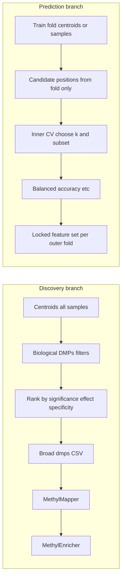

# Dual-branch DMP design (discovery vs prediction)

## How this maps to the current codebase

**Single shared list today.** In `[packages/methyldetector/methyl_detector/core/methyldetector.py](packages/methyldetector/methyl_detector/core/methyldetector.py)`, after biological filtering, `_select_dmps_multicontext` applies the **effect_size elbow** and the docstring states that **exported DMPs and the classifier both use this set**. The same `selected_dmps_df` is passed to `_export_unified_csv` and `_save_unified_model`.

**Unused / dormant pieces.**

- `[packages/methyldetector/methyl_detector/models/config.py](packages/methyldetector/methyl_detector/models/config.py)` defines `min_dmps_for_export` (“ensure enough DMPs for gene mapping”) but **nothing in core reads it** — a planned split was never wired.
- `_optimize_dmps_featurecuts` (and related helpers) in `methyldetector.py` reference `self.config.featurecuts_*` and are **never called** from `run` / `_run_multi_context`; they are effectively dead paths relative to the main pipeline.
- `[packages/methylclassifier/methyl_classifier/...](packages/methylclassifier/methyl_classifier/core/classifier.py)` loads fixed positions from the saved pickle; there is **no inner-loop top‑k selection** tied to balanced accuracy.

**Monte Carlo already reduces *outer* leakage.** `[packages/methylvalidation/methyl_validation/project_gen.py](packages/methylvalidation/methyl_validation/project_gen.py)` generates train-only cohorts per iteration so centroids (and thus DMPs) for that iteration are built from training samples — good for iteration-level holdout. It does **not** implement **nested** CV for choosing feature count or which DMPs to keep *within* the training fold.

**MethylMapper’s `optimize_dmps`** (`[packages/methylmapper/methyl_mapper/bedtools_mapper.py](packages/methylmapper/methyl_mapper/bedtools_mapper.py)`) optimizes DMP count for **stable gene sets / enrichment** — conceptually closer to the **discovery** branch than to prediction, and should not be mistaken for out-of-sample classifier tuning.

## Recommended architecture (aligned with your text)

| Branch            | Purpose                                  | Selection principles                                                                                                                                                                                       | Primary consumers                                                                                                        |
| ----------------- | ---------------------------------------- | ---------------------------------------------------------------------------------------------------------------------------------------------------------------------------------------------------------- | ------------------------------------------------------------------------------------------------------------------------ |
| **A. Discovery**  | Mechanism, stages, pathways              | q-value, effect size, stage specificity / monotonicity, resampling stability, optional regional support; **broader** lists OK                                                                              | `[MethylMapper](packages/methylmapper/)`, `[MethylEnricher](packages/methylenricher/)`, narrative / supplementary tables |
| **B. Prediction** | Healthy vs PCa (and optional multiclass) | **Nested CV**: rank and choose top‑k **only inside training data**; optimize **balanced accuracy** (or chosen metric); redundancy control; **do not** reuse discovery-only rules as the final feature lock | `[MethylClassifier](packages/methylclassifier/)` / predictor, locked panel for deployment                                |

**Hard rule for papers:** discovery lists may be built with full data for interpretation; **reported classifier performance** must use selection strictly inside training (per outer fold), or you accept that a full-cohort “panel” estimate is descriptive and validate only via a separate locked protocol (e.g. prespecified k from pilot, or nested CV).

## Implementation directions (when you move out of plan-only mode)

1. **Split MethylDetector outputs (minimal, high leverage)**
  - **Discovery export:** e.g. `sorted_by_importance_df` after biological filters, with **elbow optional/disabled** via existing `dynamic_dmp_cutoff_enabled` / `dynamic_dmp_cutoff_relaxation`, or a new explicit mode `dmp_export_mode: "discovery" \| "classifier" \| "both"`.  
  - **Classifier export:** either keep elbow + current ECDF model **only** for a `classifier-*.pkl` path, or replace with a **separate** training step (below).  
  - **Wire `min_dmps_for_export`** (or rename for clarity) so discovery CSV can retain at least N rows for mapping even if the classifier uses fewer features.
2. **Revive or replace FeatureCuts *only* as part of prediction training**
  - If reusing `_optimize_dmps_featurecuts`, it must run **inside** each outer training fold (using only fold centroids or fold samples), with config fields formally added to `[MethylDetectorConfig](packages/methyldetector/methyl_detector/models/config.py)` and **no** call path from the discovery export.  
  - Alternatively, implement nested CV in `[packages/methylvalidation](packages/methylvalidation/)` or a small `methyl-predict-train` module that: loads candidate positions from fold-level detection, runs inner CV over k / redundancy pruning, fits ECDF or another model, reports stability of chosen positions across folds.
3. **Biology categories (core / stage-specific / progression)**
  - Largely **post-detection aggregation** across comparisons already produced by `control_vs_each_disease` in project JSONs (`[pipeline_config.py](packages/methylutils/methyl_utils/pipeline_config.py)` comparison layout).  
  - Add a script or notebook step: intersect DMPs across stage contrasts (core PCa), set-difference per stage (stage-specific), and trend-based flags (progression) — outputs are **labels on discovery BED/CSV**, not required for the classifier branch.
4. **Documentation / methods text**
  - Add a short methods subsection (theory book chapter or `docs/`) stating explicitly: *mechanistic lists fed mapper/enricher; predictive panel selected by nested CV on balanced accuracy; no overlap in selection logic for performance claims.*

## What not to do

- Do **not** feed MethylMapper the same elbow-trimmed list as the only list if that list was chosen to maximize discrimination on the same samples used to report accuracy — unless mapper is clearly labeled exploratory and performance is from nested CV on a different selection path.  
- Do **not** treat MethylMapper `optimize_dmps_for_stable_genes` as substitute for **classifier** generalization tuning; keep that knob on the discovery branch.

## Suggested first milestone

Implement **dual CSV + clear metadata** from MethylDetector (discovery vs classifier filenames + JSON sidecar describing rules), point **mapper/enricher** configs at the discovery CSV, and leave the current classifier pickle as “baseline” until nested CV training is added in a second milestone.