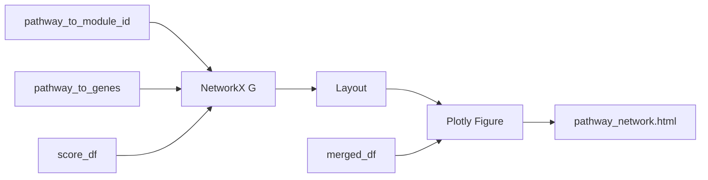

# Dynamic module/pathway/gene network plot (Cytoscape-style)

## Goal

Once we have **modules**, **pathways**, and **genes** (from `modules_ranked.csv`, `pathway_overlap_genes.csv`, and enrichment merged data), produce a **dynamic (interactive)** network plot similar to Cytoscape: nodes for modules, pathways, and/or genes; edges for membership or similarity; zoom, pan, hover, and optional drag.

---

## Graph model (what to draw)

Two natural levels:

1. **Pathway–pathway similarity graph (already in memory)**
  Nodes = pathways, edges = Jaccard similarity above threshold. Node color/size by module or significance. This is the graph we cluster with Louvain; visualizing it shows why pathways ended up in the same module.
2. **Pathway–gene bipartite (or module–pathway–gene)**
  Nodes = pathways and genes (and optionally modules); edges = “gene in pathway” or “pathway in module”. Cytoscape-style enrichment views often use this: genes on one side, pathways on the other, or a layered layout (modules → pathways → genes).

**Recommendation:** Support (1) first—pathway similarity network with nodes colored by module and optional node size by number of genes or significance—then optionally add (2) as a second view (e.g. a separate HTML or tab).

---

## Options for generating a dynamic plot

| Approach                 | How it works                                                                                                                   | Pros                                                                                                          | Cons                                                                    |
| ------------------------ | ------------------------------------------------------------------------------------------------------------------------------ | ------------------------------------------------------------------------------------------------------------- | ----------------------------------------------------------------------- |
| **Plotly + NetworkX**    | Build graph in NetworkX, compute layout (e.g. `spring_layout`), draw nodes as `go.Scatter`, edges as line traces; export HTML. | Already in pipeline (plotly, networkx). No new deps. Zoom, pan, hover. Fits MethylDetector/methylutils style. | No node-drag or force-directed physics; layout is static after compute. |
| **PyVis**                | Build NetworkX graph, convert with `pyvis.Network.from_nx(G)`, write one HTML file (uses vis.js).                              | Single HTML, very interactive: drag nodes, physics, zoom, hover. One extra dependency (`pyvis`).              | Different look from rest of pipeline; dependency.                       |
| **Cytoscape.js in HTML** | From Python: export nodes/edges to JSON; write HTML that loads Cytoscape.js from CDN and renders the graph.                    | Most Cytoscape-like look and behavior; no Python at view time; styling and interactions match Cytoscape.      | Need a small HTML/JS template and JSON schema; no new pip deps.         |

---

## Recommended approach: Plotly first, optional PyVis or Cytoscape.js

- **Phase 1 (recommended): Plotly + NetworkX**  
  - **Why:** No new dependencies; plotly and networkx are already in [requirements-pipeline.txt](requirements-pipeline.txt) and used elsewhere (e.g. MethylDetector, methylutils).  
  - **How:** In [module_pipeline.py](packages/methylenricher/methyl_enricher/module_pipeline.py) (or a new `module_network_plot.py`), after we have `pathway_to_module_id` and `pathway_to_genes`:  
    - Build a NetworkX graph: nodes = pathways (and optionally one node per module); edges = pathway–pathway from the same similarity graph used for clustering (or pathway–module membership).  
    - Assign node attributes: module label, n_genes, score.  
    - Compute layout: `nx.spring_layout(G)` or `nx.kamada_kawai_layout(G)`.  
    - Plot with Plotly: one `go.Scatter` for nodes (x, y, size by n_genes or score, color by module), and edge traces (line segments between node positions).  
    - Add hover: pathway name, module, n_genes, score.  
    - Write `module_network.html` (or `pathway_network.html`) in the same output dir when `--modules` is used. Option: `--no-plot` to skip.
  - **Result:** One HTML file; open in browser for zoom, pan, hover. Layout is fixed at generation time.
- **Phase 2 (optional): Richer interactivity**  
  - **PyVis:** Add `pyvis` to methylenricher (or pipeline) deps; build the same NetworkX graph; export via PyVis to e.g. `pathway_network_pyvis.html` for drag and physics.  
  - **Cytoscape.js:** Add a small HTML template and a function that writes `nodes`/`edges` JSON (and optionally `styles`) and an HTML file that loads Cytoscape.js and renders it; call from the module pipeline when a flag is set. Gives the most “Cytoscape desktop–like” experience.

---

## Implementation sketch (Phase 1: Plotly)

- **New file (suggested):** [packages/methylenricher/methyl_enricher/module_network_plot.py](packages/methylenricher/methyl_enricher/module_network_plot.py)  
  - `build_pathway_similarity_graph(pathway_to_module_id, pathway_to_genes, merged_df)`  
    - Reuse or recompute the same graph used for clustering (pathways as nodes, edges where Jaccard ≥ threshold).  
    - Attach node attributes: `module_label`, `n_genes`, `score` (from score_df or merged_df).
  - `plot_pathway_network(G, path_by_module, layout='spring')`  
    - Compute positions with NetworkX.  
    - Build Plotly figure: edges as line scatter, nodes as scatter (color by module, size by n_genes or score).  
    - Add hover text (pathway name, module, n_genes).  
    - Return `go.Figure`; caller writes `fig.write_html(out_path)`.
- **Integration:** In [module_pipeline.py](packages/methylenricher/methyl_enricher/module_pipeline.py), after writing `modules_ranked.csv` and `pathway_overlap_genes.csv`, if a flag `write_network_plot=True` (default True when `--modules`), call the plot function and write e.g. `pathway_network.html` to `output_dir`.  
- **CLI:** No new flag for Phase 1 (plot generated whenever `--modules` is used); optionally add `--no-network-plot` to skip.

---

## Data flow

---

## Summary

- **Best solution for a dynamic plot with no new dependencies:** **Plotly + NetworkX** — build the pathway similarity graph (and optionally module/pathway/gene graph), compute layout in NetworkX, render with Plotly, export a single HTML file for interactive zoom/pan/hover.  
- **For a more Cytoscape-like, drag-and-physics experience:** add **PyVis** (one dependency, one HTML) or **Cytoscape.js** (HTML + JSON export from Python, no extra pip deps for viewing).  
- **Graph to plot first:** pathway–pathway similarity network with nodes colored by module and sized by gene count or score; then optionally a pathway–gene or module–pathway–gene view.

