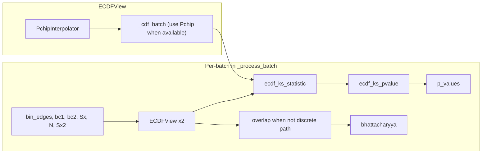

# ECDF: Continuous test (Pchip) and overlap

## Current state

- **[distribution_views.py](packages/methylutils/methyl_utils/core/distribution_views.py)**: `ECDFView` already uses `scipy.interpolate.PchipInterpolator` for per-position CDF in `_cdf()` (monotonic on [0,1]). `overlap(other)` uses `_cdf()` in a loop (so it uses Pchip). **But** `_cdf_batch()` does **not** use Pchip; it uses piecewise-linear interpolation from bin edges (lines 284–304). So any batch caller (e.g. `ecdf_ks_statistic`) currently gets piecewise-linear CDF, not the spline.
- **[statistical_tests.py](packages/methylutils/methyl_utils/statistical_tests.py)**: `ecdf_ks_statistic(ecdf_view1, ecdf_view2, position_indices, grid_size)` uses `_cdf_batch()` when present, so it uses piecewise-linear. `ecdf_ks_pvalue(...)` uses that KS statistic and `kstwobign.sf(sqrt(n_eff)*D)` for the asymptotic two-sided p-value. So a **continuous-ECDF-based p-value** path already exists; it just does not use Pchip in the batch path.
- **[methyl_centroid_pair.py](packages/methylutils/methyl_utils/methyl_centroid_pair.py)**: For ECDF positions, **p-value** is set via a loop with `chi2_contingency` on the 2×n_bins table (lines 1156–1189). **Overlap** for ECDF (when not using the discrete fast path) is computed by building two `ECDFView` instances and calling `view1.overlap(view2)` (lines 1379–1396), which uses Pchip in a per-position loop.

## Assumptions

- **Binned stats**: All centroids used with ECDF distribution have `binned_stats` (bin_edges, bin_counts). This is validated in the pipeline; no fallback for absent binned stats is required.

## Goal

1. **Statistical test for ECDF**: Stop using the chi-squared test. Use the **continuous ECDF** (Pchip-interpolated) to compute a proper test: KS statistic on a grid, then asymptotic p-value. No Beta LRT approximation for the primary ECDF path.
2. **Overlap**: Keep using the continuous ECDF; ensure the same representation (Pchip) is used consistently (including in batch paths).
3. **Fallback**: If Pchip is not available, keep existing piecewise-linear CDF (or discrete BC) as in current code; no fallback for missing binned stats.
4. **Optional**: Hybrid GPU+CPU: CDF evaluation on CPU (Pchip), KS = max|F1−F2| on GPU, p-value on CPU.

---

## 1. Use Pchip in ECDFView._cdf_batch

**File:** [packages/methylutils/methyl_utils/core/distribution_views.py](packages/methylutils/methyl_utils/core/distribution_views.py)

- In `_cdf_batch`, when `self._interpolators` is not None, evaluate the **Pchip** interpolators on the grid instead of piecewise-linear:
  - For each position index in `position_indices`, compute `out[i] = self._interpolators[position_indices[i]](grid)` (with clipping to [0,1]).
  - Keep the existing piecewise-linear implementation as the fallback when `_interpolators` is None (e.g. Pchip not installed).
- This makes `ecdf_ks_statistic` (and thus `ecdf_ks_pvalue`) use the same monotonic continuous ECDF as `overlap()` when Pchip is available.

---

## 2. Replace chi-squared with ECDF KS p-value in centroid pair

**File:** [packages/methylutils/methyl_utils/methyl_centroid_pair.py](packages/methylutils/methyl_utils/methyl_centroid_pair.py)

- When `np.any(use_ecdf_mask)` we assume binned stats are present (validation: `has_binned1`, `has_binned2`, `same_bin_edges`; no fallback for absence).
  - **Build two ECDFViews** for the batch (same inputs as the current overlap path: `bin_edges`, `bc1_batch`, `bc2_batch`, plus Sx, N, Sx2 for each centroid). Reuse the same construction as at lines 1381–1393 (or factor a small helper to build views once).
  - Call **ecdf_ks_pvalue(view1, view2, position_indices, N1, N2, grid_size)** with `position_indices = np.arange(len(positions))` (batch indices) and grid_size from config (e.g. `ecdf_ks_grid_size`, default 256). This returns KS statistic and p-values.
  - Set `p_values[use_ecdf_mask] = returned_pvalues` and `dist_ids[use_ecdf_mask] = DIST_ECDF`. Remove the entire chi2_contingency loop and pseudocount logic for ECDF.
- Ensure the views are built once per batch when ECDF is used, and reused for overlap when `overlap_approx_batch` is None (i.e. when we need continuous ECDF overlap). So: build views when `np.any(use_ecdf_mask)`; use them first for p-value, then for overlap if not using discrete fast path.

---

## 3. Overlap path (no logic change; consistency via _cdf_batch)

- **Overlap** already uses `ECDFView.overlap()` which uses `_cdf()` (Pchip) in a loop. No change required.
- After step 1, any future batch overlap path that uses `_cdf_batch` (e.g. a vectorized overlap) would also use Pchip when available.

---

## 4. Fallback when Pchip is unavailable

**File:** [packages/methylutils/methyl_utils/core/distribution_views.py](packages/methylutils/methyl_utils/core/distribution_views.py)

- When `PchipInterpolator` is None, `ECDFView` already leaves `_interpolators` as None; `_cdf` uses `np.interp` (piecewise-linear); `_cdf_batch` remains piecewise-linear. So KS statistic and p-value still exist (piecewise-linear ECDF).
- **Optional explicit fallback** (if you want to document “discrete BC” as the official fallback): when `_interpolators` is None, `overlap()` could delegate to a discrete Bhattacharyya from bin counts (e.g. call `discrete_overlap_from_bin_counts` on `_bin_counts` vs other’s bin counts) instead of the current piecewise-linear KS. That would make “no Pchip” path use discrete BC for overlap. For p-value with “no Pchip”, keep using piecewise-linear KS via `ecdf_ks_pvalue` (still a valid continuous-ish test) or document that we use discrete BC + an approximate p-value. Recommendation: keep piecewise-linear for both overlap and p-value when Pchip is missing (no code change), and document in docstrings that when Pchip is available we use the monotonic continuous ECDF; when it is not, we use piecewise-linear CDF and optionally mention discrete BC as an alternative approximation.

---

## 5. Optional: GPU + CPU hybrid for KS

- **Idea:** Evaluate CDF on a fixed grid on CPU (Pchip per position, or batch via step 1), then compute KS = max|F1−F2| per position on GPU (CuPy), then p-value with `kstwobign.sf` on CPU.
- **Place:** Either inside `ecdf_ks_statistic` (accept optional `use_gpu` and transfer arrays to CuPy for the max reduction) or in a new helper in `statistical_tests.py` used by the detector.
- **Scope:** Only the max-reduction and optional transfer; Pchip stays on CPU. This is an optimization and can be a follow-up task.

**Representation and reuse**

- F(x) is continuous (Pchip interpolant) but is **not** represented or executed on the GPU. The GPU never sees “a function”; it only sees arrays.
- **Discrete representation:** We evaluate F on a fixed grid of x values (e.g. `grid = np.linspace(0, 1, 256)`). That yields arrays `F1_grid`, `F2_grid` of shape `(n_positions, grid_size)` (float64). So the “thing” we use for KS is this discrete approximation: KS ≈ max over grid of |F1_grid − F2_grid| (the true sup is approximated by the max over the grid).
- **Pipeline:** On CPU we have `ECDFView._cdf_batch(position_indices, grid)` → returns shape `(n_positions, grid_size)`. Those arrays can be passed to CuPy (e.g. `cp.asarray(F1_grid)`); then on GPU we compute `cp.max(cp.abs(F1_grid - F2_grid), axis=1)`. So the continuous function is only used on CPU to produce the grid samples; the GPU does a single reduction on the samples.
- **Saving for future reuse:** The continuous ECDF is fully defined by `(bin_edges, bin_counts)` (or equivalently `cdf_at_edges`), which is already stored in the centroid’s `binned_stats`. So we do not need to “save” F as a continuous function for persistence; we can always reconstruct the Pchip interpolator from `binned_stats` and re-evaluate on any grid. Caching the grid evaluation (F1_grid, F2_grid) in memory is only for performance within a run (e.g. reuse the same grids for overlap and KS without recomputing); it is not required for persistence.

---

## Data flow (high level)

---

## Files to touch

| File                                                                                  | Changes                                                                                                                                                                                                         |
| ------------------------------------------------------------------------------------- | --------------------------------------------------------------------------------------------------------------------------------------------------------------------------------------------------------------- |
| [distribution_views.py](packages/methylutils/methyl_utils/core/distribution_views.py) | Use Pchip in `_cdf_batch` when `_interpolators` is not None. Optional: when Pchip is None, overlap could use discrete BC.                                                                                       |
| [methyl_centroid_pair.py](packages/methylutils/methyl_utils/methyl_centroid_pair.py)  | Build ECDFViews once when ECDF positions exist (assume binned stats present); call `ecdf_ks_pvalue` for ECDF p-values; remove chi2_contingency loop; reuse views for overlap when not using discrete fast path. |
| [statistical_tests.py](packages/methylutils/methyl_utils/statistical_tests.py)        | No change required; `ecdf_ks_statistic` / `ecdf_ks_pvalue` will automatically use Pchip once `_cdf_batch` uses it. Optional later: GPU branch for max in `ecdf_ks_statistic`.                                   |

---

## Testing

- Unit test: ECDFView with Pchip vs without (or mock); `_cdf_batch` output matches per-position `_cdf` on the same grid when Pchip is available.
- Integration: run detector with `distribution="ecdf"` and check that (1) statistical DMP count is non-zero when there is signal, (2) no chi2_contingency in the ECDF path, (3) overlap and p-values are consistent (e.g. low overlap correlates with low p-value).

