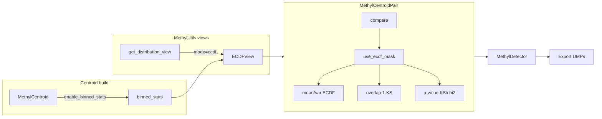

# Add empirical distribution (ECDF) as a centroid distribution option

## Context

- **MethylCentroid** (methylcentroid package) builds centroids via MethylUtils and can optionally store **binned_stats**: `bin_edges` (1D) and `bin_counts` (2D: `n_positions x n_bins`) in HDF5. This is already the right representation for an approximate ECDF per position (CDF = cumsum of bin counts / total count).
- **MethylUtils** provides distribution **views** (`[distribution_views.py](packages/methylutils/methyl_utils/core/distribution_views.py)`): protocol `MethylDistributionView` (parameters, mean, overlap) and implementations Counts, Normal, Beta, BetaBinomial, BMM; plus `get_distribution_view(centroid, mode)` and `log_probability_sample_given_centroid(..., mode)`.
- **MethylCentroidPair** (`[methyl_centroid_pair.py](packages/methylutils/methyl_utils/methyl_centroid_pair.py)`) uses a single `distribution` mode (`"auto"` | `"beta"` | `"normal"` | `"beta_binomial"` | `"beta_mixture"`), selects per-position masks (`use_normal_mask`, `use_beta_binom_mask`, `use_mixture_mask`, `use_beta_mask`), and fills `mean1`/`mean2`, `delta_mean`, variances, p-values, and Bhattacharyya (overlap) from the chosen distribution. Results use `dist` id (e.g. `DIST_BETA`, `DIST_NORMAL`).
- **MethylDetector** delegates DMP detection to MethylCentroidPair and passes `distribution` and `delta_mean_mode` from config (`[config.py](packages/methyldetector/methyl_detector/models/config.py)`); it consumes the compare-DataFrame (mean, variance, overlap, effect_size, etc.).

## Design choices

1. **ECDF representation**
  Use existing **binned_stats** (bin_edges + bin_counts per position). No new storage format. When `binned_stats` is absent, ECDF is not available for that centroid (same as BMM requiring mixture params).
2. **When to use ECDF (default in auto)**
  - **ECDF as default for small N**: In `distribution="auto"`, use ECDF when **both** centroids have `binned_stats`, same `bin_edges`, and **N is below a configurable threshold** (e.g. `max_N_for_ecdf`, default e.g. 30–50). Rationale: ECDF is the real data distribution; Beta is the correct parametric form for large N; Beta-Binomial fits when coverage differences matter at intermediate N. So auto selection order: **(1) ECDF** when N1 and N2 < threshold and binned_stats present; **(2)** existing logic: Normal for very small N, Beta-Binomial for overdispersion/low coverage, **(3) Beta** as default for large N, **(4)** mixture where available.
  - Add `**max_N_for_ecdf`** (or `min_N_for_beta`) to MethylCentroidPair and MethylDetector config so users can set the switch point.
  - Explicit option: `distribution="ecdf"` forces ECDF where binned_stats exist; otherwise fallback + warning.
  - Require both centroids to have `binned_stats` and same `bin_edges` for ECDF comparison (mirror BMM/binned handling).
3. **Mean and variance under ECDF**
  - **Mean**: sample mean = Sx/N (already available).  
  - **Variance**: sample variance = (Sx2 - Sx²/N) / max(N-1, 1) (already available).  
  ECDF view exposes mean/variance from sufficient stats; binned_stats is used for CDF (interpolated), overlap, and log-probability.
4. **Interpolated ECDF (splines)**
  - With 50 or 100 bins, the ECDF should be defined for **any** x ∈ [0,1], not only at bin edges. Use **spline interpolation** (e.g. cubic) on the step-CDF built from (bin_edges, cumsum(bin_counts)/sum(bin_counts)) so that:
    - **F(x)** = interpolated CDF at any x (monotone; clip to [0,1]).
    - **PDF(x)** = F'(x) from the spline derivative for log-probability and density queries.
  - Implementation: per position, build CDF values at bin edges (and optionally at midpoints if needed for stability); fit a **monotone** interpolant (e.g. `scipy.interpolate.PchipInterpolator` or cubic spline with care at boundaries). Use this to evaluate F(x) and F'(x) for overlap (KS on a fine grid or analytically) and for log P(sample | centroid) = log PDF(x).
  - Fallback: if splines are too heavy per position, **piecewise linear** CDF between bin edges gives F(x) for any x and piecewise-constant PDF; optional upgrade to spline for smoother PDF.
5. **Overlap (ECDF vs ECDF)**
  Use **1 - KS** with the **interpolated** CDFs: KS = max over a fine grid (or over bin edges if using piecewise linear) of |F1(x) - F2(x)|. Return value in [0, 1]. With splines, evaluate F1(x) and F2(x) at the same grid points (e.g. 200–500 points in [0,1]).
6. **P-value for ECDF**
  Use an approximate test: **two-sample KS** on the interpolated CDFs (e.g. critical values or permutation), or **chi-square** on bin counts with pooled expected counts. Document as approximate when using binned/interpolated data.
7. **Log-probability (sample given centroid under ECDF)**
  For sample proportion x at a position: evaluate the **interpolated PDF** at x (spline derivative F'(x)), with a small floor (e.g. 1e-10) to avoid log(0). Return log(PDF(x)) per position. If using piecewise-linear CDF, PDF is constant per bin = (count_in_bin / N) / bin_width; evaluate at x and return log(PDF(x)).

---

## Implementation plan

### 1. MethylUtils – ECDF view (interpolated) and get_distribution_view / log_probability

**File: [packages/methylutils/methyl_utils/core/distribution_views.py](packages/methylutils/methyl_utils/core/distribution_views.py)**

- Add **ECDFView** implementing `MethylDistributionView`:
  - **Constructor**: `(bin_edges, bin_counts, Sx, N [, Sx2])`. `bin_counts` shape `(n_positions, n_bins)`. Optionally accept a centroid and read `binned_stats` + Sx, N, Sx2.
  - **Interpolated CDF**: For each position, build step-CDF at bin_edges: `cdf_vals = cumsum(bin_counts, axis=1) / sum(bin_counts)`. Fit a **monotone spline** (e.g. `scipy.interpolate.PchipInterpolator`) on `(bin_edges, cdf_vals)` so that **F(x)** is defined for any x ∈ [0,1]. Store per-position interpolators or a vectorized evaluator. Ensure F(0)=0, F(1)=1 and monotonicity.
  - **parameters**: `{"bin_edges", "bin_counts", "Sx", "N}` (and Sx2 if provided).
  - **mean**: Sx/N per position.
  - **variance**: (Sx2 - Sx²/N) / max(N-1, 1) when Sx2 available; else approximate from binned moments.
  - **overlap(other)**: if other is ECDFView, at aligned positions evaluate F1(x) and F2(x) on a **fine grid** (e.g. 256–512 points in [0,1]); KS = max|F1(x) - F2(x)|; return 1 - KS (clipped [0,1]). If other is not ECDFView, return 1 - |mean_self - mean_other|.
  - **PDF(x)**: For log-probability, expose F'(x) via spline derivative (or piecewise-constant PDF if using linear interpolation), with a small floor to avoid log(0).
- In **get_distribution_view(centroid, mode, positions)**: add `mode == "ecdf"`. Require centroid to have `binned_stats`; build ECDFView from `centroid.binned_stats`, centroid.Sx, centroid.N, and centroid.Sx2. If binned_stats missing, raise or return None and document.
- In **log_probability_sample_given_centroid(..., mode="ecdf")**: align sample to centroid; for each position get sample proportion x; evaluate **interpolated PDF(x)** at x (spline derivative or bin-based density); return log(PDF(x)) with small floor.

### 2. MethylUtils – MethylCentroidPair: DIST_ECDF, max_N_for_ecdf, use_ecdf_mask, and ECDF path

**File: [packages/methylutils/methyl_utils/methyl_centroid_pair.py](packages/methylutils/methyl_utils/methyl_centroid_pair.py)**

- Add **DIST_ECDF = 5** and include it in any dtype or export that lists distribution id.
- Add constructor parameter **max_N_for_ecdf** (int, default e.g. 30 or 50): in auto mode, ECDF is chosen when N at a position is below this threshold and binned_stats are present.
- **Distribution selection** (in `_process_batch`, before or alongside existing masks):
  - If `distribution == "ecdf"`: set **use_ecdf_mask** True where both centroids have binned_stats and positions align. If binned_stats missing, no ECDF (fall back to beta + optional warning).
  - In **"auto"**: **First** set use_ecdf_mask where (N1 < max_N_for_ecdf) and (N2 < max_N_for_ecdf) and both have binned_stats and same bin_edges. **Then** apply existing rules for the remainder (normal for very small N, beta_binomial for overdispersion, mixture where present, beta for rest). Masks disjoint; ECDF has precedence where selected.
- **Mean/variance for ECDF positions**:  
  - mean_ecdf1 = Sx1/N1, mean_ecdf2 = Sx2/N2 (already available).  
  - var_ecdf1 = (Sx2_1 - Sx1²/N1)/max(N1-1,1), same for centroid2.  
  - Where use_ecdf_mask: set mean1_out, mean2_out, variance1_out, variance2_out to these ECDF mean/var.
- **Overlap for ECDF**: where use_ecdf_mask, compute overlap using **interpolated** CDFs (spline): F1(x), F2(x) on a fine grid in [0,1]; KS = max|F1 - F2|; result = 1 - KS. Same bin_edges required; write into bhattacharyya/overlap array.
- **P-value for ECDF**: for positions with use_ecdf_mask, compute an approximate p-value (KS or chi-square on binned counts); store in p_values and set dist_ids to DIST_ECDF.
- Ensure **compare()** output (DataFrame) and any structured array still carry the chosen distribution id (e.g. `dist` column) so MethylDetector and explorer can show "ECDF" when applicable.

### 3. MethylUtils – Centroid frame (optional .mean / .variance for ECDF)

- If a centroid is ever asked for “mean/variance in ECDF mode” at the frame level (e.g. a property), it would require binned_stats and Sx, N (and Sx2). Current design uses views and the pair for per-position choice; **no change to MethylExtendedCentroid / MethylBetaBinomialCentroid properties** is strictly required unless we want a dedicated `.mean_ecdf`/`.variance_ecdf` accessor. Recommendation: **no new centroid properties**; ECDF is used only through the view and the pair. If later we add an explorer column `mean_ecdf`, it can be computed from the view or from Sx/N and sample var at export time.

### 4. Methylcentroid package – Explorer position table

**File: [packages/methylcentroid/methyl_centroid/explorer.py](packages/methylcentroid/methyl_centroid/explorer.py)**

- In `**build_position_table`**: when the frame has **binned_stats**, compute per-position **mean_ecdf** (Sx/N) and **var_ecdf** (sample variance from Sx, Sx2, N). Add columns `mean_ecdf`, `var_ecdf`.
- Add **best_distribution** branch: if ECDF is to be chosen (e.g. when binned_stats present and a config or heuristic says “use ECDF”), set `r["best_distribution"] = "ECDF"` and set `r["mean"]` / `r["variance"]` from mean_ecdf/var_ecdf when best is ECDF.
- Ensure **mixture table** and any other place that lists distribution types include "ECDF" where relevant.

### 5. MethylDetector – Config and delegation

**File: [packages/methyldetector/methyl_detector/models/config.py](packages/methyldetector/methyl_detector/models/config.py)**

- Add **"ecdf"** to the allowed `distribution` field (and validators).
- Add **max_N_for_ecdf** (int, default e.g. 30 or 50): when distribution is "auto", positions with N below this threshold (and binned_stats present) use ECDF. Pass through to MethylCentroidPair.
- In delta_mean_mode and overlap_mode: add "ecdf" to allowed values if desired; pair uses ECDF mean/overlap when distribution is ecdf or when use_ecdf_mask is set in auto. Document that ECDF requires centroids built with binned_stats.

**File: [packages/methyldetector/methyl_detector/core/methyldetector.py](packages/methyldetector/methyl_detector/core/methyldetector.py)**

- No change to delegation logic if MethylCentroidPair already receives `distribution` and returns `dist` in the DataFrame; ensure export/display of the distribution column shows "ECDF" when `dist == DIST_ECDF` (or equivalent string mapping).

### 6. MethylCentroid (app) – Binned stats and docs

- **Config**: Ensure there is an option to enable binned stats when building centroids (e.g. `enable_binned_stats` / `binned_stats_bins`). This already exists; document that enabling it is required for ECDF distribution option in MethylDetector/MethylCentroidPair.
- **Docs**: In MethylCentroid_Theoretical_Foundation.md (or equivalent), add a section on **Empirical distribution (ECDF)**: per-position binned histograms (bin_edges, bin_counts) with **spline interpolation** so F(x) and PDF(x) are defined for any x in [0,1]; mean = Sx/N, variance = sample var; overlap = 1 - KS on interpolated CDFs; log-probability from interpolated PDF; p-value approximate (KS or chi-square). In auto mode, ECDF is the **default when N < max_N_for_ecdf** (real data distribution); Beta for large N; Beta-Binomial when coverage differences matter. Requires `enable_binned_stats` when building the centroid.

### 7. Summary of files to touch

| Component | File                                    | Changes                                                                                                        |
| --------- | --------------------------------------- | -------------------------------------------------------------------------------------------------------------- |
| Views     | methylutils/.../distribution_views.py   | ECDFView with spline-interpolated CDF/PDF; get_distribution_view("ecdf"); log_probability(mode="ecdf")         |
| Pair      | methylutils/.../methyl_centroid_pair.py | DIST_ECDF; max_N_for_ecdf; use_ecdf_mask; auto uses ECDF when N < max_N_for_ecdf; interpolated overlap/p-value |
| Explorer  | methylcentroid/.../explorer.py          | mean_ecdf, var_ecdf; best_distribution "ECDF" when N < threshold and binned_stats; r["mean"]/r["variance"]     |
| Config    | methyldetector/.../config.py            | distribution: add "ecdf"; max_N_for_ecdf; validators                                                           |
| Detector  | methyldetector/.../methyldetector.py    | Map dist id to "ECDF"; pass max_N_for_ecdf to pair                                                             |
| Docs      | methylcentroid docs                     | ECDF: spline interpolation, default for small N, mean/var/overlap/p-value, binned_stats requirement            |

---

## Data flow (high level)

---

## Edge cases and notes

- **Missing binned_stats**: If user selects `distribution="ecdf"` but centroid has no binned_stats, the pair should either raise a clear error or fall back to beta and log a warning. Same in get_distribution_view.
- **bin_edges mismatch**: When comparing two centroids with ECDF, require same bin_edges (as in existing BMM binned path); otherwise skip ECDF for that context.
- **Variance in ECDFView**: Protocol does not require variance; the pair and explorer can compute sample variance from Sx, Sx2, N without needing bin_counts. ECDFView can expose variance in parameters or via a separate method if we want get_distribution_view to return it.
- **Backward compatibility**: New DIST_ECDF id and "ecdf" mode; existing configs remain valid. Export scripts that map dist to strings need to handle the new id (e.g. 5 -> "ECDF"). Default max_N_for_ecdf (e.g. 30) means auto will use ECDF for small-N positions when binned_stats exist.
- **Spline choice**: Use a monotone interpolant (e.g. PCHIP) so F(x) stays in [0,1] and non-decreasing; avoid standard cubic splines that can overshoot. Alternatively piecewise linear CDF gives F(x) for any x with piecewise-constant PDF.
- **statsmodels ECDF**: statsmodels.distributions.empirical_distribution.ECDF returns a **step function** only (no interpolation option; TODO in source for linear interpolation not implemented). We build the ECDF from binned (bin_edges, bin_counts) and add interpolation via scipy.interpolate (e.g. PchipInterpolator). Raw-observation ECDF would require storing per-position sample values; binned + interpolate is the chosen approach.
- **Variance for skewed distributions**: The variance we use for ECDF (and for the Normal view) is the **sample variance** (Sx2 - Sx²/N)/(N-1). It is an **unbiased estimator of the population variance for any distribution**, including skewed ones; it does not assume Normality. So for a continuous, skewed empirical distribution, this same formula remains the appropriate variance estimator. No change needed for ECDF variance; optionally we could later add skewness (e.g. from Sx3 or binned moments) to characterize shape, but the variance estimator itself is already distribution-agnostic.

