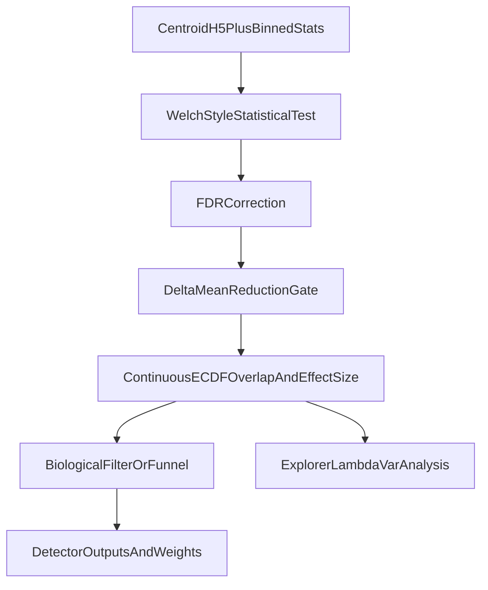

# Refactor ECDF Biological Effect Size

## Goal

Replace the current bounded Welch/KS sigmoid effect-size flow with a new single biological score delegated to MethylUtils:

`effect_size = |delta_mean| * (1 - overlap_ecdf) * exp(-lambda_var * (sqrt(variance1) + sqrt(variance2)))`

Use a Welch-style mean-difference statistical test as the first stage, then a `delta_mean` reduction gate, then compute the continuous-ECDF overlap/effect size only on the reduced set. Do not preserve backward compatibility, and remove the fast approximate pre-ranking path.

## Core MethylUtils Changes

Update [packages/methylutils/methyl_utils/statistical_tests.py](/home/ubuntu/MethylPipeline/packages/methylutils/methyl_utils/statistical_tests.py) to become the canonical home for the new biology-aware scoring.

Add shared helpers for:

- Welch-style significance testing that returns per-position test statistic, p-value, and FDR-ready outputs for detector use.
- Continuous ECDF overlap from `ECDFView` objects using PCHIP-derived PDFs and trapezoidal integration of `min(pdf1, pdf2)` on `[0,1]`.
- Final effect-size computation using `delta_mean`, `overlap_ecdf`, `variance1`, `variance2`, and `lambda_var`.
- Optional `lambda_var` optimization helper for Explorer, replacing scale calibration.

Keep [packages/methylutils/methyl_utils/core/distribution_views.py](/home/ubuntu/MethylPipeline/packages/methylutils/methyl_utils/core/distribution_views.py) focused on representation/interpolation, but extend it only as needed for efficient PDF evaluation or batched overlap support.

Update [packages/methylutils/methyl_utils/methyl_centroid_pair.py](/home/ubuntu/MethylPipeline/packages/methylutils/methyl_utils/methyl_centroid_pair.py) so it no longer owns a separate effect-size formula. It should delegate effect-size and overlap computations to the new MethylUtils helpers, removing the current formula drift.

Essential current code to replace/deprecate conceptually:

```1133:1196:/home/ubuntu/MethylPipeline/packages/methylutils/methyl_utils/statistical_tests.py
def welch_d_ks_overlap(...):
    ...
    corrected_d = welch_d * T
    expit_arg = np.clip(scale * corrected_d, -700.0, 700.0)
    bounded_effect_size = np.clip(2.0 * expit(expit_arg) - 1.0, 0.0, 1.0)
```

```1322:1451:/home/ubuntu/MethylPipeline/packages/methylutils/methyl_utils/methyl_centroid_pair.py
# effect_size: single biological importance measure
...
def compute_effect_sizes(...):
    return self.compute_effect_sizes_altA(...)
```

## Detector Refactor

Update [packages/methyldetector/methyl_detector/core/methyldetector.py](/home/ubuntu/MethylPipeline/packages/methyldetector/methyl_detector/core/methyldetector.py) to use a simpler staged pipeline:

1. Statistical test stage: Welch-style significance test, then FDR correction.
2. `delta_mean` reduction gate on statistically retained positions.
3. Continuous-ECDF overlap + final `effect_size` on the reduced set only.
4. Biological funnel/filtering using `delta_mean`, `overlap_ecdf`, and final `effect_size`.

Remove the fast biological funnel path and its approximate score aliasing. Specifically replace the logic centered on:

- `_compute_fast_metrics_df()`
- `_compute_real_ecdf_metrics_for_biological_dmps()`
- `use_fast_biological_funnel`
- `bounded_effect_size_approx`, `overlap_approx`, and related flow control

The new detector should call only shared MethylUtils helpers for final effect-size math. Preserve output columns only where they still make sense, but normalize naming around the new score and overlap semantics.

## Explorer Refactor

Update [packages/methyldetector/methyl_detector/explorer.py](/home/ubuntu/MethylPipeline/packages/methyldetector/methyl_detector/explorer.py) from a two-phase ranking/refinement tool into a staged analysis tool that mirrors the new detector pipeline:

1. Statistical significance stage using the chosen Welch-style test.
2. `delta_mean` reduction stage to limit the expensive ECDF work.
3. Continuous-ECDF overlap and final effect-size computation.
4. Biological funnel exploration/reporting over `delta_mean`, `overlap_ecdf`, `effect_size`, and `lambda_var`.

Remove:

- K/top-K refinement logic
- approximate overlap modes for pre-ranking
- scale calibration logic
- sigmoid-scale reporting and optimization

Replace them with:

- `lambda_var` optimization/exploration
- reporting tied to the new final score and overlap definition
- explicit counts after statistical filtering and after `delta_mean` reduction

## Config And CLI Updates

Update [packages/methyldetector/methyl_detector/models/config.py](/home/ubuntu/MethylPipeline/packages/methyldetector/methyl_detector/models/config.py) and Explorer CLI/config surfaces to match the new design.

Remove or repurpose obsolete knobs:

- `use_fast_biological_funnel`
- `sigmoid_scale`
- Explorer scale-calibration options
- approximate-overlap ranking controls that only existed for the old two-phase path

Add/standardize knobs for:

- `lambda_var`
- optional Explorer `lambda_var` search/optimization range
- ECDF overlap grid size for the new overlap integral
- optional `delta_mean` pre-ECDF reduction threshold if distinct from the later biological filter threshold

## Tests

Add or update tests in:

- [packages/methylutils/methyl_utils/tests](/home/ubuntu/MethylPipeline/packages/methylutils/methyl_utils/tests)
- [packages/methyldetector/tests/test_explorer.py](/home/ubuntu/MethylPipeline/packages/methyldetector/tests/test_explorer.py)

Cover at minimum:

- identical distributions -> `effect_size = 0`, `overlap_ecdf = 1`
- separated distributions -> low overlap and high effect size
- same mean but different shape -> low `delta_mean`, correspondingly low biological score even if ECDFs differ
- high variance penalty reduces score symmetrically with separate `variance1`, `variance2`
- detector pipeline only computes continuous-ECDF overlap after the `delta_mean` gate
- Explorer `lambda_var` optimization updates reports consistently

## Docs

Update the detector and MethylUtils docs to reflect the new semantics and remove outdated descriptions of the old effect-size formula and fast approximate ranking path. Prioritize:

- [packages/methyldetector/docs/METHYLDETECTOR_EXPLORER.md](/home/ubuntu/MethylPipeline/packages/methyldetector/docs/METHYLDETECTOR_EXPLORER.md)
- [packages/methyldetector/docs/MethylDetector_Theoretical_Foundation.md](/home/ubuntu/MethylPipeline/packages/methyldetector/docs/MethylDetector_Theoretical_Foundation.md)
- [packages/methyldetector/docs/Effect_Size_Theory.tex](/home/ubuntu/MethylPipeline/packages/methyldetector/docs/Effect_Size_Theory.tex)
- [packages/methylutils/docs/MethylUtils_Theoretical_Foundation.md](/home/ubuntu/MethylPipeline/packages/methylutils/docs/MethylUtils_Theoretical_Foundation.md)
- [packages/methylutils/docs/METHYLUTILS_IMPLEMENTATION.md](/home/ubuntu/MethylPipeline/packages/methylutils/docs/METHYLUTILS_IMPLEMENTATION.md)

## Data Flow




## Risks

- Continuous ECDF overlap via PCHIP derivative is CPU-bound and must stay after the `delta_mean` reduction gate to remain tractable on chromosome-scale data.
- Removing backward compatibility means configs, CSV semantics, and downstream interpretation can change sharply in one pass; tests and docs need to move together.
- Any remaining code that assumes `effect_size` came from the old sigmoid/approx pipeline must be updated in the same change set.

