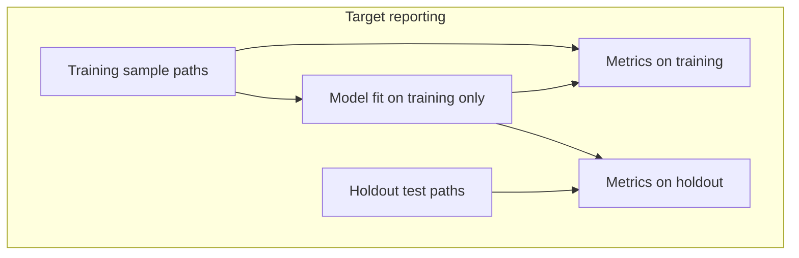

# ECDF metrics: training vs testing

## Target principle (product / methods standard)

- **Training:** Models (centroids, DMP panel, ECDF classifier artifacts) are fit using **training data only**.
- **Generalization:** **Holdout testing data**—samples **not** used to build centroids or tune the panel—are what should **estimate** generalization.
- **Reporting:** The **best** presentation is **two** numbers (each with confusion matrix / BA as needed), clearly labeled:
  1. **Training (in-sample) metrics** — scoring **training** samples after the model is fixed. Interprets **cohort homogeneity** and how well the panel separates the population the centroids summarize (not generalization).
  2. **Holdout (test) metrics** — scoring **disjoint holdout** samples only. Interprets **generalization** to new individuals from the same study design.

A large gap (train high, test low) suggests overfitting or cohort shift; train and test both high supports generalization **within** the assumed sampling frame.

The current codebase often exposes **one** `balanced_accuracy` without always stating which split it refers to; aligning implementation with the dual-reporting standard above is the intended follow-up.

---

## Direct answer (current behavior)

**Yes — in the default wiring, what you are often looking at is in-cohort / reuse of training material, not a clean held-out test set.** That does **not** automatically mean the biology is wrong, but **`balanced_accuracy = 1` is an optimistic signal** if read as “test accuracy”: it shows the panel separates **those** samples well; it is **not** by itself evidence of generalization.

Two separate layers matter:

1. **Which samples are scored** (predictor / labeled runs).
2. **Whether detector-internal BA uses a train/holdout split** on that matrix.

---

## 1. MethylPredictor (`model` ecdf path): test paths often equal training cohorts

[`resolve_predictor_config_per_comparison`](packages/methylpredictor/methyl_predictor/project_resolver.py) documents precedence explicitly:

- CLI `--test-control` / `--test-disease`, **or**
- `step_config.predictor` test paths when set, **or**
- **Else training cohorts from the project** (same comparison groups used to build the model).

The binary comparison loop (lines ~917–949) collects `control_paths` / `disease_paths` from the **project’s predictor sides** for that comparison when caller test paths are not provided — i.e. **the same samples listed for the cohort**, not a separate test manifest.

So **`validation_metrics.json` / `balanced_accuracy` from `methyl-predictor` is usually “resubstitution-style” on the project cohort** unless you deliberately point predictor at **different** sample paths (CLI or `step_config.predictor`).

**Gap vs target:** There is no first-class **paired** run that writes **both** `training_metrics` and `holdout_metrics` from one invocation; achieving the target likely means **project schema** (e.g. explicit `training_sample_paths` vs `holdout_sample_paths` per group) and **predictor output** with two metric blocks (and optionally two CSV prefixes or a `split` column).

---

## 2. MethylDetector: validation samples default to centroid cohort paths

[`resolve_detector_config_per_cancer_group`](packages/methyldetector/methyl_detector/utils/project_resolver.py) sets:

- `centroid1_validation_samples` ← `project.get_group_sample_paths_by_label(ctrl_label)`
- `centroid2_validation_samples` ← `project.get_group_sample_paths_by_label(dis_label)`

So **detector validation methylation matrices are drawn from the same group paths as the centroids**, unless you override with explicit validation sample lists / `use_metadata` with a different intent (QUICKSTART even notes `use_metadata` when “the same samples used to build the centroids are acceptable for validation”).

**Internal split:** [`_prepare_validation_splits`](packages/methyldetector/methyl_detector/core/methyldetector.py) uses `validation_split_ratio`; when it is **≤ 0**, it returns a single split **`(idx_all, idx_all)`** — calibration and evaluation indices are the **same rows**. Docs ([`QUICKSTART.md`](packages/methyldetector/QUICKSTART.md)) state default **`0` = no split**; set e.g. `0.2` for stratified holdout within that validation matrix.

**Caveat to verify in your environment:** `validation_split_ratio` / `validation_n_repeats` are used via `getattr(self.config, ...)` but **do not appear as declared fields** on [`MethylDetectorConfig`](packages/methyldetector/methyl_detector/models/config.py) in the current file — if Pydantic drops unknown keys, JSON `step_config.detection` values for those keys might be **silently ignored**, leaving effective behavior at the code default (`0`). Worth confirming with a one-off config dump or test; if ignored, that strengthens the “no internal holdout” story.

**Gap vs target:** FeatureCuts / BA tuning should not treat “validation” as both train and test without labeling; long term, **holdout-only** rows should drive generalization estimates, and **training** rows can be reported separately for homogeneity—either via explicit path lists or a strict internal split that is **documented in outputs**.

---

## 3. How this relates to “overfitting”

- **ECDF classifiers** are built from **centroid binned histograms** at DMP positions (not a weight fit on per-sample logits), but **DMP selection** (e.g. featurecuts / target BA) still **optimizes on the validation matrix** you configure.
- If that matrix is **the same cohort as the centroids** and there is **no row holdout**, **BA is not an unbiased estimate of performance on new individuals**.
- **`balanced_accuracy = 1`** on that setup means **perfect separation on that fixed cohort** — useful as a **sanity / cohort-separation** check, misleading if interpreted as **test-set accuracy**.

---

## 4. Migration path toward the target

- **Data contract:** Project / freeze config should distinguish **samples that enter centroids** from **holdout evaluation samples** (no leakage into centroid HDF5 or DMP tuning, depending on stage).
- **Predictor:** After dual path lists exist, run (or single run with two phases) **labeled prediction** on training list → `training_metrics`; on holdout list → `holdout_metrics`; both in `validation_metrics.json` (names TBD) and reflected in docs.
- **Detector:** Separate validation matrices or enforce `validation_split_ratio > 0` with schema support; emit which split each BA refers to in `result*.json` when both are computed.
- **Pipeline / validation package:** MC and `--post-model-validation` should **label** which samples each metric uses; align with [`packages/methylvalidation/docs/USAGE.md`](packages/methylvalidation/docs/USAGE.md) narratives.

---

## Summary

| Question | Answer |
|----------|--------|
| Is BA often on “training” cohort samples? | **Yes**, by default: detector validation paths match group paths; predictor falls back to the same cohorts. |
| Is there always an internal train/test split on those rows? | **No** when `validation_split_ratio` is 0 (documented default) — same indices for calib and test in `_prepare_validation_splits`. |
| Does BA=1 imply overfitting? | It implies **perfect fit to that evaluated set**; **generalization** requires **disjoint holdout** evaluation — otherwise the metric is **optimistic**. |
| Desired reporting? | **Two** labeled metric blocks: **training** (homogeneity / fit) and **holdout** (generalization). |

Follow-up work is **design + implementation** of explicit train/holdout paths, dual metric emission, schema fixes for ignored detector keys (if confirmed), and documentation—not yet executed in this iteration.
