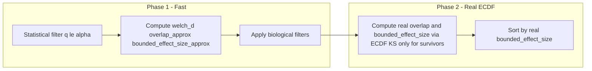

# ECDF Fast Funnel for DMP Filtering and Ranking

## Current behavior (slow)

- After statistical filter (q ≤ α), **every** candidate position gets full ECDF-based metrics in `[_compute_missing_metrics_df](packages/methyldetector/methyl_detector/core/methyldetector.py)` → `_compute_chunk_metrics_df` → `welch_d_ks_overlap(..., ecdf_view1, ecdf_view2, position_indices)`.
- ECDF KS is computed in `[ecdf_ks_statistic](packages/methylutils/methyl_utils/statistical_tests.py)` / `[ecdf_ks_pvalue](packages/methylutils/methyl_utils/statistical_tests.py)` (grid over [0,1], per-position CDF evaluation). No GPU equivalent; this dominates runtime when many positions pass the statistical filter.
- Biological filters (min_delta_mean, max_overlap, min_bounded_effect_size) are applied **after** ECDF metrics are computed for all.

## Target behavior

1. **Statistical filter** (unchanged): keep rows with `q_value <= alpha` → many candidates.
2. **Fast biological metrics (no ECDF):**
  - **(a) Delta-mean / Welch’s d:** Already have `delta_mean`, `variance1`, `variance2`, `n1`, `n2` in comparison results. Compute **Welch’s d** = |delta_mean| / sqrt(var1/n1 + var2/n2) (no ECDF). Use it for a “strength of difference” filter (e.g. min |delta_mean| and/or min welch_d).
  - **(b) Overlap approximation:** Avoid ECDF KS. Prefer a **discrete overlap** from the same binned counts used for the chi-squared test (bin_counts per position): e.g. histogram intersection (sum over bins of min(p1,p2)) or Bhattacharyya coefficient on bin proportions (sum sqrt(p1*p2)). This respects asymmetry of the ECDF and matches the data shape. When binned counts are not available, fall back to a **Normal-based overlap** (e.g. 2*Φ(-welch_d/2)).
  - **(c) Approximated effect size:** Bounded effect size approx = sigmoid(scale * welch_d * (1 - overlap_approx)), same formula as in `[welch_d_ks_overlap](packages/methylutils/methyl_utils/statistical_tests.py)` but with overlap_approx instead of (1 - ks_d).
3. **Apply biological filters** using these fast columns: min_delta_mean (|delta_mean|), max_overlap (overlap_approx), min_bounded_effect_size (bounded_effect_size_approx).
4. **Real ECDF metrics only for survivors:** For the filtered subset, call ECDF-based computation (existing `welch_d_ks_overlap` with ECDF views and `position_indices` = indices of the subset in the original comparison) to get real **overlap** = 1 - ks_d and real **bounded_effect_size** in [0,1].
5. **Sort** the final DMP list by **real** `bounded_effect_size` (descending).

Result: ECDF (and any non-GPU code) runs only on the typically much smaller set that passed the approximate funnel, while the funnel itself uses only means/variances and Welch’s d.

---

## Implementation

### 1. MethylUtils: discrete overlap and fast metrics (no ECDF)

**File:** [packages/methylutils/methyl_utils/statistical_tests.py](packages/methylutils/methyl_utils/statistical_tests.py) (or a small helper in distribution_views / methyl_centroid_pair)

- Add `**discrete_overlap_from_bin_counts(bc1, bc2)`** (vectorized): inputs shape `(n_bins,)` or `(n_positions, n_bins)`; normalize to proportions; overlap in [0,1] via histogram intersection or discrete Bhattacharyya. Fast and respects asymmetry.
- Add `**welch_d_fast_overlap_approx(..., overlap_approx=None)`** that:
  - Computes **Welch’s d** as in `welch_d_ks_overlap` (same SE and capping with `WELCH_D_MAX`).
  - If `overlap_approx` is provided use it; else **Normal fallback:** `overlap_approx = 2 * norm.cdf(-welch_d/2)`.
  - Computes **bounded_effect_size_approx** = sigmoid(scale * welch_d * (1 - overlap_approx)).
  - Returns dict: `welch_d`, `overlap_approx`, `bounded_effect_size_approx` (no ECDF, no `ecdf_view` args).
- Optionally add `**compute_real_ecdf_metrics_for_subset(delta_mean, var1, n1, var2, n2, position_indices, ecdf_view1, ecdf_view2, scale, grid_size)`** that calls the existing `welch_d_ks_overlap` with ECDF views and the given `position_indices` and returns only the real `ks_d`, `overlap` (= 1 - ks_d), and `bounded_effect_size`. This is a thin wrapper so MethylDetector can request “real metrics for these indices only.”

### 2. MethylCentroidPair: discrete overlap in comparison output

**File:** [packages/methylutils/methyl_utils/methyl_centroid_pair.py](packages/methylutils/methyl_utils/methyl_centroid_pair.py)

- In `**_compute_statistics`**, when `has_binned1` and `has_binned2` and `same_bin_edges` (same condition as for ECDF chi2 test), compute **discrete overlap** per position from `bc1`, `bc2` using `discrete_overlap_from_bin_counts(bc1, bc2)` (vectorized over positions). Store in the comparison output so MethylDetector receives it:
  - Either extend `**CENTROID_COMPARISON_DTYPE`** with a field `('overlap_approx', np.float32)` and fill it (use NaN or 0.5 for positions without binned data), or
  - Attach `overlap_approx` when converting the structured array to a DataFrame (e.g. after `_apply_fdr_correction`, add column from a separate array). Prefer extending the dtype for consistency.
- For positions that do not have binned counts (e.g. Beta-only path), set `overlap_approx` to NaN so the fast funnel can fall back to Normal-based overlap.

### 3. MethylDetector: two-phase funnel

**File:** [packages/methyldetector/methyl_detector/core/methyldetector.py](packages/methyldetector/methyl_detector/core/methyldetector.py)

- **After** statistical filter (around line 387):
  - Call a new `**_compute_fast_metrics_df(filtered_results)`** that:
    - If `overlap_approx` exists in the DataFrame and is valid (e.g. not all NaN), use it as the overlap for the funnel.
    - Otherwise (or for rows where overlap_approx is NaN) compute **Normal-based** overlap via `welch_d_fast_overlap_approx(..., overlap_approx=None)`.
    - Computes **welch_d** and **bounded_effect_size_approx** = sigmoid(scale * welch_d * (1 - overlap_approx)), using the chosen overlap_approx (discrete when available, else Normal-based). Add columns: `welch_d`, `overlap_approx`, `bounded_effect_size_approx`. For the **filtering step only**, set `overlap = overlap_approx` and `bounded_effect_size = bounded_effect_size_approx` so existing `_apply_biological_filters` works unchanged.
  - Apply **biological filters** on this DataFrame → `bio_df` (subset of rows).
  - Call a new `**_compute_real_ecdf_metrics_for_df(bio_df, ecdf_view1, ecdf_view2)`** that:
    - Uses `position_indices = bio_df.index.to_numpy(dtype=np.intp)` (original row indices in the full comparison).
    - Extracts per-row arrays from `bio_df` (delta_mean, variance1, n1, variance2, n2) and calls `welch_d_ks_overlap` (or the subset wrapper) with ECDF views and this `position_indices`.
    - Writes back into `bio_df`: `overlap`, `bounded_effect_size` (and optionally `ks_d`, `ks_p_value`, `welch_d` if you want to keep them consistent). Ensure `effect_size` is set to the real `bounded_effect_size` for downstream (e.g. context weighting, export).
  - **Sort** `bio_df` by `bounded_effect_size` descending.
  - Use this sorted `bio_df` as the biological DMP list for the rest of the pipeline (BMM refinement, selection, export, etc.).
- **Remove or gate** the current “compute ECDF for all filtered” path when the fast funnel is enabled: do not call `_compute_missing_metrics_df` on the full `filtered_results` in that case; only the fast metrics + real metrics on the subset.
- **Config:** Add an option (e.g. `use_fast_biological_funnel: bool = True` in detection config) to switch between: (A) new behavior: fast approx → biological filters → real ECDF only on survivors → sort by real bounded_effect_size; (B) legacy: current behavior (ECDF for all filtered, then filter, then sort). This allows fallback and A/B comparison.

### 4. Filter funnel sweep and exports

- **Filter funnel sweep** (`[_run_filter_funnel_sweep](packages/methyldetector/methyl_detector/core/methyldetector.py)`): When using the fast funnel, the sweep must use the **same** fast metrics for consistency (overlap_approx, bounded_effect_size_approx) when counting “n_biological_dmps” for each threshold combination. No ECDF needed in the sweep.
- **Exports and logging:** Final exported DMP table and any “top DMPs by effect” should use the **real** `bounded_effect_size` and `overlap` (ECDF-based) and sort by real `bounded_effect_size`; the fast columns can be omitted from export or kept as debug (e.g. `overlap_approx`, `bounded_effect_size_approx`).

### 5. Summary flow (mermaid)

---

## Files to touch

| Location                                                                                                                         | Change                                                                                                                                                                                                                                                  |
| -------------------------------------------------------------------------------------------------------------------------------- | ------------------------------------------------------------------------------------------------------------------------------------------------------------------------------------------------------------------------------------------------------- |
| [packages/methylutils/methyl_utils/statistical_tests.py](packages/methylutils/methyl_utils/statistical_tests.py)                 | Add `discrete_overlap_from_bin_counts`; add `welch_d_fast_overlap_approx(..., overlap_approx=None)` with Normal fallback; optional `compute_real_ecdf_metrics_for_subset`.                                                                              |
| [packages/methylutils/methyl_utils/methyl_centroid_pair.py](packages/methylutils/methyl_utils/methyl_centroid_pair.py)           | In `_compute_statistics`, when binned_stats present, compute discrete overlap from bc1/bc2 and add to results (extend dtype with `overlap_approx` or attach column).                                                                                    |
| [packages/methyldetector/methyl_detector/core/methyldetector.py](packages/methyldetector/methyl_detector/core/methyldetector.py) | Add `_compute_fast_metrics_df`, `_compute_real_ecdf_metrics_for_df`; change flow after statistical filter to two-phase when config enabled; add `use_fast_biological_funnel` to config usage; keep filter funnel sweep using fast metrics when enabled. |
| [packages/methyldetector/methyl_detector/models/config.py](packages/methyldetector/methyl_detector/models/config.py)             | Add `use_fast_biological_funnel: bool = True` (or similar) under detection config.                                                                                                                                                                      |

---

## Notes

- **Welch’s d** is already used in `welch_d_ks_overlap`; the fast path reuses the same formula (no equal-variance assumption).
- **Overlap approximation:** Prefer **discrete overlap** from bin counts (histogram intersection or discrete Bhattacharyya) when binned_stats are present—same data as the chi-squared test, and it respects asymmetry of the ECDF. Use **Normal-based** (2*Φ(-welch_d/2)) only as fallback when binned counts are not available.
- **GPU:** Fast path is vectorized NumPy (and could use CuPy for welch_d/expit later if desired). ECDF KS remains CPU-only; by running it only on the filtered subset, total ECDF cost drops roughly by the ratio (candidates after statistical filter) / (candidates after biological filter).
- **Backward compatibility:** With `use_fast_biological_funnel=False`, keep the current “compute ECDF for all filtered, then filter” path so behavior is unchanged.

