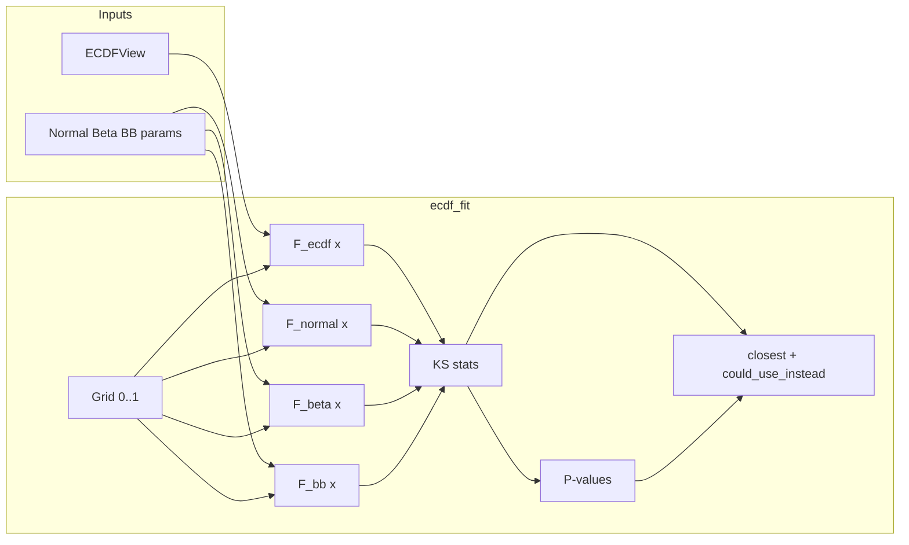

# ECDF vs theoretical distribution comparison and tests

## Goal

Compare the continuous ECDF (spline-interpolated from binned_stats) to the theoretical CDFs (Normal, Beta, Beta-Binomial) per position: compute the maximum difference (KS statistic), test significance, and identify which theoretical distribution is closest and whether it could be used instead of ECDF.

## 1. Theoretical CDFs on [0,1]

- **ECDF**: Already available as `ECDFView._cdf(position_idx, x)` for any `x` in [0,1] ([distribution_views.py](packages/methylutils/methyl_utils/core/distribution_views.py)).
- **Normal**: Proportions are supported on [0,1]. Use a **truncated Normal** CDF so that F(0)=0 and F(1)=1. With `mu`, `sigma2` from NormalView: `scipy.stats.truncnorm.cdf(x, a=(0-mu)/sigma, b=(1-mu)/sigma, loc=mu, scale=sigma)` with `sigma = sqrt(sigma2)`.
- **Beta**: `scipy.stats.beta.cdf(x, alpha, beta)` — already on [0,1].
- **Beta-Binomial (proportion view)**: The proportion distribution implied by Beta-Binomial is Beta(α_bb, β_bb). Use `scipy.stats.beta.cdf(x, alpha_bb, beta_bb)`.

## 2. New utility module

**Add:** [packages/methylutils/methyl_utils/ecdf_fit.py](packages/methylutils/methyl_utils/ecdf_fit.py) (new file).

- `**ecdf_vs_theoretical_ks(ecdf_view, position_idx, mu, sigma2, alpha, beta, alpha_bb, beta_bb, grid_size=256)`**  
  - Evaluate ECDF and the three theoretical CDFs on a common grid `x = np.linspace(0, 1, grid_size)`. **Grid size**: Use a sufficiently fine grid (e.g. 256 or 512) so that the maximum difference over the grid closely approximates the true KS statistic sup over x in [0,1]; 256 is the default and is high enough for practical accuracy; 512 can be used if tighter approximation is needed.
  - For Normal: use `truncnorm` as above; guard against `sigma2 <= 0` or `sigma` too small (fall back to a step at mu or skip).
  - KS statistics: `ks_normal = max|F_ecdf(x) - F_normal(x)|`, same for Beta and Beta-Binomial.
  - Return a small struct or dict: `ks_normal`, `ks_beta`, `ks_betabinomial`, and optionally `closest` (name of distribution with smallest KS).
- `**ecdf_vs_theoretical_ks_pvalue(..., n_samples)`**  
  - One-sample KS null: under H0 “data came from the theoretical distribution”, the statistic D = max|F_emp - F_theory| has a known distribution (Kolmogorov). Use `scipy.stats.kstwobign` for asymptotic: `p ≈ 2 * kstwobign.sf(sqrt(n) * D)` (two-sided), with `n = n_samples` (N at that position).
  - Return the same KS dict plus `p_normal`, `p_beta`, `p_betabinomial`, and a flag like `could_use_instead` (True if the closest distribution has p > 0.05).
- `**compare_ecdf_to_theoretical_at_positions(centroid, position_indices=None, grid_size=256)`**  
  - Build ECDFView from centroid (requires `binned_stats`); build Normal/Beta/BetaBinomial parameters from the same centroid (Sx, Sx2, N for Normal; alpha, beta for Beta; alpha_bb, beta_bb for BetaBinomial where available).
  - For each position index (or all positions with binned_stats), call `ecdf_vs_theoretical_ks` (and optionally `_ks_pvalue`) and aggregate into a DataFrame or list of dicts with columns: position (or index), ks_normal, ks_beta, ks_betabinomial, closest, p_normal, p_beta, p_betabinomial, could_use_instead.
- **Edge cases**: If centroid has no `alpha_bb`/`beta_bb`, pass None and skip Beta-Binomial KS (or use Beta params as proxy). If `sigma2` is zero or negative, skip Normal or use a degenerate CDF.

## 3. Tests

**Add:** [packages/methylutils/tests/test_ecdf_vs_theoretical.py](packages/methylutils/tests/test_ecdf_vs_theoretical.py).

- **Test KS computation and API**  
  - Create synthetic binned counts (e.g. from a Beta(2, 5) distribution: sample N points, bin into `bin_edges`, get `bin_counts`). Build ECDFView(bin_edges, bin_counts, Sx, N, Sx2). Compute theoretical params from the same sufficient stats (e.g. Beta MLE or MoM from Sx, Sx2, N; Normal mu/sigma2; Beta-Binomial from count-based MoM if available).  
  - Call `ecdf_vs_theoretical_ks` and assert that `ks_beta` is the smallest of the three (ECDF built from Beta data is closest to Beta).  
  - Assert returned keys: `ks_normal`, `ks_beta`, `ks_betabinomial`, `closest`.
- **Test significance (synthetic)**  
  - Generate data from Beta(α, β), build ECDF and theoretical params. Call `ecdf_vs_theoretical_ks_pvalue` with n_samples = N. Assert that `p_beta` is the largest (or that we cannot reject Beta) and that `closest == "beta"` and optionally `could_use_instead` is True when N is large enough.
- **Test Normal and Beta-Binomial**  
  - Same pattern: generate data from a truncated Normal (or from Beta-Binomial by generating p ~ Beta then counts ~ Binomial(n, p), then proportions); build binned ECDF and params; assert the corresponding theoretical has the smallest KS and (optionally) non-significant p-value.
- **Test grid and edge cases**  
  - Assert that with a single bin (or degenerate counts), the utility does not crash (handles zero variance, single-bin ECDF).
- **Optional: test `compare_ecdf_to_theoretical_at_positions`**  
  - Use a small in-memory centroid (or mock) with binned_stats and Sx, N, Sx2, alpha, beta, alpha_bb, beta_bb; call `compare_ecdf_to_theoretical_at_positions` and check shape and column names of the result.

## 4. Integration points (optional, not required for “tests” scope)

- **MethylCentroidExplorer**: Could add an option (e.g. `--ecdf-fit`) that runs `compare_ecdf_to_theoretical_at_positions` for the loaded centroid and exports columns (e.g. `closest_distribution`, `ks_normal`, `ks_beta`, `ks_betabinomial`, `ecdf_vs_closest_pvalue`) in the position table or a separate CSV. Left as a follow-up unless you want it in this plan.
- **Exports**: Add `ecdf_fit` (or `ecdf_fit.py` symbols) to [packages/methylutils/methyl_utils/**init**.py](packages/methylutils/methyl_utils/__init__.py) if the API should be public.

## 5. File summary

| Action   | File                                                                                                                                                                                                |
| -------- | --------------------------------------------------------------------------------------------------------------------------------------------------------------------------------------------------- |
| Create   | [packages/methylutils/methyl_utils/ecdf_fit.py](packages/methylutils/methyl_utils/ecdf_fit.py) — KS comparison and p-value helpers                                                                  |
| Create   | [packages/methylutils/tests/test_ecdf_vs_theoretical.py](packages/methylutils/tests/test_ecdf_vs_theoretical.py) — pytest tests (synthetic ECDF vs Normal/Beta/BetaBinomial, closest, significance) |
| Optional | [packages/methylutils/methyl_utils/**init**.py](packages/methylutils/methyl_utils/__init__.py) — export `ecdf_vs_theoretical_ks`, `compare_ecdf_to_theoretical_at_positions`                        |

## 6. Data flow (high level)

## 7. Notes

- **Grid size**: The implementation assumes `grid_size` is high enough that the discrete maximum over the grid approximates the true sup-norm (KS statistic). Default 256 is sufficient; optionally allow 512 for higher accuracy. No need to go much higher (diminishing returns).
- **N for p-value**: Use the centroid’s N (sample size) at that position so the KS null distribution reflects how many samples the ECDF is based on.
- **Binned ECDF**: The ECDF is built from binned counts, so it’s a smoothed empirical CDF. The KS test is approximate; the p-value indicates whether the continuous ECDF is consistent with the theoretical CDF, not with raw unbinned data.
- **Beta-Binomial**: Treated as the Beta(α_bb, β_bb) CDF for the proportion; no discrete correction on the grid (proportion support is [0,1]).

