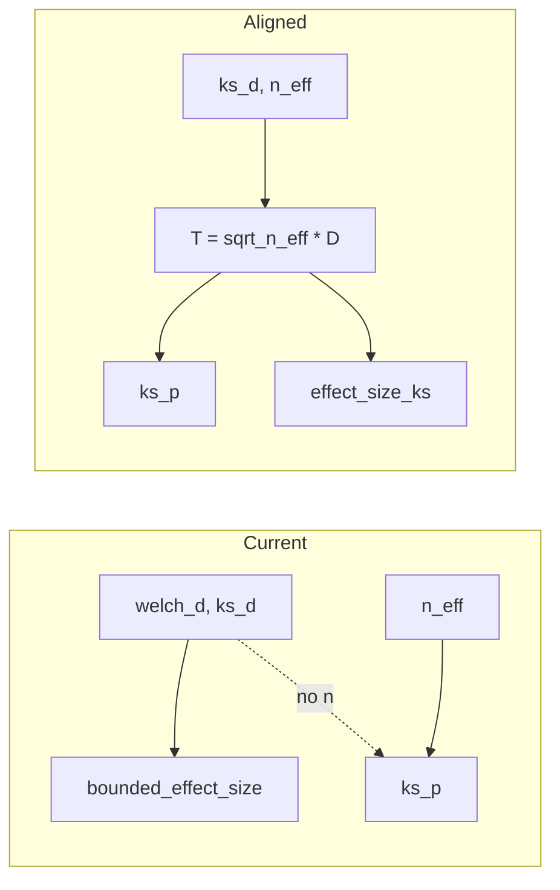

# Aligning effect size with KS p-value (statistical significance)

## Why the correlation is low

- **Current effect size**: `bounded_effect_size = sigmoid(scale * welch_d * ks_d)`. It uses Welch's d and the KS statistic D but **does not use sample size**.
- **KS p-value**: `ks_p = kstwobign.sf(sqrt(n_eff) * D)` with `n_eff = 2 / (1/n1 + 1/n2)` (harmonic mean). So the test statistic that drives the p-value is **T = sqrt(n_eff) * D**. Same D with larger n → smaller p (more significant); same D with smaller n → larger p (less significant).

So two positions can have the same effect size (same welch_d and ks_d) but very different ks_p if n_eff differs. Effect size ignores n; the test does not. That weakens the correlation between effect_size and ks_p.

## Options to improve correlation

### Option 1: Effect size from the same statistic as the test (maximum alignment)

Define effect size as a bounded transform of the **KS test statistic** T = sqrt(n_eff) * D:

- **Formula**: `effect_size_ks = sigmoid(scale * sqrt(n_eff) * ks_d)` (with a scale chosen so typical T values map to a sensible [0,1] range; e.g. scale ≈ 0.5–2 so that T in [0, 5] gives a spread).
- **Pros**: Same quantity (T) drives both effect_size_ks and ks_p, so they are **monotonically related** (and correlation with -log(ks_p) or 1 - ks_p will be very high). No Welch term, so purely “distribution difference + power.”
- **Cons**: Drops mean difference (welch_d); two positions with the same D and n get the same effect even if one has a much larger mean shift. So this is “KS-significance as effect,” not “biological magnitude.”

**Implementation**: In [packages/methylutils/methyl_utils/statistical_tests.py](packages/methylutils/methyl_utils/statistical_tests.py), add an optional return (or a separate helper) that computes `n_eff`, `T = sqrt(n_eff) * ks_d`, and `effect_size_ks = sigmoid(scale_ks * T)`. Expose in Explorer as an extra column (e.g. `effect_size_ks` or `bounded_effect_size_ks`) so users can compare or use it for ranking.

---

### Option 2: Add sample size into the current formula (blend)

Keep the current “magnitude” idea but make it depend on n so it lines up better with significance:

- **Formula**: `bounded_effect_size_v2 = sigmoid(scale * welch_d * ks_d * f(n_eff))` with e.g. `f(n_eff) = log(1 + sqrt(n_eff))` or `f(n_eff) = sqrt(n_eff) / (1 + sqrt(n_eff))` so that larger n boosts the argument and pushes effect size up when the test is more likely to be significant.
- **Pros**: Still uses welch_d and ks_d; only adds a smooth n term. Correlation with ks_p should improve.
- **Cons**: Choice of f is arbitrary; correlation will be better than now but not monotonic unless the formula is dominated by the same T as the test.

**Implementation**: In `welch_d_ks_overlap`, compute `n_eff`, then e.g. `corrected_d = welch_d * ks_d * np.log1p(np.sqrt(n_eff))` (or similar), and use that inside the sigmoid. Tune scale if needed.

---

### Option 3: Significance-derived effect (1 - p or -log10(p) normalized)

Define an effect that is **purely a transform of the p-value** so it is perfectly (inversely) correlated with ks_p:

- **Formula**: `effect_size_sig = 1 - ks_p` (so significant → effect near 1) or `effect_size_sig = -log10(ks_p) / max_log10` capped to [0, 1] (e.g. max_log10 = 10 so p=1e-10 → 1).
- **Pros**: By construction, effect_size_sig and ks_p are perfectly (inversely) related. No new statistical model.
- **Cons**: No notion of “magnitude” of the difference; only “how significant.” Not suitable as the only effect if you want to distinguish “big difference, small n” from “small difference, large n.”

**Implementation**: In the Explorer (or in statistical_tests), add a column `effect_size_sig = 1 - ks_p` (and optionally `effect_size_log10p`) for the refined positions. No change to the core formula.

---

### Option 4: Hybrid (keep current, add KS-aligned column)

Keep the current `bounded_effect_size` as the “biological” effect (welch_d * ks_d) and add a **second** column that is designed to align with significance:

- **Columns**:  
  - `bounded_effect_size`: unchanged (sigmoid(scale * welch_d * ks_d)).  
  - `effect_size_ks`: sigmoid(scale_ks * sqrt(n_eff) * ks_d) (Option 1).  
  Or alternatively add `effect_size_sig = 1 - ks_p` (Option 3).
- **Pros**: Users can rank or filter by significance-aligned effect when they want agreement with ks_p, and still use the current effect for magnitude. No breaking change.
- **Cons**: Two (or more) effect-like columns to document and interpret.

**Implementation**: In [packages/methylutils/methyl_utils/statistical_tests.py](packages/methylutils/methyl_utils/statistical_tests.py), have `welch_d_ks_overlap` also compute `n_eff`, `T = sqrt(n_eff) * ks_d`, and return e.g. `effect_size_ks` (sigmoid of T). In [packages/methyldetector/methyl_detector/explorer.py](packages/methyldetector/methyl_detector/explorer.py), add that (and optionally `effect_size_sig`) to the Phase 2 result DataFrame and CSV.

---

### Option 5: Replace the main effect size formula with the KS statistic

Change the **primary** bounded effect size to the KS-based form so that the main metric users see is aligned with the test:

- **Formula**: `bounded_effect_size = sigmoid(scale * sqrt(n_eff) * ks_d)` (same as Option 1 but as the default effect size).
- **Pros**: Single effect size; high correlation with ks_p; same statistic as the test.
- **Cons**: Replaces the current “welch_d + separation” interpretation; no direct role for mean difference in the one number. Breaking change for anyone relying on the current formula.

**Implementation**: In `welch_d_ks_overlap`, compute n_eff from n1, n2; set `corrected_d = np.sqrt(n_eff) * ks_d` (and optionally keep returning welch_d and ks_d for CSV). Tune scale so that typical T values sit in a good range for the sigmoid.

---

## Recommendation summary

| Option                               | Correlation with ks_p      | Keeps welch_d / magnitude | Breaking change      |
| ------------------------------------ | -------------------------- | ------------------------- | -------------------- |
| 1 – effect_size_ks (extra column)    | Very high (monotonic in T) | No (extra column only)    | No                   |
| 2 – n_eff in current formula         | Better                     | Yes                       | Yes (formula change) |
| 3 – effect_size_sig = 1 - ks_p       | Perfect (inverse)          | No (p-only)               | No (add column)      |
| 4 – Hybrid (current + Option 1 or 3) | High for new column        | Yes (current unchanged)   | No                   |
| 5 – Replace with KS statistic        | Very high                  | No                        | Yes                  |

**Practical path**: Implement **Option 4 (hybrid)** in the Explorer: keep `bounded_effect_size` as is, and add **effect_size_ks** = sigmoid(scale_ks * sqrt(n_eff) * ks_d) (and optionally **effect_size_sig** = 1 - ks_p) in the CSV and DataFrame. That gives a significance-aligned effect for ranking/filtering while preserving the current magnitude metric. If you later want a single number aligned with the test, you can switch the primary formula to Option 5 and keep the old one under a legacy name.