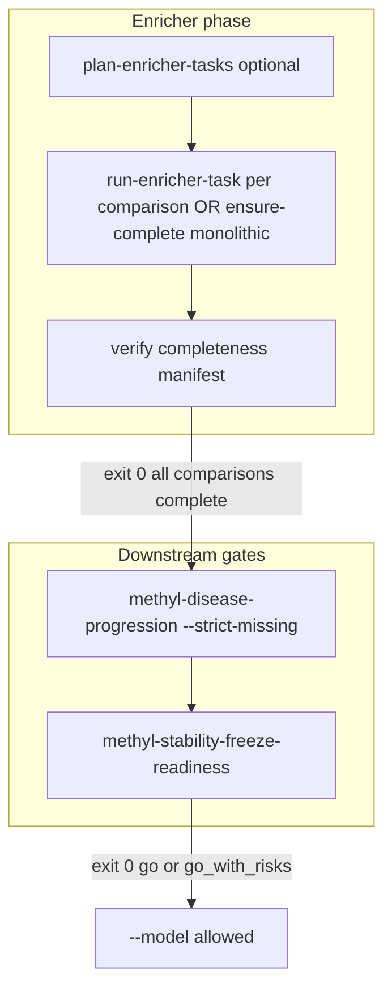

# Enricher ensure-complete and biological-readiness chain

## Problem

Today [`methyl_enricher/enricher.py`](packages/methylenricher/methyl_enricher/enricher.py) queries Enrichr **one library at a time**, logs failures, and continues. A run can exit **0** with partial `enrich_*.csv` files and a thin `enrichment_merged.csv`. [`methyl-disease-progression`](packages/methyldiseaseprogression/methyl_disease_progression/cli.py) does not call Enrichr; it only reads existing enricher outputs. [`methyl-stability-freeze-readiness`](packages/methylvalidation/methyl_validation/stability_freeze_readiness.py) trusts freeze RCs and progression `missing_inputs`, but does **not** verify per-library Enrichr completeness.

## Target workflow



**Unix exit convention:** `0` = success/complete, non-zero = incomplete or failed.

---

## Architecture (per-comparison granularity)

Each **comparison** is one distributed task. Inside the task, the enricher runs all configured libraries with **retry/backoff** (handles 429 and malformed CSV/JSON responses from gseapy).

| Artifact | Path (production freeze) |
|----------|--------------------------|
| Per-library results | `.../enricher/<control>/<disease>/enrich_<library>.csv` |
| Merged ORA | `.../enricher/<control>/<disease>/enrichment_merged.csv` |
| Modules (if enabled) | `.../enricher/<control>/<disease>/modules_ranked.csv` |
| Task status | `.../enricher/<control>/<disease>/enricher_task_status.json` |
| Completeness summary | `.../production/enricher/enricher_completeness.json` |

---

## Phase 1 — Core enricher refactor (methylenricher)

**Primary files:**
- [`packages/methylenricher/methyl_enricher/enricher.py`](packages/methylenricher/methyl_enricher/enricher.py)
- [`packages/methylenricher/methyl_enricher/config.py`](packages/methylenricher/methyl_enricher/config.py)
- [`packages/methylenricher/methyl_enricher/cli.py`](packages/methylenricher/methyl_enricher/cli.py)

### 1a. Extract reusable primitives

- **`enrich_one_library(lib, genes, output_dir) -> Result`**
  - Wraps `gseapy.enrichr` for a single library.
  - Writes `enrich_{lib}.csv` on success.
  - Classifies errors: `rate_limited` (429 / "status code: 429"), `parse_error`, `network`, `other`.
- **`merge_library_results(output_dir, libraries) -> DataFrame`**
  - Builds `enrichment_merged.csv` from existing `enrich_*.csv` (no API calls).
  - Enables resume: re-run only failed libraries, then merge.
- **`assess_completeness(output_dir, expected_libraries, modules_enabled) -> CompletenessReport`**
  - Checks each expected `enrich_*.csv` exists and is non-empty.
  - Optionally requires `modules_ranked.csv`.

### 1b. Retry policy (config-driven)

Add to `EnricherStepConfig` (and CLI flags):

| Field | Default | Purpose |
|-------|---------|---------|
| `enricher_max_retries` | `5` | Per-library attempts |
| `enricher_retry_base_seconds` | `30` | Initial backoff |
| `enricher_retry_max_seconds` | `600` | Cap backoff |
| `enricher_inter_library_delay_seconds` | `2` | Pause between libraries (monolithic) |

Backoff: exponential with jitter on 429/network/parse failures; skip retry only on deterministic validation errors (empty gene list).

Refactor `EnrichmentAnalyzer.run_enrichment` to use these helpers; preserve current behavior when retries=0 (legacy fast-fail optional via `--no-retry`).

### 1c. `--ensure-complete` CLI mode

Add to [`cli.py`](packages/methylenricher/methyl_enricher/cli.py):

```bash
methyl-enricher --project .../production/project.json --ensure-complete [--modules]
```

Behavior for **each comparison** (existing per-group loop):

1. Load genes from mapper combined CSV (same as today).
2. For each expected library: skip if valid `enrich_{lib}.csv` exists (unless `--force`); else query with retry.
3. `merge_library_results`.
4. If `--modules` / config `modules: true`: run module pipeline **from merged enrichment** (skip re-enrichment if merge unchanged and modules outputs exist — optional `skip_if_complete`).
5. Write `enricher_task_status.json` (`completed` | `partial` | `failed`, libraries ok/missing, attempts).
6. Exit **0** only if all comparisons complete; else **1**.

Flags:
- `--ensure-complete` — enable completion semantics + non-zero exit on partial
- `--force` — re-query even when CSV exists
- `--comparison LABEL` — run one comparison (for distributed workers)
- `--verify-only` — no API calls; check artifacts and exit

---

## Phase 2 — Distributed queue (per-comparison tasks)

Mirror the MC queue pattern in [`packages/methylvalidation`](packages/methylvalidation) but scoped to **production enricher** (post-freeze mapper outputs).

**New module:** `packages/methylenricher/methyl_enricher/enricher_queue.py` (or small subpackage)

### 2a. Task schema

Extend [`task_schema.py`](packages/methylvalidation/methyl_validation/task_schema.py) **or** add `EnricherComparisonTaskV1` in methylenricher (preferred to avoid coupling):

```json
{
  "task_schema_version": "1.0",
  "task_id": "enricher_PCa_PCa3",
  "mode": "enricher_comparison",
  "project_json": "/work/.../production/project.json",
  "comparison_label": "PCa_PCa3",
  "input_file": ".../mapper/all/PCa_PCa3/all-gene_name-combined.csv",
  "output_dir": ".../enricher/all/PCa_PCa3",
  "libraries": ["KEGG_2021_Human", "..."],
  "modules": true,
  "enricher_step_config": { "...": "snapshot" }
}
```

### 2b. Subcommands (methyl-enricher or methyl-validation)

**Recommendation:** add enricher-local subcommands to keep freeze/post-freeze logic together:

| Command | Role |
|---------|------|
| `methyl-enricher plan-tasks --project PROD.json` | Write `production/enricher/queue/tasks/*.json`, `plan.json`, `enricher_completeness.json` (pending) |
| `methyl-enricher export-queue --project PROD.json` | Emit `queue_manifest.jsonl` + `commands.sh` (same shape as MC export) |
| `methyl-enricher run-task --task TASK.json` | Run one comparison with `--ensure-complete --comparison LABEL`; write `enricher_task_status.json`; idempotent skip if `completed` (unless `--force`) |
| `methyl-enricher verify-complete --project PROD.json` | Aggregate all comparison statuses; exit 0/1 |

Storage layout under `monte_carlo_runs/production/enricher/queue/` parallels [`DISTRIBUTED_QUEUE.md`](packages/methylvalidation/docs/DISTRIBUTED_QUEUE.md).

### 2c. Distributed execution pattern

```bash
# Planner (fast, one process)
methyl-enricher plan-tasks --project .../production/project.json
methyl-enricher export-queue --project .../production/project.json

# N workers (one comparison each)
methyl-enricher run-task --task .../queue/tasks/enricher_PCa_PCa1.json
# ... PCa2..PCa5 in parallel

# Gate before progression
methyl-enricher verify-complete --project .../production/project.json
```

Workers need shared NFS + venv; no Enrichr calls cross-comparison within a worker (reduces 429 vs monolithic 5×18 burst).

---

## Phase 3 — Freeze and pipeline integration

**File:** [`packages/methylvalidation/methyl_validation/pipeline_runner.py`](packages/methylvalidation/methyl_validation/pipeline_runner.py)

- Replace bare `run_enricher()` with:
  ```python
  ["methyl-enricher", "--project", str(project_json), "--ensure-complete"]
  ```
  when `step_config.enricher.ensure_complete` is true (new flag, default **true** for new configs).
- Remove dead `--per-cancer-group` passthrough (flag does not exist on enricher CLI; per-group is already automatic via `--project`).
- Progression step unchanged but only runs if enricher RC == 0.
- Add config knob `step_config.enricher.distributed: true` → freeze runs **mapper only** + `plan-tasks` (does not block on workers); document that an external orchestrator must run tasks then `verify-complete` before progression.

**File:** [`packages/methylvalidation/methyl_validation/stability.py`](packages/methylvalidation/methyl_validation/stability.py) — no change to freeze merge logic.

---

## Phase 4 — Downstream gates (progression + readiness)

### 4a. Progression

**File:** [`packages/methyldiseaseprogression/methyl_disease_progression/progression.py`](packages/methyldiseaseprogression/methyl_disease_progression/progression.py)

- Read `production/enricher/enricher_completeness.json` when present.
- If any comparison incomplete: add to `missing_inputs` and fail when `strict_missing=true`.
- CLI: exit **1** on strict failure (already does via exception).

Recommend setting in project config:
```json
"progression": { "enabled": true, "strict_missing": true, "report_md": true }
```

### 4b. Readiness

**File:** [`packages/methylvalidation/methyl_validation/stability_freeze_readiness.py`](packages/methylvalidation/methyl_validation/stability_freeze_readiness.py)

Add **enricher completeness** section:

- Load `enricher_completeness.json` or scan `enrich_*.csv` counts vs expected preset.
- New verdict rule: if any comparison missing libraries → `progression: warn` at minimum; optionally `no_go` when `require_complete_enricher: true` in validation config.
- Surface in markdown: per-stage library counts, failed libraries list.

### 4c. Biological gate before `--model`

Use existing [`biological_review_confirmed`](packages/methylvalidation/methyl_validation/config.py) + new helper script or subcommand:

```bash
methyl-validation biological-readiness --project-root /work/.../Healthy_vs_PCa1-5-CG
```

Runs sequentially (subprocess, no new coupling):
1. `methyl-enricher verify-complete --project .../production/project.json`
2. `methyl-disease-progression --project ... --strict-missing --report-md`
3. `methyl-stability-freeze-readiness <project_root>`

Exit **0** only if all three succeed with acceptable verdict. Document that operators set `biological_review_confirmed: true` only after this passes.

---

## Phase 5 — Tests and docs

### Tests (methylenricher)

- `test_enrich_one_library_retry.py` — mock gseapy: 429 then success; parse error then success.
- `test_merge_library_results.py` — merge from partial CSV set; idempotent merge.
- `test_ensure_complete_cli.py` — verify-only, comparison filter, exit codes.
- `test_enricher_queue.py` — plan/run-task/verify idempotency with temp project tree.

### Tests (readiness / progression)

- Readiness fails/warns when `enricher_completeness.json` shows partial libraries.
- Progression strict_missing includes enricher incompleteness.

### Docs

- [`packages/methylenricher/docs/USAGE.md`](packages/methylenricher/docs/USAGE.md) — `--ensure-complete`, retry config, distributed queue.
- [`packages/methylvalidation/docs/DISTRIBUTED_QUEUE.md`](packages/methylvalidation/docs/DISTRIBUTED_QUEUE.md) — new section "Post-freeze enricher queue".
- [`packages/methylvalidation/docs/STABILITY_FREEZE_READINESS.md`](packages/methylvalidation/docs/STABILITY_FREEZE_READINESS.md) — enricher completeness criteria.

---

## Implementation order

1. **Phase 1** — refactor + monolithic `--ensure-complete` (immediate value, no distributed infra required).
2. **Phase 4b/4a** — readiness + progression consume completeness manifest.
3. **Phase 2** — plan/export/run-task for distributed workflows.
4. **Phase 3** — freeze hook + optional `biological-readiness` subcommand.
5. **Phase 5** — tests/docs throughout.

---

## Non-goals (this iteration)

- Local GMT/offline Enrichr (future fallback if API remains unstable).
- Per-library distributed tasks (user chose per-comparison).
- Automatic infinite orchestrator loop in production (workers + `verify-complete` replace the pseudo-code `while` loop explicitly).

---

## Example operator sequence (Healthy_vs_PCa1-5-CG)

After `--freeze` (mapper done):

```bash
# Monolithic (single machine)
methyl-enricher --project .../production/project.json --ensure-complete

# OR distributed
methyl-enricher plan-tasks --project .../production/project.json
methyl-enricher export-queue --project .../production/project.json
# schedule 5x run-task workers
methyl-enricher verify-complete --project .../production/project.json

# Biological confirmation chain
methyl-disease-progression --project .../production/project.json --strict-missing --report-md
methyl-stability-freeze-readiness /work/prostate-cancer/Healthy_vs_PCa1-5-CG
# then set biological_review_confirmed: true and run --model
```
