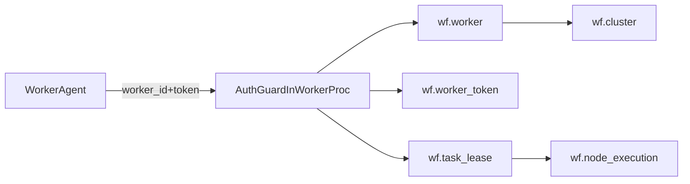

# Extend `wf` schema for registered workers

## Current gaps in the script
- The script defines JSON payload fields as `NVARCHAR(MAX)` instead of native `JSON`.
- Worker identity is currently only a free-text `@worker_id` in lease/procedure calls, without prior registration.
- There is no `cluster` model or enforced worker-to-cluster membership.
- There is no token/key authentication guard before requesting or updating leased tasks.

## Proposed schema extensions

### 1) Define payload fields as native `JSON` (empty tables)
Target columns in [`/home/ubuntu/MethylPipeline/workflow_engine/MethylPipeline_202604291041.sql`](/home/ubuntu/MethylPipeline/workflow_engine/MethylPipeline_202604291041.sql):
- `wf.workflow_instance.context_json`
- `wf.workflow_input_template.template_json`
- `wf.node_execution.input_json`
- `wf.node_execution.output_json`
- `wf.execution_context.context_value_json`

Plan:
- Change these columns directly to `JSON` in the DDL.
- Update affected procedures/functions to use `JSON` parameters/variables where appropriate.
- Skip migration/backfill/dual-write because tables are empty.

### 2) Introduce cluster registry
Add table `wf.cluster`:
- `id BIGINT IDENTITY PK`
- `cluster_key NVARCHAR(128) UNIQUE` (stable external ID)
- `name NVARCHAR(256)`
- `provider NVARCHAR(64)` (e.g., LambdaLabs, Nebius, TITAN)
- `shared_storage_uri NVARCHAR(1024)` (network/storage root)
- `worker_mount_path NVARCHAR(256) NOT NULL DEFAULT N'/work'`
- `status VARCHAR(32) CHECK (status IN ('ACTIVE','DISABLED'))`
- audit columns (`created_at_utc`, `updated_at_utc`)

This satisfies the requirement that workers belong to a cluster with shared storage mapped locally (default `/work`).

### 3) Introduce worker registry
Add table `wf.worker`:
- `id BIGINT IDENTITY PK`
- `cluster_id BIGINT NOT NULL FK -> wf.cluster(id)`
- `external_worker_key NVARCHAR(128) UNIQUE NULL` (optional portal/device identifier)
- `display_name NVARCHAR(256)`
- `hostname NVARCHAR(256) NULL`
- `capabilities JSON NULL`
- `status VARCHAR(32) CHECK (status IN ('REGISTERED','SUSPENDED','REVOKED'))`
- `last_seen_at_utc DATETIME2 NULL`
- audit columns

Add index:
- `(cluster_id, status)` for scheduling/auth checks.

### 4) Add worker token/key authentication
Add table `wf.worker_token`:
- `id BIGINT IDENTITY PK`
- `worker_id BIGINT NOT NULL FK -> wf.worker(id)`
- `token_hash VARBINARY(32) NOT NULL` (SHA-256 of token)
- `token_prefix NVARCHAR(16)` (for ops lookup, non-secret)
- `issued_at_utc`, `expires_at_utc`, `revoked_at_utc`
- `status VARCHAR(32) CHECK (status IN ('ACTIVE','EXPIRED','REVOKED'))`

Rules:
- Never store raw token.
- Unique index on `(worker_id, token_hash)`.
- Optional filtered index for active token validation.

### 5) Tie task lease to `wf.worker.id`
Evolve `wf.task_lease`:
- Keep column name `worker_id` but redefine it as `BIGINT NOT NULL` FK to `wf.worker(id)`.
- Remove use of text worker identity in leasing logic.
- Keep/update index `IX_tl_worker_expiry` on numeric `worker_id`.

## Procedure/function changes
Update worker-facing procedures in [`/home/ubuntu/MethylPipeline/workflow_engine/MethylPipeline_202604291041.sql`](/home/ubuntu/MethylPipeline/workflow_engine/MethylPipeline_202604291041.sql):
- `wf.sp_worker_request_task`
- `wf.sp_worker_heartbeat`
- `wf.sp_worker_fail_task`
- `wf.sp_worker_submit_result`

Changes:
- Require `@worker_id BIGINT` + `@worker_token`.
- Add auth guard block:
  - Resolve worker by `worker.id`.
  - Validate worker status and cluster status.
  - Validate token hash exists and is active.
- Enforce lease ownership by `worker.id`.
- Update `last_seen_at_utc` on successful auth/heartbeat.

## Optional scheduling extension (recommended)
If tasks must run only on specific clusters, add:
- `wf.workflow_action.allowed_cluster_id NULL` FK, or
- `wf.workflow_instance.cluster_id NOT NULL` FK.

Then add a filter in `sp_worker_request_task` so a worker only leases tasks in its cluster.

## Rollout sequence
1. Create `wf.cluster`, `wf.worker`, `wf.worker_token`.
2. Define JSON payload columns directly as native `JSON`.
3. Redefine `wf.task_lease.worker_id` as `BIGINT` FK to `wf.worker(id)`.
4. Deploy updated worker procedures requiring `@worker_id BIGINT` + token.
5. Register clusters/workers/tokens before enabling worker polling.

## Minimal architecture flow

## Key files to modify in implementation phase
- [`/home/ubuntu/MethylPipeline/workflow_engine/MethylPipeline_202604291041.sql`](/home/ubuntu/MethylPipeline/workflow_engine/MethylPipeline_202604291041.sql): add DDL, constraints, indexes, and stored procedure rewrites.
- [`/home/ubuntu/MethylPipeline/workflow_engine/workflow_definition.sql`](/home/ubuntu/MethylPipeline/workflow_engine/workflow_definition.sql): keep definition script aligned if this file is still used as baseline for clean deployments.