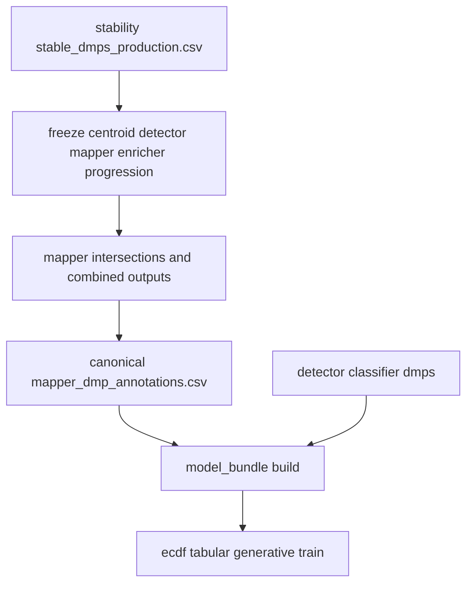

# Freeze Mapper Annotations For Model Bundle

## Goal
Ensure `--model` consumes gene/feature annotations from `--freeze` mapper outputs (stable DMP panel context), instead of rebuilding `dmp_df` only from detector CSVs that miss those annotations.

## Current Gap (confirmed)
- `build_model_feature_bundle()` currently loads DMP loci and effect sizes from detector exports and fills missing `gene_name/feature_type` with `unknown`.
- `--freeze` already generates mapper intersections and combined gene outputs under production mapper directories, but those artifacts are not used by model-bundle assembly.

## Proposed Design

### 1) Create canonical per-locus mapper annotation table (once, after freeze)
- Add a small builder in [packages/methylvalidation/methyl_validation/model_bundle.py](/home/ubuntu/MethylPipeline/packages/methylvalidation/methyl_validation/model_bundle.py) that:
  - Reads mapper `*-intersections.csv` files from each comparison mapper directory (resolved via project comparison paths).
  - Parses `dmp_name` to `(chromosome, position, context)`.
  - Collapses multi-hit rows to one deterministic annotation row per locus (comparison + chrom + pos + context), selecting the strongest mapping by `combined_weight` (fallback to `region_weight`/`effect_size` when needed).
  - Outputs fields needed by model backends: `gene_name`, `feature_type`, `region_weight`, plus provenance columns.
- Materialize this into a stable cache artifact under production (e.g. `production/model_bundle/mapper_dmp_annotations.csv`).

### 2) Persist annotation-cache pointer during freeze
- In [packages/methylvalidation/methyl_validation/stability.py](/home/ubuntu/MethylPipeline/packages/methylvalidation/methyl_validation/stability.py), after successful `run_pipeline_for_production(...)` in `freeze_production_model(...)`:
  - Build the annotation cache from production mapper outputs.
  - Write a pointer into production `project.json` step config metadata (or model bundle metadata block) so `--model` can discover and reuse it directly.
  - Include artifact path and row counts in `production_summary.json` for traceability.

### 3) Make model-bundle assembly consume mapper annotations first
- Update [packages/methylvalidation/methyl_validation/model_bundle.py](/home/ubuntu/MethylPipeline/packages/methylvalidation/methyl_validation/model_bundle.py):
  - Keep detector CSVs as source-of-truth for per-comparison effect sizes / class labels.
  - Left-join canonical mapper annotations onto detector loci by `(comparison_label, chromosome, position, context)`.
  - Preserve old behavior only as fallback for pure `dmp` workflows; for `gene/structural/hybrid` feature-family modes, enforce annotation availability (explicit error when missing) to avoid silent `unknown`-heavy bundles.
  - Record annotation source in manifest metadata (`mapper_annotation_source`, coverage stats, unknown-rate).

### 4) Ensure trainer paths carry strictness for gene-level modes
- In [packages/methylvalidation/methyl_validation/trainer_api.py](/home/ubuntu/MethylPipeline/packages/methylvalidation/methyl_validation/trainer_api.py):
  - Pass feature-family context into bundle creation so model-bundle can enforce mapper-annotation requirements for non-`dmp` modes.
  - Keep backend behavior unchanged otherwise.

### 5) Add regression tests for freeze→model reuse contract
- Extend [packages/methylvalidation/tests/test_model_bundle_tabular_backend.py](/home/ubuntu/MethylPipeline/packages/methylvalidation/tests/test_model_bundle_tabular_backend.py):
  - New fixture with detector CSV + mapper intersections; verify output `dmp_df` contains mapped `gene_name/feature_type/region_weight` rather than `unknown`.
  - Verify deterministic collapse when one DMP maps to multiple features.
- Add/extend freeze orchestration tests (likely [packages/methylvalidation/tests/test_cli_resume.py](/home/ubuntu/MethylPipeline/packages/methylvalidation/tests/test_cli_resume.py) or dedicated stability tests):
  - Assert freeze writes annotation cache/pointer and `--model` uses it without rerunning mapper.

## Data Flow After Change

## Validation Checklist
- `model_feature_bundle.h5` shows realistic non-`unknown` gene/feature coverage for production runs.
- Gene-level aggregated ECDF reports expected gene counts (order-of-hundreds, not ~1 unless biologically justified).
- Re-running `--model` with different backends reuses freeze-generated annotation cache and does not invoke bedtools mapping again.