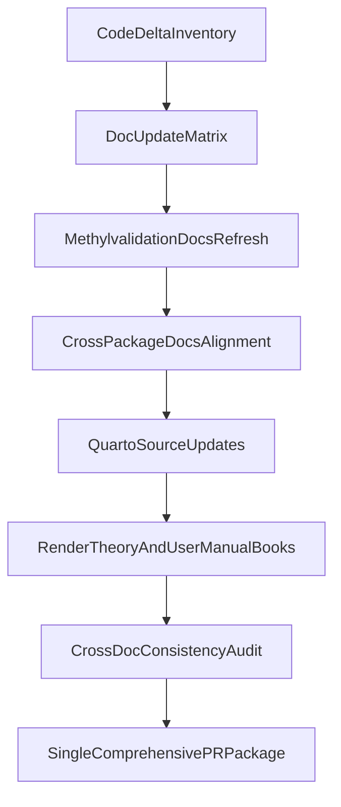

# Full Documentation Revision for Latest Mono-Repo Changes

## Goal
Bring all user-facing and developer-facing documentation into sync with the latest MethylPipeline behavior across workflow orchestration, feature semantics, model backends, and outputs.

## Scope Confirmed
- Full repository documentation sweep.
- Single comprehensive PR.
- Update docs source files and regenerate committed rendered book artifacts (`_book` HTML/PDF).

## Primary Drift Areas To Fix
- Adaptive MC stability early-stop coverage is partial and needs consistent explanation across package docs + theory config reference.
- `observed_hybrid`/`feature_family_set` semantics changed (gene/structural dynamic features, mapper annotation requirement, removed weighted outlier score) and must replace outdated USAGE text.
- Aggregated ECDF OvR backend (`ecdf_aggregated_*`) is under-documented in methylvalidation docs and theory config docs.
- `tabular_max_dmps` default semantics changed (no cap by default) and current theory docs still describe old defaults.
- Model-MC shared-run symlink reuse and multiclass holdout wiring behavior need explicit operational documentation.
- New/changed production artifacts (e.g., mapper annotation cache, aggregated ECDF model files, early-stop diagnostics) must be documented consistently.

## Files To Update
- Root/index/navigation:
  - [/home/ubuntu/MethylPipeline/README.md](/home/ubuntu/MethylPipeline/README.md)
  - [/home/ubuntu/MethylPipeline/docs/index.md](/home/ubuntu/MethylPipeline/docs/index.md)
  - [/home/ubuntu/MethylPipeline/docs/config_parameter_matrix.md](/home/ubuntu/MethylPipeline/docs/config_parameter_matrix.md)
- Orchestrator docs (highest priority):
  - [/home/ubuntu/MethylPipeline/packages/methylvalidation/docs/USAGE.md](/home/ubuntu/MethylPipeline/packages/methylvalidation/docs/USAGE.md)
  - [/home/ubuntu/MethylPipeline/packages/methylvalidation/docs/IMPLEMENTATION.md](/home/ubuntu/MethylPipeline/packages/methylvalidation/docs/IMPLEMENTATION.md)
  - [/home/ubuntu/MethylPipeline/packages/methylvalidation/docs/STABILITY_FREEZE_READINESS.md](/home/ubuntu/MethylPipeline/packages/methylvalidation/docs/STABILITY_FREEZE_READINESS.md)
  - [/home/ubuntu/MethylPipeline/packages/methylvalidation/docs/HYPERPARAMETER_SEARCH.md](/home/ubuntu/MethylPipeline/packages/methylvalidation/docs/HYPERPARAMETER_SEARCH.md)
  - [/home/ubuntu/MethylPipeline/packages/methylvalidation/docs/DISTRIBUTED_QUEUE.md](/home/ubuntu/MethylPipeline/packages/methylvalidation/docs/DISTRIBUTED_QUEUE.md)
- Cross-package docs impacted by runtime changes:
  - [/home/ubuntu/MethylPipeline/packages/methylpredictor/docs/IMPLEMENTATION.md](/home/ubuntu/MethylPipeline/packages/methylpredictor/docs/IMPLEMENTATION.md)
  - [/home/ubuntu/MethylPipeline/packages/methylclassifier/docs/IMPLEMENTATION.md](/home/ubuntu/MethylPipeline/packages/methylclassifier/docs/IMPLEMENTATION.md)
  - [/home/ubuntu/MethylPipeline/packages/methylclassifier/docs/THEORY.md](/home/ubuntu/MethylPipeline/packages/methylclassifier/docs/THEORY.md)
  - [/home/ubuntu/MethylPipeline/packages/methylcentroid/docs/IMPLEMENTATION.md](/home/ubuntu/MethylPipeline/packages/methylcentroid/docs/IMPLEMENTATION.md)
  - [/home/ubuntu/MethylPipeline/packages/methylutils/docs/IMPLEMENTATION.md](/home/ubuntu/MethylPipeline/packages/methylutils/docs/IMPLEMENTATION.md)
- Quarto source + rendered outputs:
  - [/home/ubuntu/MethylPipeline/docs/theory/chapters/13-configuration-reference.qmd](/home/ubuntu/MethylPipeline/docs/theory/chapters/13-configuration-reference.qmd)
  - [/home/ubuntu/MethylPipeline/docs/theory/chapters/14-user-guide.qmd](/home/ubuntu/MethylPipeline/docs/theory/chapters/14-user-guide.qmd)
  - [/home/ubuntu/MethylPipeline/docs/user-manual/04-stage-stability.qmd](/home/ubuntu/MethylPipeline/docs/user-manual/04-stage-stability.qmd)
  - [/home/ubuntu/MethylPipeline/docs/user-manual/05-stage-freeze.qmd](/home/ubuntu/MethylPipeline/docs/user-manual/05-stage-freeze.qmd)
  - [/home/ubuntu/MethylPipeline/docs/user-manual/06-stage-model-building.qmd](/home/ubuntu/MethylPipeline/docs/user-manual/06-stage-model-building.qmd)
  - [/home/ubuntu/MethylPipeline/docs/user-manual/12-distributed-monte-carlo.qmd](/home/ubuntu/MethylPipeline/docs/user-manual/12-distributed-monte-carlo.qmd)
  - Regenerated outputs under theory/user-manual `_book` directories and PDFs.

## Execution Plan
1. Build a doc-change matrix from code deltas (feature/config/CLI/output) and map each delta to required doc targets.
2. Update methylvalidation docs first as canonical workflow source (commands, configs, outputs, migration notes).
3. Propagate backend/runtime semantics to affected package docs (predictor/classifier/centroid/utils) to remove contradictions.
4. Update theory and user-manual Quarto chapters for configuration defaults/semantics and stage behavior.
5. Regenerate Quarto books (theory + user manual) and ensure rendered outputs match source updates.
6. Run consistency audit:
   - config key names/defaults match code;
   - stage order and artifact paths are consistent across root docs/package docs/books;
   - removed/deprecated behavior is not described as current.
7. Produce a final documentation change summary for reviewers (what changed, where, why).

## Consistency Checklist
- New keys documented consistently: `stability_early_stop_*`, `ecdf_aggregated_*`, `feature_family_set` semantics, `tabular_max_dmps` optional cap.
- Artifact tables include: `early_stopping` in `stability_summary.json`, `mapper_dmp_annotations.csv`, `mapper_annotation_cache`, `ecdf_aggregated_ovr.pkl/.meta.json`, and related predictor outputs.
- `observed_hybrid` sections reflect dynamic mapped features (no legacy weighted outlier score claim).
- Model-MC docs describe shared artifact symlink reuse and implications.
- Multiclass holdout/predictor routing docs reflect current generated run-project behavior.

## Validation
- Manual link and path sanity check across edited docs.
- Quarto render succeeds for both books without unresolved references.
- Spot-check representative generated pages/PDF sections for updated config defaults and artifact descriptions.

## Flow
