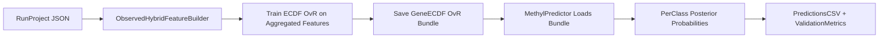

# Implement Gene-Level ECDF OvR

## Goal
Add a new ECDF backend path that trains and predicts on aggregated features (e.g., gene, promoter, terminator, exon, intron, gene_body) using the same probabilistic ECDF logic and effect-size-informed weighting principles currently used at DMP level.

## Current Gap
- Existing ECDF multiclass path in [`/home/ubuntu/MethylPipeline/packages/methylclassifier/methyl_classifier/project_resolver.py`](/home/ubuntu/MethylPipeline/packages/methylclassifier/methyl_classifier/project_resolver.py) + [`/home/ubuntu/MethylPipeline/packages/methylutils/methyl_utils/ecdf_classifier.py`](/home/ubuntu/MethylPipeline/packages/methylutils/methyl_utils/ecdf_classifier.py) consumes detector/DMP artifacts.
- `feature_mode=observed_hybrid` and `feature_family_set=gene` currently affect tabular/generative model paths; ECDF classifier training still resolves to DMP detection outputs.

## Proposed Architecture

## Implementation Steps
- **1) Introduce ECDF aggregated-feature trainer module**
  - Add new training entrypoint in [`/home/ubuntu/MethylPipeline/packages/methylvalidation/methyl_validation`](/home/ubuntu/MethylPipeline/packages/methylvalidation/methyl_validation) (e.g., `ecdf_aggregated_backend.py`) that:
    - builds train matrices with [`/home/ubuntu/MethylPipeline/packages/methylvalidation/methyl_validation/observed_feature_builder.py`](/home/ubuntu/MethylPipeline/packages/methylvalidation/methyl_validation/observed_feature_builder.py),
    - trains one binary ECDF head per OvR class,
    - stores union feature schema and per-head column maps similar to current OVR package semantics.

- **2) Add effect-size-informed aggregated feature weights for ECDF heads**
  - Define deterministic feature-weight construction from observed-hybrid anchors/metadata (e.g., aggregated absolute effect-size summaries per feature family).
  - Persist weights in package metadata for reproducible inference and calibration.

- **3) Wire ECDF backend selection in trainer API**
  - Update [`/home/ubuntu/MethylPipeline/packages/methylvalidation/methyl_validation/trainer_api.py`](/home/ubuntu/MethylPipeline/packages/methylvalidation/methyl_validation/trainer_api.py) ECDF step builder to choose:
    - legacy DMP ECDF path (default),
    - new aggregated-feature ECDF path when `feature_mode=observed_hybrid` and family set is not `dmp` (or controlled by explicit config flag).

- **4) Extend classifier loading/inference for aggregated-feature ECDF package**
  - Update [`/home/ubuntu/MethylPipeline/packages/methylclassifier/methyl_classifier/core/classifier.py`](/home/ubuntu/MethylPipeline/packages/methylclassifier/methyl_classifier/core/classifier.py) to recognize/load the new package type (feature schema + per-head ECDF models).
  - Keep OvR fusion contract (`prob_class*`) consistent with existing predictor behavior.

- **5) Update predictor sample scoring path for aggregated features**
  - In [`/home/ubuntu/MethylPipeline/packages/methylpredictor/methyl_predictor/core/predictor.py`](/home/ubuntu/MethylPipeline/packages/methylpredictor/methyl_predictor/core/predictor.py), add data-loading branch for aggregated-feature ECDF bundles so sample features are constructed with the same schema used at train time.
  - Ensure multiclass uses all configured `test_group_paths` classes and fails fast on schema mismatch.

- **6) Output semantics and class evidence reporting**
  - Keep primary outputs as posterior probabilities (`prob_class0..K-1`) for compatibility.
  - Add optional per-class evidence diagnostics (e.g., temperature-scaled log-score before softmax) to prediction report/metadata for interpretability.
  - Do not label these diagnostics as p-values unless a statistically valid p-value transformation is introduced.

- **7) Config and docs updates**
  - Update backend/config docs in:
    - [`/home/ubuntu/MethylPipeline/packages/methylvalidation/methyl_validation/config.py`](/home/ubuntu/MethylPipeline/packages/methylvalidation/methyl_validation/config.py)
    - [`/home/ubuntu/MethylPipeline/packages/methylclassifier/docs/THEORY.md`](/home/ubuntu/MethylPipeline/packages/methylclassifier/docs/THEORY.md)
    - [`/home/ubuntu/MethylPipeline/packages/methylpredictor/docs/IMPLEMENTATION.md`](/home/ubuntu/MethylPipeline/packages/methylpredictor/docs/IMPLEMENTATION.md)
  - Document exact meaning of probabilities vs optional evidence diagnostics.

## Test Plan
- Unit tests:
  - package serialization/deserialization for aggregated-feature ECDF OvR,
  - schema compatibility checks and deterministic feature ordering,
  - multiclass prediction over all classes with `test_group_paths`.
- Integration tests:
  - model-mc shared-run reuse + ECDF aggregated path,
  - labeled multiclass metrics output and no fallback to single class.
- Regression tests:
  - legacy DMP ECDF behavior remains unchanged when aggregated mode is off.

## Acceptance Criteria
- ECDF can train/predict multiclass using aggregated feature families (gene/structural) with effect-size-informed weights.
- Predictor outputs `prob_class*` across all classes for MC test splits.
- No silent fallback to DMP-only ECDF path when aggregated mode is requested.
- Existing DMP ECDF workflows remain backward compatible.