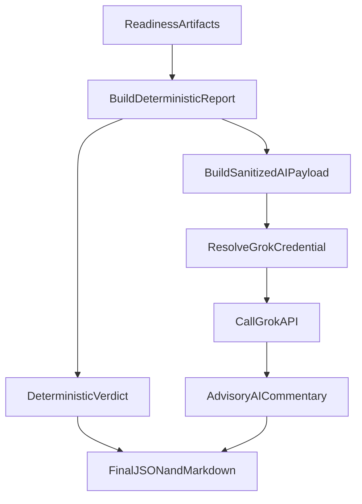

# Add Grok Review To Readiness CLI

## Goal
Extend [`/home/ubuntu/MethylPipeline/packages/methylvalidation/methyl_validation/stability_freeze_readiness.py`](/home/ubuntu/MethylPipeline/packages/methylvalidation/methyl_validation/stability_freeze_readiness.py) with an optional **inline** Grok analysis step that reuses MethylMapper credential resolution and sends a **sanitized** payload (plus selected top-N trend/label summaries), avoiding local/private paths.

## Key Design Decisions (locked)
- Integration style: **inline flags** on existing readiness CLI.
- Privacy mode: **sanitized summary + selected top tables** (no absolute local paths).
- AI output role: **advisory appendix** to readiness, never overriding deterministic go/no-go.
- Grok model default: **`grok-4.3`**.

## Default Runtime Parameters (locked)
- Grok review: **enabled by default** (opt-out via `--no-grok-review`).
- `--grok-model`: **`grok-4.3`**
- `--grok-max-top-rows`: **10**
- `--grok-timeout-seconds`: **60**
- `--grok-max-retries`: **2**
- `--grok-temperature`: **0.1**
- Path redaction in AI payload: **enabled by default**.
- Include raw AI response in report JSON: **disabled by default**.
- If Grok fails (missing key, timeout, API error): **non-blocking warning only**; deterministic readiness verdict remains unchanged.

## Implementation Plan
1. **Define sanitized AI payload contract**
   - Add helper(s) in readiness module to derive an AI payload from the computed report:
     - include verdict, stability/freeze/progression metrics, module trend top-N, label-count top-N.
     - explicitly exclude `project_root`, `paths.*`, and any absolute filesystem references.
   - Add tests to assert no path-like strings (e.g. `/work/`, `/home/`, `/lambda/`) are present in the AI payload.

2. **Reuse MethylMapper credential resolver for Grok key**
   - Import and use [`SecureCredentialManager` from `/home/ubuntu/MethylPipeline/packages/methylmapper/methyl_mapper/secure_credentials.py`](/home/ubuntu/MethylPipeline/packages/methylmapper/methyl_mapper/secure_credentials.py).
   - Resolve with same precedence MethylMapper documents (explicit key, encrypted file, Azure Key Vault, env) by configuring:
     - `credential_name="grok_api_key"`
     - `env_var_name="GROK_API_KEY"`
     - optional `azure_key_vault_url`, `azure_secret_name`, `methyl_mapper_home` CLI args.

3. **Add optional Grok call path in readiness CLI**
   - Add CLI args in readiness tool, e.g.:
     - `--grok-review` / `--no-grok-review` (default on; explicit opt-out)
     - `--grok-model` (default `grok-4.3`)
     - `--grok-max-top-rows` (controls top-N evidence rows in payload)
     - `--grok-max-retries`, `--grok-temperature`
     - `--grok-api-key`, `--azure-key-vault-url`, `--azure-secret-name`, `--methyl-mapper-home`
     - optional `--grok-timeout-seconds`.
   - Implement a small HTTP client (`https://api.x.ai/v1/chat/completions`) with robust error handling and clear failure messages.
   - If key missing or API call fails, keep deterministic report output and append a non-fatal warning.

4. **Integrate AI section into outputs without leaking paths**
   - Extend report structure with an `ai_review` object (status/model/summary/caveats/raw_excerpt optional).
   - Update markdown renderer to append an "AI readiness commentary (advisory)" section when available.
   - Keep deterministic verdict unchanged; AI content is contextual analysis only.

5. **Strip unnecessary private path references from standard report output**
   - Add a sanitization mode for persisted outputs (default on for AI payload, optional for full report rendering):
     - suppress or redact path-heavy fields in markdown/json where not analytically necessary.
   - Preserve compatibility by keeping full report internals available unless `--redact-paths` is requested.

6. **Docs + tests**
   - Update:
     - [`/home/ubuntu/MethylPipeline/packages/methylvalidation/docs/STABILITY_FREEZE_READINESS.md`](/home/ubuntu/MethylPipeline/packages/methylvalidation/docs/STABILITY_FREEZE_READINESS.md)
     - [`/home/ubuntu/MethylPipeline/packages/methylvalidation/docs/USAGE.md`](/home/ubuntu/MethylPipeline/packages/methylvalidation/docs/USAGE.md)
   - Add tests for:
     - payload sanitization,
     - credential resolution plumbing,
     - graceful behavior on missing key/API failure,
     - AI section rendering,
     - deterministic verdict unaffected by AI commentary.

## Data Flow (with AI step)

## Expected Outcome
- `methyl-stability-freeze-readiness` can optionally append a Grok-based disease-consistency commentary using existing credential infrastructure.
- AI input is privacy-conscious (sanitized + top evidence only).
- Core readiness gates remain deterministic and reproducible.