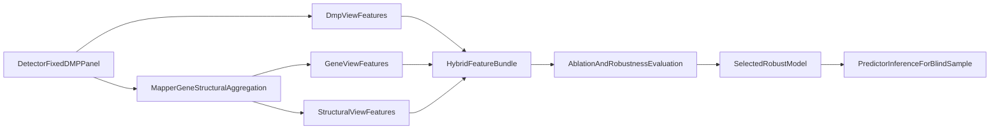

# Hybrid Robust Modeling Upgrade Plan

## Goal
Extend the existing prediction stack so it can train and infer with a **hybrid feature bundle** (DMP + gene + gene-structural features), using biologically validated effect-size weighting and robustness-first evaluation.

## Current Baseline (What Exists)
- DMP selection and effect-size coverage are implemented in [`C:/Work/MethylPipeline/packages/methyldetector/methyl_detector/core/methyldetector.py`](C:/Work/MethylPipeline/packages/methyldetector/methyl_detector/core/methyldetector.py) and effect-size math in [`C:/Work/MethylPipeline/packages/methylutils/methyl_utils/statistical_tests.py`](C:/Work/MethylPipeline/packages/methylutils/methyl_utils/statistical_tests.py).
- Mapper already computes rich gene/structural aggregates (`hits_*`, `effect_size_{feature}`, `gene_feature_importance`) in [`C:/Work/MethylPipeline/packages/methylmapper/methyl_mapper/bedtools_mapper.py`](C:/Work/MethylPipeline/packages/methylmapper/methyl_mapper/bedtools_mapper.py) and region parsing in [`C:/Work/MethylPipeline/packages/methylmapper/methyl_mapper/gtf_regions.py`](C:/Work/MethylPipeline/packages/methylmapper/methyl_mapper/gtf_regions.py).
- Current model backends consume DMP-centric features (`raw_dmp` / `observed_hybrid`) in [`C:/Work/MethylPipeline/packages/methylvalidation/methyl_validation/tabular_backend.py`](C:/Work/MethylPipeline/packages/methylvalidation/methyl_validation/tabular_backend.py), [`C:/Work/MethylPipeline/packages/methylvalidation/methyl_validation/generative_backend.py`](C:/Work/MethylPipeline/packages/methylvalidation/methyl_validation/generative_backend.py), and [`C:/Work/MethylPipeline/packages/methylvalidation/methyl_validation/observed_feature_builder.py`](C:/Work/MethylPipeline/packages/methylvalidation/methyl_validation/observed_feature_builder.py).
- Biology outputs (mapper/enricher/progression) are currently parallel to model training, not direct inputs, orchestrated via [`C:/Work/MethylPipeline/packages/methylvalidation/methyl_validation/pipeline_runner.py`](C:/Work/MethylPipeline/packages/methylvalidation/methyl_validation/pipeline_runner.py).

## Target Architecture

## Implementation Phases

### Phase 1: Define a stable hybrid feature contract
- Introduce explicit feature families (`dmp`, `gene`, `structural`) and versioned schema in [`C:/Work/MethylPipeline/packages/methylvalidation/methyl_validation/model_bundle.py`](C:/Work/MethylPipeline/packages/methylvalidation/methyl_validation/model_bundle.py).
- Preserve current `raw_dmp` and `observed_hybrid` behavior as backward-compatible modes.
- Add metadata that records aggregation parameters (region weights, effect-size transforms, min coverage, selected panel version).

### Phase 2: Build per-sample gene and structural aggregations
- Extend feature building in [`C:/Work/MethylPipeline/packages/methylvalidation/methyl_validation/observed_feature_builder.py`](C:/Work/MethylPipeline/packages/methylvalidation/methyl_validation/observed_feature_builder.py) to compute sample-level gene/structural descriptors from fixed DMP panel mappings.
- Reuse mapper semantics (exclusive feature assignment and region weighting) from [`C:/Work/MethylPipeline/packages/methylmapper/methyl_mapper/bedtools_mapper.py`](C:/Work/MethylPipeline/packages/methylmapper/methyl_mapper/bedtools_mapper.py) to avoid conceptual drift between biology and ML.
- Add effect-size-weighted aggregate formulas (e.g., weighted mean methylation shift, weighted direction balance, weighted hit density) that mirror biologically proven DMP weighting.

### Phase 3: Integrate hybrid mode into training backends
- Extend tabular backend in [`C:/Work/MethylPipeline/packages/methylvalidation/methyl_validation/tabular_backend.py`](C:/Work/MethylPipeline/packages/methylvalidation/methyl_validation/tabular_backend.py) to accept selectable family sets (`dmp-only`, `gene-only`, `structural-only`, `hybrid`).
- Extend generative backend in [`C:/Work/MethylPipeline/packages/methylvalidation/methyl_validation/generative_backend.py`](C:/Work/MethylPipeline/packages/methylvalidation/methyl_validation/generative_backend.py) with the same family gating for apples-to-apples robustness comparisons.
- Keep predictor compatibility in [`C:/Work/MethylPipeline/packages/methylpredictor/methyl_predictor/core/predictor.py`](C:/Work/MethylPipeline/packages/methylpredictor/methyl_predictor/core/predictor.py) by loading bundled schema and applying identical preprocessing at inference.

### Phase 4: Robustness-first evaluation and selection
- Add leakage-safe split strategies and repeated cohort-aware validation loops in [`C:/Work/MethylPipeline/packages/methylvalidation/methyl_validation/pipeline_runner.py`](C:/Work/MethylPipeline/packages/methylvalidation/methyl_validation/pipeline_runner.py).
- Expand metrics reporting in [`C:/Work/MethylPipeline/packages/methylvalidation/methyl_validation/validator_metrics.py`](C:/Work/MethylPipeline/packages/methylvalidation/methyl_validation/validator_metrics.py) with robustness indicators (BA variance, worst-group BA, calibration stability).
- Implement mandatory ablations: `dmp`, `gene`, `structural`, `dmp+gene`, `dmp+structural`, `hybrid-all`; select model by robustness criterion first, BA second.

### Phase 5: Configuration and rollout
- Add config switches for feature-family selection and aggregation hyperparameters in project/step config parsing (starting from [`C:/Work/MethylPipeline/packages/methylutils/methyl_utils/pipeline_config.py`](C:/Work/MethylPipeline/packages/methylutils/methyl_utils/pipeline_config.py)).
- Provide production-safe defaults that preserve current behavior unless `hybrid` mode is explicitly enabled.
- Ensure `--freeze` and `--model` workflows remain reproducible with explicit artifact versioning and model-feature manifest.

## Acceptance Criteria
- A trained model can run in `hybrid` mode and score blind samples with the same predictor CLI flow as current production.
- Feature bundle captures all selected family columns plus deterministic preprocessing metadata.
- Robustness report includes ablation comparison and variance-aware selection outputs.
- Existing DMP-only workflows remain unchanged by default.

## Risks and Mitigations
- Mapper/ML semantic mismatch risk: mitigate by reusing mapper feature semantics directly in feature builder utilities.
- Feature explosion and overfitting risk: mitigate with stability filtering, family-wise regularization, and ablation-based pruning.
- Backward compatibility risk: mitigate by versioned schema and strict default-off behavior for new feature families.