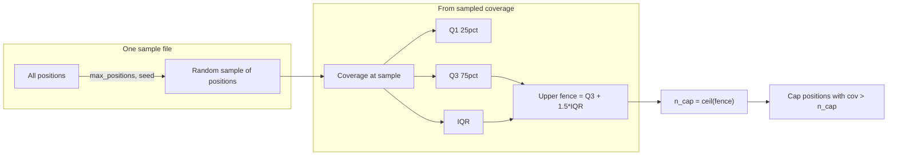

# IQR-based coverage cap (median + 1.5*IQR outlier limit)

## Problem with the current / suggested approach

- **Goal**: After BAM extraction, cap per-position counts to avoid artificially lowering methylation variance when labs re-sequence the same library (duplicates, no new information). Identify positions with unrealistically high coverage and cap them.
- **Difficulty**: The true "typical" coverage is unknown because of those same outliers.
- **Approach**: Use the **median** coverage (robust to outliers). Compute it from a **random sample of positions** (cheap). Use that same sample to define an **outlier limit** via the 1.5*IQR rule: positions above Q3 + 1.5*IQR are impossible given the distribution and should be capped.

A **percentile-based** n_cap (e.g. 95th percentile) is the wrong rule: it caps a fixed fraction of positions regardless of whether they are true outliers. The **IQR-based** rule defines outliers as values above the upper fence (Q3 + 1.5*IQR), which is the standard boxplot criterion and matches the intended logic.

---

## Intended flow

1. **Median coverage**: Solved by taking the median of the random sample (already in [packages/methylutils/methyl_utils/core/methyl_frame.py](packages/methylutils/methyl_utils/core/methyl_frame.py): `MethylSample.median_coverage(max_positions, seed)`).
2. **Outlier limit (n_cap)**: From the **same** random sample of positions, compute Q1, Q3, IQR; set **n_cap = Q3 + 1.5  IQR** (upper fence). Integer n_cap = max(1, ceil(that value)). Only positions with coverage > n_cap are then thinned (binomial cap).

---

## Implementation

### 1. MethylUtils: IQR-based n_cap from sampled coverage

**Option A – extend MethylSample (methyl_frame.py)**  
Add a method that returns both a robust summary and the fence-based n_cap from the same random sample:

- `coverage_iqr_n_cap(self, *, max_positions=100_000, iqr_multiplier=1.5, seed=None) -> tuple[float, float, int]`  
  - Sample up to `max_positions` positions (same as `median_coverage`).  
  - On that coverage array: median, Q1 = 25th percentile, Q3 = 75th percentile, IQR = Q3 - Q1.  
  - Upper fence = Q3 + iqr_multiplier * IQR.  
  - n_cap = max(1, int(np.ceil(upper_fence))).  
  - **Edge**: If IQR == 0 (all coverages equal), set n_cap = max(1, ceil(median)) or ceil(Q3) so we do not cap everything.  
  - Return e.g. `(median, upper_fence, n_cap)` for logging.

**Option B – standalone in io.py (if estimation must work from path only)**  
Add `estimate_n_cap_from_sample_path(path, *, max_positions=100_000, iqr_multiplier=1.5, seed=None) -> int` (and optionally return median/fence for logging):

- Use `load_pos_from_h5(path)`, draw random indices, `load_from_h5(path, indices=idx)`, get coverage from the loaded object.  
- Compute Q1, Q3, IQR, upper_fence = Q3 + iqr_multiplier*IQR.  
- n_cap = max(1, ceil(upper_fence)); if IQR == 0, n_cap = max(1, ceil(median)) or ceil(Q3).  
- Return n_cap (and optionally median, fence).

Recommendation: implement **both** – the method on `MethylSample` for in-memory use and tests, and the path-based helper in `io.py` that loads a subset and delegates to the same math (or calls the method on the loaded object). That keeps one definition of “IQR n_cap” and reuses the existing “random sample of positions” pattern.

### 2. MethylCentroid config and wiring

In [packages/methylcentroid/methyl_centroid/config.py](packages/methylcentroid/methyl_centroid/config.py) (and any existing auto n_cap fields):

- **cap_coverage_auto_n_cap** (bool): when True and `cap_coverage_n_cap` is None, estimate n_cap from the first sample.
- **cap_coverage_n_cap_method**: `"iqr"` (default). Reserve `"percentile"` for future use if needed.
- **cap_coverage_n_cap_iqr_multiplier**: float, default **1.5** (standard boxplot fence).
- **cap_coverage_n_cap_max_positions**: int (e.g. 100_000) and **cap_coverage_seed** (optional) for the random sample.

Remove or repurpose any **percentile**-based auto n_cap option so the default behavior is IQR-based.

In [packages/methylcentroid/methyl_centroid/methyl_centroid.py](packages/methylcentroid/methyl_centroid/methyl_centroid.py):

- When `cap_coverage` is True, `cap_coverage_n_cap` is None, and `cap_coverage_auto_n_cap` is True: before adding samples, call the estimator on the first sample path (path-based helper from io), pass `max_positions`, `iqr_multiplier`, `seed`. Set `_cap_coverage_n_cap` to the returned n_cap and enable capping.
- Log the estimated median, upper fence, and n_cap (if the helper returns them) so the lab can confirm the limit is “logical” (e.g. near expected 30x rather than an artifact).

### 3. Edge cases and defaults

- **IQR = 0**: All sampled coverages equal → set n_cap = max(1, ceil(median)) (or ceil(Q3)) so no position is capped, or only those above that single value. Avoid n_cap = 0 or negative.
- **Very small sample**: If the number of sampled positions is too small (e.g. < 100), Q1/Q3 may be unstable; consider a minimum (e.g. 1000) or fallback to median + k*MAD if needed (can be a follow-up).
- **Minimum n_cap**: Ensure n_cap >= 1 so binomial thinning is well-defined.

### 4. Documentation

- In MethylUtils (e.g. docstring for the new method and `estimate_n_cap_from_sample_path`): state that the **median** is estimated from a random sample of positions (robust, cheap), and the **outlier limit** n_cap is the upper fence **Q3 + 1.5*IQR** from the same sample, so only positions with coverage above that (re-sequencing/duplicates) are capped.
- In MethylCentroid config/docs: explain that with `cap_coverage_auto_n_cap=True`, n_cap is set using this IQR rule on the first sample so that “impossible” coverage values are capped without requiring a fixed percentile or known mean.

---

## Summary of changes

| Component                   | Change                                                                                                                                                                                                                                                                     |
| --------------------------- | -------------------------------------------------------------------------------------------------------------------------------------------------------------------------------------------------------------------------------------------------------------------------- |
| MethylUtils methyl_frame.py | Add `MethylSample.coverage_iqr_n_cap(max_positions, iqr_multiplier=1.5, seed)` returning (median, upper_fence, n_cap); use same random sample as `median_coverage`.                                                                                                        |
| MethylUtils io.py           | Add `estimate_n_cap_from_sample_path(path, max_positions, iqr_multiplier=1.5, seed)` that loads a random subset of positions and computes n_cap via Q1/Q3/IQR (reuse same math or call the method on loaded sample). Optionally return (median, fence, n_cap) for logging. |
| MethylCentroid config       | Add/align: cap_coverage_auto_n_cap, cap_coverage_n_cap_method="iqr", cap_coverage_n_cap_iqr_multiplier=1.5, cap_coverage_n_cap_max_positions, seed. Remove or deprecate percentile-based auto n_cap.                                                                       |
| MethylCentroid build        | When auto n_cap is enabled, call the IQR-based estimator on the first sample and set n_cap; log median and fence.                                                                                                                                                          |
| Docs                        | Describe median + 1.5*IQR as the outlier limit and that only positions above that are capped.                                                                                                                                                                              |

This aligns the implementation with the intended design: **median from a random sample** answers “typical coverage”; **Q3 + 1.5*IQR** from the same sample defines which positions are outliers and sets the cap so only those are thinned.