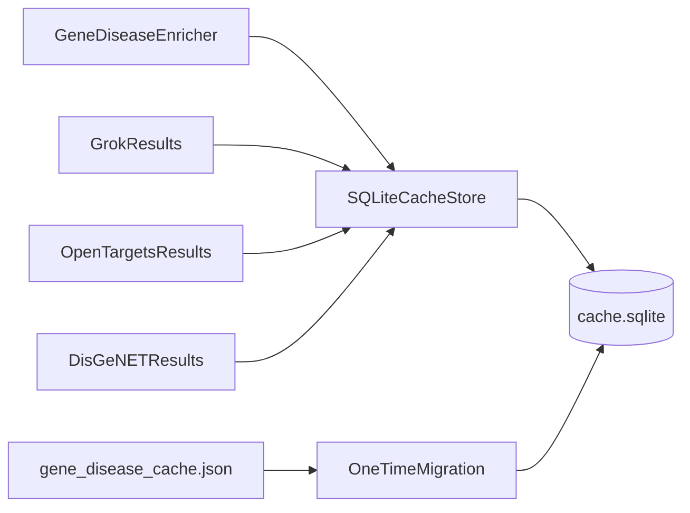

# MethylMapper SQLite Cache Plan

## Goal

Move enrichment caching from a single JSON file to SQLite (WAL) under shared `methyl_mapper_home`, so concurrent VMs can safely upsert partial source results (Grok/Open Targets/DisGeNET) without clobbering each other.

## Target Files

- [packages/methylmapper/methyl_mapper/gene_disease_enricher.py](/home/ubuntu/MethylPipeline/packages/methylmapper/methyl_mapper/gene_disease_enricher.py)
- [packages/methylmapper/methyl_mapper/config.py](/home/ubuntu/MethylPipeline/packages/methylmapper/methyl_mapper/config.py)
- [packages/methylmapper/methyl_mapper/cli.py](/home/ubuntu/MethylPipeline/packages/methylmapper/methyl_mapper/cli.py)
- [packages/methylmapper/methyl_mapper/**init**.py](/home/ubuntu/MethylPipeline/packages/methylmapper/methyl_mapper/__init__.py)
- New module: `packages/methylmapper/methyl_mapper/cache_db.py`
- New tests: `packages/methylmapper/tests/test_cache_db.py` (and targeted enricher tests)

## Design

## Implementation Steps

1. **Add SQLite cache store abstraction**

- Create `cache_db.py` with:
  - schema init/migrations (`PRAGMA journal_mode=WAL`, `synchronous=NORMAL`, `busy_timeout`)
  - tables for `associations`, `disease_ids`, `target_ids`
  - composite primary keys:
    - associations: `(source, gene, disease_term)`
    - disease IDs: `(disease_term)`
    - target IDs: `(gene_name)`
  - upsert/read-batch methods used by current cache API semantics.

1. **Wire enricher to DB-backed cache**

- In `gene_disease_enricher.py`, keep current in-memory runtime caches and TTL logic, but replace JSON persistence paths (`_load_disk_cache`, `_save_disk_cache`, disk lookups) with SQLite reads/writes.
- Keep existing `_cache_get_batch`, `_cache_set`, `_disease_cache_get/set`, `_target_cache_get/set` method signatures so enrichment logic remains unchanged.
- Ensure source-partial behavior: if Grok row exists and Open Targets row missing, only query/upsert missing source rows.

1. **One-time JSON -> SQLite migration**

- On startup (cache enabled), if legacy `gene_disease_cache.json` exists and DB has no migrated marker, import rows into SQLite in a single transaction.
- Store migration marker/version in metadata table.
- Keep JSON file untouched or rename to `.migrated` after successful import (implementation choice: rename for idempotency and visibility).

1. **Config/CLI surface updates**

- Add typed mapper config fields in `MapperStepConfig` for DB cache path/backend mode (default backend `sqlite`, default path `${methyl_mapper_home}/cache/gene_disease_cache.sqlite`).
- In `cli.py`, propagate these options into `BedtoolsMapper`/`GeneDiseaseEnricher` construction with backward-compatible defaults.

1. **Concurrency and durability hardening**

- Use short-lived SQLite connections per write/read operation (or thread-local connections) to avoid cross-thread cursor sharing.
- Ensure all writes are `BEGIN IMMEDIATE` + batched upserts to reduce lock time.
- Preserve behavior when cache disabled (`--no-cache`) by bypassing DB reads/writes.

1. **Tests and verification**

- Add tests for:
  - schema init and WAL mode
  - idempotent upsert/read batch for multiple sources
  - partial-source refresh (Grok cached, Open Targets miss)
  - one-time JSON migration correctness and idempotency
  - TTL expiration behavior parity with current logic
  - concurrent writer/readers smoke test (threaded)
- Run targeted pytest for `methylmapper` and lint checks for touched files.

## Compatibility Guarantees

- No change to enrichment scoring/threshold logic.
- No change to external output columns.
- Existing users with JSON cache get automatic migration once.
- Shared path usage under `/work/<disease>/.methyl_mapper` remains the default pattern.

