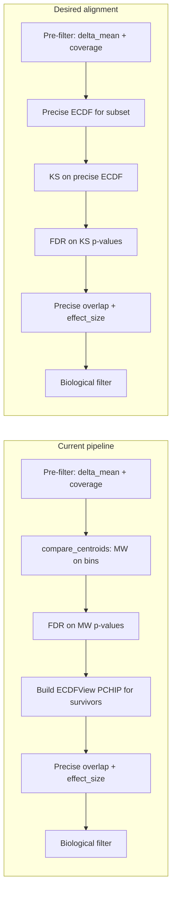

# MethylDetector Algorithm: Where and How to Improve

## Current vs desired flow

**Your mental model:** After a big cut (delta_mean_reduction + min coverage), compute **precise overlap** and test **statistical significance using Kolmogorov–Smirnov and the precise ECDF**.

**Current implementation:** Significance is **Mann–Whitney U from bin-count histograms**; the **precise ECDF** (PCHIP) is used only **after** the significance gate for overlap and effect_size.

---

## 1. Statistical significance: MW on bins vs KS on precise ECDF

**Where it is now**

- **Significance gate:** [methyl_centroid_pair.py](packages/methylutils/methyl_utils/methyl_centroid_pair.py) `compare_centroids` uses `mann_whitney_from_bin_counts` (bin counts only).  
- **FDR:** Applied to these MW p-values in [methyldetector.py](packages/methyldetector/methyl_detector/core/methyldetector.py) (e.g. around the call that builds the comparison table and runs FDR).  
- **Precise ECDF:** Built only for positions that already passed q ≤ alpha ([methyldetector.py](packages/methyldetector/methyl_detector/core/methyldetector.py) ~564–579), then used for `ecdf_overlap_integral` and `ecdf_effect_size` in `_compute_missing_metrics_df` / `_compute_chunk_metrics_df`.

**Gap**

- KS on the **continuous** ECDF is the test that matches “precise ECDF” and is consistent with the overlap definition (same PCHIP CDF/PDF).  
- KS is already implemented: [statistical_tests.py](packages/methylutils/methyl_utils/statistical_tests.py) `ecdf_ks_statistic` (grid-based sup |F1−F2|) and `ecdf_ks_pvalue` (asymptotic, uses n1/n2 for effective n).  
- It is **not** used in the main DMP significance path; it appears in explorer and theoretical-distribution checks.

**Improvement options**

- **Option A (recommended):** Add a **configurable significance test**: e.g. `significance_test: "mann_whitney" | "ks_ecdf"`.  
  - For `ks_ecdf`: after the pre-filter (delta_mean + coverage), build **ECDFView (PCHIP)** for the **pre-filtered position set** (not only survivors). Run `ecdf_ks_statistic` + `ecdf_ks_pvalue` on that set, apply FDR to KS p-values, then keep q ≤ alpha. Reuse the same ECDFViews for precise overlap/effect_size (no second build for survivors).  
  - Trade-off: Building ECDFViews for the full pre-filtered set is more expensive than MW on bins; the funnel already reduces this set, so cost is bounded by `delta_mean_reduction`.
- **Option B:** Two-pass: keep current MW + FDR as a cheap filter, then **re-test survivors** with KS on PCHIP and optionally re-FDR or flag “MW-only” vs “KS-confirmed” for reporting.  
- **Option C:** Keep MW as primary, but add an **optional KS gate** after the biological filter (e.g. “require KS p ≤ threshold” for a high-confidence subset).

**Implementation pointers**

- Add config for `significance_test` with **default `"ks_ecdf"`** (ECDF/KS); `"mann_whitney"` remains available as the alternative.  
- **Single grid size:** One parameter (e.g. `ecdf_grid_size`), default **256**, used for both KS statistic and overlap/effect_size integration. Replace or alias `ecdf_overlap_grid_size` and `ecdf_ks_grid_size` so the detector uses this single value everywhere.  
- In [methyldetector.py](packages/methyldetector/methyl_detector/core/methyldetector.py): when `significance_test == "ks_ecdf"` (default), after building the pre-filtered index set, build ECDFViews for that set, call `ecdf_ks_pvalue(ecdf_view1, ecdf_view2, position_indices, n1, n2, grid_size)` with the unified grid size, then run FDR on the returned p-values and apply q ≤ alpha. Reuse the same views in `_compute_missing_metrics_df` for overlap/effect_size.

---

## 2. ECDF source: trapezoidal vs PCHIP and when each is used

**Current**

- **Approximate (in compare_centroids):** [statistical_tests.py](packages/methylutils/methyl_utils/statistical_tests.py) `ecdf_bhattacharyya_trapezoidal_from_bin_counts` → `overlap_approx` / initial effect_size from bins only.  
- **Precise (after gate):** [distribution_views.py](packages/methylutils/methyl_utils/core/distribution_views.py) ECDFView with PCHIP; overlap via `ecdf_overlap_integral` (PCHIP-derived PDFs, trapezoidal integration over grid).  
- Centroids store `binned_stats` (e.g. bin_edges, bin_counts); both trapezoidal and PCHIP use these.

**Improvements**

- **Clarify roles:** Keep trapezoidal-from-bins as the **cheap** path for ranking/candidates when you do not want to build PCHIP for the full pre-filter set. Use PCHIP for **final** overlap and effect_size (already done for survivors). If you add KS on precise ECDF (Option A above), PCHIP is used for both significance and overlap on the same set.  
- **Optional trapezoidal overlap for effect_size:** For very large pre-filter sets, you could use trapezoidal overlap **inside** compare_centroids to compute an approximate effect_size for biological-style filtering before building any PCHIP (e.g. top-K by approximate effect_size then build PCHIP only for that K). Not implemented today; would require exposing trapezoidal overlap in the comparison table and optionally using it in a pre-stage.  
- **Interpolation choice:** PCHIP is already used for “precise”; no need to switch to another interpolator unless you have evidence of bias (e.g. at boundaries). If needed, document that trapezoidal is piecewise-linear CDF from bins and PCHIP is C1-continuous and better for derivatives (PDF).

---

## 3. Funnel ordering and FDR scope

**Current**

- Order: Pre-filter (delta_mean + coverage) → compare_centroids (MW on bins) → FDR on **pre-filtered set only** → q cut → ECDFView for survivors → precise overlap/effect_size → biological filter.  
- As noted in [MethylDetector_Theoretical_Foundation.md](packages/methyldetector/docs/MethylDetector_Theoretical_Foundation.md): “FDR is applied to the pre-filtered subset only; q-values are therefore liberal relative to testing all positions.”

**Improvements**

- **Document clearly:** In config or docs, state that FDR is conditional on the pre-filter (delta_mean and coverage). If you ever support “test all positions,” FDR would need to be over the full set and q-values would be stricter.  
- **KS path:** If you move to KS on the pre-filtered set (Option A), FDR scope stays the same (pre-filtered set); only the p-values change from MW to KS.  
- **Order is already correct:** Precise overlap and effect_size are computed after the significance gate, so no change needed there; if you add KS, the only change is building ECDFViews earlier (before FDR) when using `ks_ecdf`.

---

## 4. Grid sizes and binned_stats resolution

**Current**

- Overlap: [methyldetector.py](packages/methyldetector/methyl_detector/core/methyldetector.py) `config.ecdf_overlap_grid_size` (default 512); [statistical_tests.py](packages/methylutils/methyl_utils/statistical_tests.py) `ecdf_overlap_integral` uses this grid.  
- KS: [methyl_centroid_pair.py](packages/methylutils/methyl_utils/methyl_centroid_pair.py) `ecdf_ks_grid_size` 256; [statistical_tests.py](packages/methylutils/methyl_utils/statistical_tests.py) `ecdf_ks_statistic` uses a grid.  
- Centroids: `binned_stats` with a fixed number of bins (e.g. 20); PCHIP builds CDF from (bin_edges, cumulative counts).

**Improvements**

- **Grid size:** 256 for KS and 512 for overlap are reasonable. Expose `ecdf_ks_grid_size` in the detector config when KS is used; consider a single “ecdf_grid_size” used for both KS and overlap for consistency (or keep separate if you want to tune KS vs overlap accuracy).  
- **Binned_stats bins:** Increasing the number of bins (e.g. 30–50) improves ECDF resolution and PCHIP accuracy at the cost of memory and a bit of compute. Optional: make bin count configurable at centroid build time and document the trade-off.  
- **Chunking:** [methyldetector.py](packages/methyldetector/methyl_detector/core/methyldetector.py) `_compute_missing_metrics_df` already chunks by memory for the (n_positions × grid_size) PDF matrices; the same chunking can be used when computing KS over the pre-filtered set if needed.

---

## 5. Biological importance vs effect_size

**Current**

- [methyldetector.py](packages/methyldetector/methyl_detector/core/methyldetector.py) `_compute_biological_importance`: sorts DMPs by `effect_size` (descending); there is no separate “biological_importance” scalar—**effect_size is the biological importance measure** (with overlap and variance terms).  
- Biological filter: e.g. minimum prefix by cumulative effect_size to reach `effect_size_coverage` ([MethylDetector_Theoretical_Foundation.md](packages/methyldetector/docs/MethylDetector_Theoretical_Foundation.md) Stage 8).

**Improvements**

- **Keep effect_size as canonical:** It already encodes separation (1−overlap) and reliability (variance penalty). No change required unless you want a separate score.  
- **Optional enrichment:** Add an optional “biological_importance” that combines effect_size with stability (e.g. bootstrap over samples or chromosomes) or reproducibility (e.g. overlap with another study’s DMPs); would require extra data or runs.  
- **Document:** In docs or docstrings, state explicitly that “biological importance” in the detector is implemented as sorting and filtering by effect_size.

---

## 6. Summary: recommended changes (in order)

| Priority | Change                                                                                                                                                                                                                           | Where                                                                                                                                             |
| -------- | -------------------------------------------------------------------------------------------------------------------------------------------------------------------------------------------------------------------------------- | ------------------------------------------------------------------------------------------------------------------------------------------------- |
| 1        | Add **optional significance test = KS on precise ECDF** (config `significance_test: "mann_whitney"                                                                                                                               | "ks_ecdf"`). When` ks_ecdf`, build ECDFViews for pre-filtered set, run` ecdf_ks_pvalue`, FDR on KS p-values, reuse views for overlap/effect_size. |
| 2        | Document FDR scope (pre-filtered set) and that significance can be MW or KS; update [MethylDetector_Theoretical_Foundation.md](packages/methyldetector/docs/MethylDetector_Theoretical_Foundation.md) to describe the KS option. | Docs and Stage 3 text.                                                                                                                            |
| 3        | Expose **ecdf_ks_grid_size** in detector config when KS is used; consider sharing or documenting grid size for overlap vs KS.                                                                                                    | Config schema, [methyldetector.py](packages/methyldetector/methyl_detector/core/methyldetector.py).                                               |
| 4        | Optional: make **binned_stats bin count** configurable at centroid build and document trade-off.                                                                                                                                 | Centroid build path (outside detector).                                                                                                           |
| 5        | Optional: two-pass or “KS-confirmed” flag if you keep MW as default and want a conservative subset.                                                                                                                              | [methyldetector.py](packages/methyldetector/methyl_detector/core/methyldetector.py).                                                              |

Implementing (1) aligns the algorithm with your description: after the big cut, statistical significance is tested with **Kolmogorov–Smirnov and the precise ECDF**, and the same ECDF is used for precise overlap and effect_size.