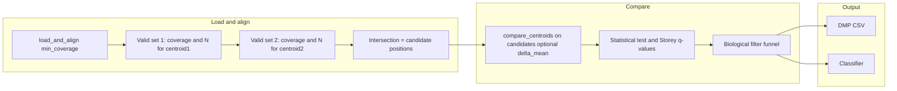

# MethylDetector: Position filters, Storey-only FDR, remove optimization, funnel-only export

**No backward compatibility.** Config changes are reflected in [configs/project_Healthy_vs_PCa1-4.json](configs/project_Healthy_vs_PCa1-4.json), which is the pattern for all other configurations.

**Final output:** (1) CSV with the DMPs, (2) Classifier. No other DMP artifacts.

---

## 1. Config: coverage and sample thresholds

**File:** [packages/methyldetector/methyl_detector/models/config.py](packages/methyldetector/methyl_detector/models/config.py)

- **Add `min_coverage`** (default `4`, same as MethylCentroid): minimum total coverage (Sm+uC) per position in each centroid. Allow values ≥ 4 for stricter precision when comparing centroids.
- **Replace `min_N_abs` / `min_N_pct`** with:
  - **`min_samples_abs`**: absolute minimum number of samples (N) per position (e.g. default `1`).
  - **`min_samples_pct`**: minimum fraction of that centroid’s cohort per position (e.g. default `0.05`).
- **Add** `effective_min_samples(self, cohort_size: int) -> int` (replaces `effective_min_N`): `max(min_samples_abs, ceil(min_samples_pct * cohort_size))`. **Different cohort sizes** (e.g. centroid1 has 50 samples, centroid2 has 30) yield different effective minimums per centroid.
- **Remove** optimization-related fields: `optimize_dmps`, `optimization_method`, `featurecuts_exhaustive_search`, `featurecuts_max_candidates`. Remove or simplify validation-only fields that existed only for optimization.
- **Update** [configs/project_Healthy_vs_PCa1-4.json](configs/project_Healthy_vs_PCa1-4.json) `step_config.detection`: drop `optimize_dmps`, `optimization_method`, `min_N_pct`; add `min_coverage` (e.g. 4), `min_samples_abs`, `min_samples_pct`. This file is the reference for all other configs.

## 2. Position eligibility: per-centroid valid sets, then intersection

**Goal:** Each centroid has its **own** valid positions (coverage ≥ min_coverage and N ≥ that centroid’s effective_min_samples). **Candidate positions for MethylCentroidPair comparison = intersection of the two valid sets.** We do not apply the same numeric threshold to both centroids; cohort sizes can differ.

**MethylUtils** [packages/methylutils/methyl_utils/methyl_centroid_pair.py](packages/methylutils/methyl_utils/methyl_centroid_pair.py):

- **`load_and_align`**: keep `load_and_align(path1, path2, min_coverage=4)`; returns aligned centroids and all common positions (no filtering by N here).
- **`MethylCentroidPair.__init__`**: add `min_coverage: int = 4` and `min_samples: Optional[Tuple[int, int]] = None` (min_samples_1, min_samples_2). No single-int option; the two centroids can have different cohort sizes, so we always pass per-centroid minimums when used by MethylDetector.
- **`_align_centroids`** (or the method that produces the position set for comparison):
  - For **centroid1**: valid_1 = positions where (coverage_1 ≥ min_coverage and N_1 ≥ min_samples_1). For **centroid2**: valid_2 = positions where (coverage_2 ≥ min_coverage and N_2 ≥ min_samples_2). Use coverage = Sm+Su where available; otherwise existing fallback.
  - **Candidate positions** = intersection of valid_1 and valid_2 (and subset of common positions from load_and_align).
- If `min_samples` is None, keep current behavior for callers that do not pass it (e.g. explorer): use only min_coverage for the N filter.

**MethylDetector** [packages/methyldetector/methyl_detector/core/methyldetector.py](packages/methyldetector/methyl_detector/core/methyldetector.py):

- Call `load_and_align(..., min_coverage=self.config.min_coverage)`.
- Cohort sizes: `n1_max = centroid1.N.max()`, `n2_max = centroid2.N.max()` (can differ). Compute `min_s1 = self.config.effective_min_samples(n1_max)`, `min_s2 = self.config.effective_min_samples(n2_max)`.
- Construct `MethylCentroidPair(..., min_coverage=self.config.min_coverage, min_samples=(min_s1, min_s2))` so that _align_centroids uses per-centroid valid sets and returns their intersection as the comparison candidate set.
- Optional delta_mean pre-filter continues to apply on top of this candidate set (unchanged).

## 3. FDR: Storey only

- **MethylDetector** ([methyldetector.py](packages/methyldetector/methyl_detector/core/methyldetector.py), ~483–489): In the KS-ECDF path, **remove** the `try` that uses `statsmodels.multitest.multipletests(..., method="fdr_tsbh")`. Always use Storey (e.g. `storey_qvalues` from `methyl_utils.statistical_tests`); remove the `except ImportError` fallback that already used Storey so the code path is Storey-only.
- **MethylUtils** ([methyl_centroid_pair.py](packages/methylutils/methyl_utils/methyl_centroid_pair.py), `_apply_fdr_correction` ~793–804): **Always** use Storey (e.g. call `_storey_qvalue` or `storey_qvalues`). Remove the `try` block that uses `multipletests(..., method='fdr_tsbh')` so Benjamin–Hochberg (including two-stage BH) is never used.

## 4. Remove optimization

- **Config:** Remove `optimize_dmps`, `optimization_method`, and featurecuts-specific options (see §1).
- **Core flow** in [methyldetector.py](packages/methyldetector/methyl_detector/core/methyldetector.py):
  - `**_select_dmps_multicontext`**: Remove the optimization branch (featurecuts, bayesian_optimization, binary_search). After biological filtering, “selected” DMPs = all biological DMPs (no BA-based subset selection). Remove or simplify validation loading/splits that exist only to drive optimization.
  - **Exports:** Only two outputs: **(1) CSV with the DMPs**, **(2) Classifier.** Remove the `-biological-sorted` and any final-selected export; one DMP CSV (funnel result) and the classifier built from that set.
  - **_create_multi_context_result**: Treat selected as the biological DMP set; remove optimization-only validation fields.
- **Methods to remove or stub:** `_optimize_dmps_featurecuts`, `_optimize_dmps_bayesian`, `_optimize_dmps_binary_search`, and helpers used only by them.

## 5. Final output

- **DMP CSV:** DMPs that passed all biological filters (funnel). Single unified DMP CSV.
- **Classifier:** Trained and saved from that same DMP set. No second artifact set.

## 6. Explorer and docs

- **Explorer** [packages/methyldetector/methyl_detector/explorer.py](packages/methyldetector/methyl_detector/explorer.py) and CLI: Use `min_coverage`, `min_samples_abs`, `min_samples_pct`; same logic as detector: per-centroid valid sets, then intersection for comparison.
- **Docs and examples:** Update README, QUICKSTART, and references to removed/renamed params and Storey-only FDR.

## Summary flow (mermaid)

- **Per-centroid:** Each centroid has its own valid positions (coverage ≥ min_coverage, N ≥ effective_min_samples for that centroid's cohort size). Candidate positions = **intersection** of the two valid sets.
- **FDR:** Storey only (no Benjamin–Hochberg).
- **No optimization.** Final output = DMP CSV + Classifier.

