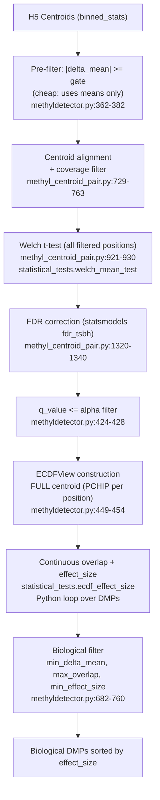

# MethylDetector Funnel Analysis

## Pipeline Data Flow




---

## What Works Well

- The staged funnel concept is correct: cheap mean-difference gate, then statistical significance, then biologically-grounded ECDF overlap, then biological filters.
- The pre-filter (`delta_mean_reduction` / `min_delta_mean`) was placed before `compare_centroids` after the performance issue, which correctly avoids running the Welch test on positions that could never pass the biological filter.
- The effect-size formula `|delta_mean| * (1 - overlap) * exp(-lambda_var * (sqrt(var1) + sqrt(var2)))` is biologically interpretable with three independent components: mean shift, distributional separation, and reliability.
- `effect_size_ecdf` (empirical quantile among surviving DMPs) is a useful relative measure for cut-point selection.
- Context weighting (trimmed mean of effect_size) gives CG/CHG/CHH contexts appropriate relative importance downstream.

---

## Issue 1 — Critical Correctness Bug: ECDFView Position Indexing

**Location:** `[methyldetector.py:449-454](packages/methyldetector/methyl_detector/core/methyldetector.py)` and `[methyldetector.py:3260-3263](packages/methyldetector/methyl_detector/core/methyldetector.py)`

`position_lookup` maps genomic position → index in `centroid1`'s full position array:

```python
# methyldetector.py:452-454
position_lookup = {int(pos): idx for idx, pos in enumerate(centroid1.pos.values)}
```

Those indices are then used to address **both** `ecdf_view1` and `ecdf_view2`:

```python
# methyldetector.py:3260-3263
position_indices = [position_lookup[int(pos)] for pos in chunk_df["position"].values]
results = ecdf_effect_size(..., ecdf_view1=ecdf_view1, ecdf_view2=ecdf_view2,
                           position_indices=position_indices)
```

`ecdf_view2` is built from the **full** `centroid2` (all positions), but the indices used come from `centroid1`'s positional ordering. Unless centroid1 and centroid2 happen to have identical position arrays in identical order, `ecdf_view2._pdf_batch(position_indices, grid)` retrieves PDFs for the **wrong genomic positions** in centroid2.

**Example:** If centroid1 has positions `[10, 20, 50]` and centroid2 has positions `[10, 30, 50]`, then `position_lookup[50] = 2`. But index `2` in `ecdf_view2` corresponds to position `50` in centroid2 only by coincidence—for any position that is not at the same array index in both centroids, the comparison is silently wrong.

**Fix required:** Build ECDFViews only from the aligned common positions (using both centroids' position arrays to derive the correct index for each centroid independently), or maintain separate index lookups for centroid1 and centroid2 and pass both to `ecdf_effect_size`.

---

## Issue 2 — Performance: ECDFView Built for Full Centroid

**Location:** `[distribution_views.py:208-214](packages/methylutils/methyl_utils/core/distribution_views.py)` called from `[methyldetector.py:449-451](packages/methyldetector/methyl_detector/core/methyldetector.py)`

```python
ecdf_view1 = get_distribution_view(centroid1, "ecdf")   # ALL positions
ecdf_view2 = get_distribution_view(centroid2, "ecdf")   # ALL positions
```

`ECDFView.__init__` builds one `PchipInterpolator` per position in a Python `for` loop:

```python
for i in range(n_positions):
    interp = PchipInterpolator(self._bin_edges, cdf_at_edges[i])
    self._interpolators.append(interp)
```

For CHH with 68M positions × 2 centroids = 136M `PchipInterpolator` objects. This uses several GB of Python heap and takes minutes. In the terminal run you shared, only **69 positions** from CHH survived to need ECDF computation. The ratio is 68,000,000 objects constructed to serve 69.

**Fix:** Build `ECDFView` only for the positions that appear in `filtered_results` (the statistically significant subset), using their indices in each centroid's array.

---

## Issue 3 — Performance: Welch Test Is CPU-Only

**Location:** `[statistical_tests.py:1073](packages/methylutils/methyl_utils/statistical_tests.py)`

```python
p_values = 2.0 * t_dist.sf(np.abs(t_stat), df=dof)   # scipy.stats.t.sf — CPU only
```

`scipy.stats.t.sf` evaluates the Student-t survival function via the regularized incomplete beta function for each unique `(t_stat, dof)` pair. There is no GPU path here even when CuPy is available. For CHH at 68M positions (before the pre-filter was added), this was the single most expensive serial CPU operation.

With the pre-filter now reducing the tested set to ~hundreds of positions, this is no longer the primary bottleneck. But it matters if `delta_mean_reduction` or `min_delta_mean` is `null` or very low.

**Potential improvement:** For large N (many samples per position, as in a centroid), the Welch t-distribution converges to a Normal. Substituting `scipy.stats.norm.sf(t_stat)` when `min(dof) > 30` would be faster and numerically equivalent, and `scipy.stats.norm.sf` vectorizes more efficiently.

---

## Issue 4 — Statistical: Pre-filtering Inflates Discoveries (Liberal FDR)

**Location:** `[methyl_centroid_pair.py:1320-1340](packages/methylutils/methyl_utils/methyl_centroid_pair.py)`

FDR correction (`fdr_tsbh`) runs only on the pre-filtered subset. The Benjamini-Hochberg correction assumes the m tests are a random sample from the total space of hypotheses. Restricting to `|delta_mean| >= gate` before FDR violates this assumption in two ways:

- The denominator `m` is smaller, so all q-values are deflated (more liberal).
- The p-value distribution in the pre-filtered set is enriched for small values (the alternative is over-represented), causing Storey's π₀ to be underestimated, further deflating q-values.

This is a known trade-off in computational genomics (screen-and-test). The practical consequence is that the nominal `alpha = 0.05` FDR is not guaranteed; the actual FDR may be higher.

Awareness of this trade-off is important for interpreting the results. If strict FDR control is required, the correct approach is to run the Welch test on all positions and apply FDR across all m p-values, then filter by `delta_mean`. However, for this dataset (prostate cancer CG context: 2033 statistically significant positions out of 4.3M), the difference in q-values is likely small in practice.

---

## Issue 5 — Design: Two Different Variance Concepts in Effect Size

**Stage 4 (Welch test)** uses sample variance from `(Sx2 - Sx²/N)/(N-1)` — the variance of methylation fractions across samples at a position.

**Stage 4f / Stage 8 (effect_size)** uses `variance1/2_out` which for the majority of positions (Beta mode) is `alpha*beta/(tau²*(tau+1))` — the variance of the Beta distribution fitted to the centroid. This is a model-based variance representing single-sample methylation uncertainty, not between-sample spread.

The biological interpretation is subtly different: Beta variance is a property of the fitted model, not a direct measure of between-sample heterogeneity. For the reliability term in `effect_size`, using the **sample variance from Sx/Sx2** would be more consistent with the Welch test and more directly interpretable as "how variable is this position across individuals in the group."

---

## Issue 6 — Design: Delta Mean Direction Lost

**Location:** `[methyl_centroid_pair.py:1192](packages/methylutils/methyl_utils/methyl_centroid_pair.py)`

```python
delta_mean = np.abs(mean1_out - mean2_out)
```

The absolute value is taken before writing to the output. The exported `delta_mean` column does not distinguish hypermethylation (disease > control) from hypomethylation (disease < control). The `delta_sign` column that appears in some downstream exports is derived from the original means, so the information is not entirely lost, but the primary column used for filtering and effect_size is unsigned.

---

## Issue 7 — Minor: Redundant Post-filter

**Location:** `[methyldetector.py:438-441](packages/methyldetector/methyl_detector/core/methyldetector.py)`

After the pre-filter (Stage 2) ensures only positions with `|delta_mean| >= gate` enter `compare_centroids`, there is a second identical filter on `filtered_results`. This is harmless but adds noise to the code. The comment already acknowledges it as a safety guard.

---

## Summary Table


| Issue                                                               | Severity | Type        | Location                                 |
| ------------------------------------------------------------------- | -------- | ----------- | ---------------------------------------- |
| ECDFView indexed with centroid1 offsets for centroid2               | Critical | Correctness | `methyldetector.py:449-454`, `3260-3263` |
| ECDFView built for full centroid (millions), used for tiny fraction | High     | Performance | `distribution_views.py:208-214`          |
| Welch test CPU-only, no GPU path                                    | Medium   | Performance | `statistical_tests.py:1073`              |
| FDR on pre-filtered subset — liberal q-values                       | Medium   | Statistical | `methyl_centroid_pair.py:1320-1340`      |
| Variance in effect_size is Beta model variance, not sample variance | Low      | Statistical | `methyl_centroid_pair.py:1290-1307`      |
| delta_mean unsigned — hyper/hypomethylation direction lost          | Low      | Design      | `methyl_centroid_pair.py:1192`           |
| Redundant post delta_mean filter                                    | Trivial  | Design      | `methyldetector.py:438-441`              |


