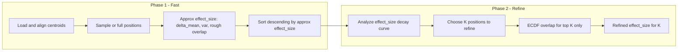

# MethylDetectorExplorer CLI and Two-Phase Effect Size Strategy

## Context

- **MethylCentroidPair** ([packages/methylutils/methyl_utils/methyl_centroid_pair.py](packages/methylutils/methyl_utils/methyl_centroid_pair.py)) compares two centroids in batches; when both have `binned_stats`, it uses **discrete_overlap_from_bin_counts** for all positions (fast). The **ECDF overlap** path (PchipInterpolator in [packages/methylutils/methyl_utils/core/distribution_views.py](packages/methylutils/methyl_utils/core/distribution_views.py) ECDFView) is CPU-bound (one interpolator per position, grid evaluation per pair), and is only used when discrete overlap is not available.
- **Goal**: Use ECDF overlap only to **refine** effect_size for the most biologically important positions. For the rest, use an **approximate** effect_size (delta_mean, centroid variances, rough overlap) so that we can sort once, then run expensive ECDF only on a chosen subset (e.g. top K).

## Architecture

## 1. Approximate effect_size (no Pchip)

- **Inputs**: Aligned centroids (or a subset of positions). Per position: `delta_mean`, `variance1`, `variance2`, `N1`, `N2` (and optionally bin_counts for discrete overlap).
- **Rough overlap** (choose one):
  - **Discrete overlap**: `discrete_overlap_from_bin_counts(bc1, bc2)` — already fast and vectorized; use when `binned_stats` present.
  - **Normal-based**: `welch_d_fast_overlap_approx(delta_mean, var1, n1, var2, n2)` from [packages/methylutils/methyl_utils/statistical_tests.py](packages/methylutils/methyl_utils/statistical_tests.py) when discrete not available (returns `overlap_approx`).
- **Approximate effect_size**: Reuse same formula as MethylCentroidPair: `effect_size = |delta_mean| * (1 - BC) / (combined_std + eps)` with variance_reliability (see `compute_effect_sizes_altA` in methyl_centroid_pair.py). BC here = rough overlap (discrete or Normal-based).
- **Scope**: Apply to a **sample** of positions first (e.g. 1% of 4.4M ≈ 44k) so the Explorer can run quickly to tune parameters; optionally support “all positions” with the same fast formula for a full run.

## 2. Sort and decay analysis

- Sort positions by **approximate effect_size** descending.
- **Decay analysis**: For the sorted list, analyze how effect_size drops with rank (e.g. effect_size vs rank, or log(effect_size) vs rank). Use this to decide **K** = number of positions that get refined effect_size.
- **Heuristics for K** (implement at least one, allow override):
  - **Knee/elbow**: Detect knee on the curve (e.g. Kneedle or simple derivative-based) and set K = rank at knee.
  - **Threshold**: K = number of positions with approximate effect_size ≥ fraction of max (e.g. ≥ 0.1 * max_effect_size).
  - **Fixed fraction**: K = min(top_pct * N, max_positions).
  - **User override**: `--refine-top-k` forces K.

## 3. Refined effect_size for top K only

- For the **top K** positions (by approximate effect_size), compute **ECDF overlap**:
  - Build **ECDFView** only for those K positions (slice `bin_edges`, `bin_counts`, `Sx`, `N`, `Sx2` for the K indices) to avoid building 4.4M Pchip interpolators.
  - Call `view1.overlap(view2)` (or equivalent) to get ECDF-based overlap for the K positions.
  - Recompute **effect_size** using the same formula but with this ECDF overlap (and same delta_mean, variances).
- Merge: Final table has **refined** effect_size (and overlap) for top K, and **approximate** effect_size for the rest (or only export top K refined if desired).

## 4. MethylDetectorExplorer placement and CLI

- **Location**: Implement inside the existing **methyldetector** package:
  - New module: [packages/methyldetector/methyl_detector/explorer.py](packages/methyldetector/methyl_detector/explorer.py) — class `MethylDetectorExplorer`, functions for approximate effect_size, decay analysis, and refined effect_size for a subset.
  - New CLI entry point: either a **subcommand** of the existing `methyl-detector` CLI (e.g. `methyl-detector explore ...`) or a **separate script** `methyl-detector-explorer` in [packages/methyldetector/pyproject.toml](packages/methyldetector/pyproject.toml). Recommendation: **separate script** `methyl-detector-explorer` for a dedicated “analyze and optimize” tool, mirroring MethylCentroidExplorer.
- **CLI arguments** (minimal set):
  - `--centroid1-dir`, `--centroid2-dir` (or paths to two H5 files)
  - `--chromosome`, `--context` (e.g. `1`, `CG`)
  - `--sample-fraction` (e.g. `0.01` for 1% of positions for Phase 1; default small value)
  - `--refine-top-k` (optional: fixed K; if not set, use heuristic from decay analysis)
  - `--output-dir` or `--output` (report + optional CSV/plot)
  - `--min-coverage` (pass-through to load_and_align)
- **Outputs**:
  - **Report** (JSON or text): total positions, sample size, K chosen, heuristic used, timing for Phase 1 vs Phase 2.
  - **Optional**: CSV of positions with columns including approximate vs refined effect_size for the top K; or a plot of effect_size vs rank (and chosen K).

## 5. MethylUtils changes (if any)

- **No change required** to MethylCentroidPair for the Explorer to work: the Explorer will call `MethylCentroidPair.load_and_align`, then implement its own two-phase logic (approximate effect_size on a subset, sort, choose K, then build ECDFViews only for K positions and compute ECDF overlap + effect_size).
- **Optional enhancement** (later): In MethylUtils, expose a helper that computes **approximate bounded_effect_size** for many positions (welch_d + discrete overlap to expit) (e.g. `approximate_effect_size_batch(delta_mean, var1, var2, overlap_approx, ...)`) so the Explorer and potentially MethylDetector can share the same formula. Same for “ECDF overlap and bounded_effect_size for a subset of indices” (sliced ECDFViews) to keep Explorer logic in one place. Prefer implementing the formula and sliced-ECDF logic inside the Explorer first; factor into MethylUtils only if MethylDetector later adopts the two-phase flow.

## 6. Integration with MethylDetector (future)

- **Not in initial scope**: Changing MethylDetector’s default behavior. The Explorer is a **standalone analysis/optimization** tool. Later, MethylDetector could add an option (e.g. `use_explorer_refinement: true`, `refine_top_k: auto`) that runs the same two-phase strategy (approximate for all, sort, refine top K with ECDF) and uses the refined effect_size for DMP ranking for that subset.

## 7. Implementation order

1. **explorer.py**: Implement `MethylDetectorExplorer` with:
  - Load and align via `MethylCentroidPair.load_and_align`; optionally subsample positions (e.g. by `sample_fraction`).
  - Phase 1: Compute approximate effect_size (discrete or Normal-based overlap) and sort descending.
  - Decay analysis: effect_size vs rank; choose K (knee / threshold / fraction / override).
  - Phase 2: For top K, build ECDFViews on sliced data, compute ECDF overlap, recompute effect_size; merge into result table.
  - Return/export report and optional CSV and plot.
2. **CLI**: Add `methyl-detector-explorer` script in pyproject.toml pointing to a new `methyl_detector.cli.explorer_main:main` (or similar); implement options above.
3. **Tests**: Unit tests for approximate effect_size vs MethylCentroidPair’s effect_size on a tiny fixture; and for “K selection” given a synthetic decay curve.
4. **Docs**: Short section in MethylDetector README or new `docs/METHYLDETECTOR_EXPLORER.md` describing the two-phase strategy, CLI usage, and output interpretation.

## Key files

| File                                                                                                                         | Purpose                                                                                                   |
| ---------------------------------------------------------------------------------------------------------------------------- | --------------------------------------------------------------------------------------------------------- |
| [packages/methyldetector/methyl_detector/explorer.py](packages/methyldetector/methyl_detector/explorer.py)                   | New: MethylDetectorExplorer class, approximate effect_size, decay analysis, refined effect_size for top K |
| [packages/methyldetector/methyl_detector/cli/explorer_main.py](packages/methyldetector/methyl_detector/cli/explorer_main.py) | New: CLI for `methyl-detector-explorer`                                                                   |
| [packages/methyldetector/pyproject.toml](packages/methyldetector/pyproject.toml)                                             | Add script entry `methyl-detector-explorer`                                                               |
| [packages/methylutils/methyl_utils/statistical_tests.py](packages/methylutils/methyl_utils/statistical_tests.py)             | Use: `discrete_overlap_from_bin_counts`, `welch_d_fast_overlap_approx`                                    |
| [packages/methylutils/methyl_utils/core/distribution_views.py](packages/methylutils/methyl_utils/core/distribution_views.py) | Use: ECDFView built from **sliced** bin_counts/Sx/N/Sx2 for K positions only                              |
| [packages/methylutils/methyl_utils/methyl_centroid_pair.py](packages/methylutils/methyl_utils/methyl_centroid_pair.py)       | Use: `load_and_align`, `compute_effect_sizes_altA` (or inline formula)                                    |

