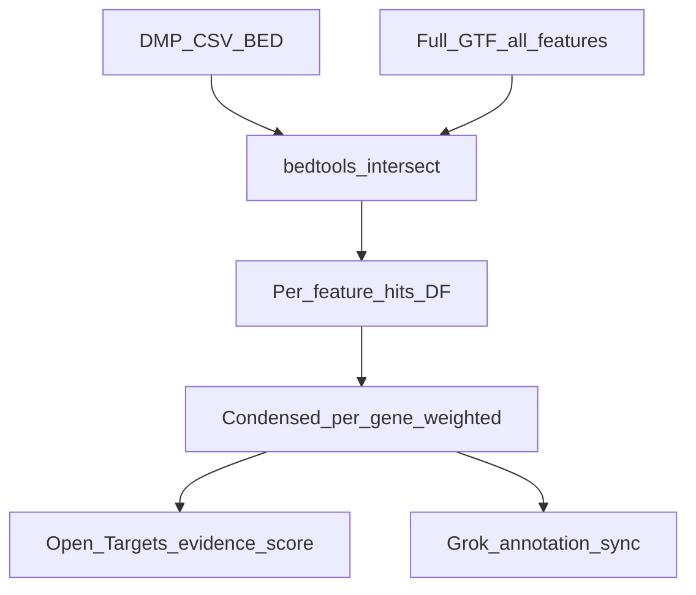

# MethylMapper: Bedtools-first research plan (updated)

## Strategic goal

- **Replace** the Azure SQL `spMapDMP2Genes` workflow with the **Python + Bedtools** pipeline as the main way to extract information from supplied DMPs.
- **Maximize** usable biology from WGBS-derived DMPs: not only genes, but **all GTF feature types** by default, plus a clear path to **additional annotation layers** (regulatory BEDs, etc.).

---

## 1. Genomic features: default “everything”, optional restriction

**Requirement:** Default = extract **all** GTF genomic features (transcript, exon, CDS, UTR, gene, etc.). Allow narrowing to an **explicit list** when needed.

**Current code:** [`BedtoolsMapper`](packages/methylmapper/methyl_mapper/bedtools_mapper.py) sets `feature_types = feature_types or ['gene']`, which **under-reports** structure.

**Planned behavior:**

- `feature_types=None` → **do not filter** on the GTF `feature` column after intersect (keep every overlapping row type present in the file).
- `feature_types=['exon','gene',...]` → restore current filter for controlled runs.
- CLI/config: document default “all features” and add `--feature-types` (repeatable or comma-separated) to restrict.

---

## 2. Condensed gene list weighted by all features

**Requirement:** One **gene-centric** output that reflects **every** feature type overlapping that gene’s DMPs, not separate silos.

**Planned approach (implementation detail to refine in code):**

- Keep detailed **DMP × feature** intersection table as the rich export.
- Add (or extend) aggregation keyed by `gene_id` / `gene_name` that includes:
  - **Roll-up weights:** reuse existing per-row `weight` / optional `region_weight` logic so gene-level Stouffer uses **all** contributing intersections (exon + intron + CDS + …), not only `gene` rows.
  - **Feature mix summary:** e.g. counts or flags per `feature_type` per gene (which structures are hit).
  - **Single ranked table:** `gene_p_value`, `gene_q_value` (Storey), direction, DMP counts, and a compact summary of feature diversity.

This may require adjusting `aggregate_by_feature` / merge paths so gene-level stats are computed from the **unfiltered** intersect dataframe when default-all-features is on.

---

## 3. Statistics: Stouffer + Storey

**Decision:** Use **automatic Storey lambda** in Python (`storey_lambda=None` default). **Do not** tie FDR to SQL `dbo.params.lambda` for parity—the SQL path is being retired for this use case.

---

## 4. Enrichment: Grok vs Open Targets (no DisGeNET)

**Roles (fixed for your pipeline):**

| Source | Role |
|--------|------|
| **Grok** | **Annotation** — narrative/summary fields, biological context, curated-style text you define in prompts (not the primary numeric association score). |
| **Open Targets** | **Evidence and score** — structured association metrics, targets, and evidence suitable for thresholds and tables. |
| **DisGeNET** | **Out of scope** — no API access; remove from defaults, examples, and recommended `enrich_source` strings; keep code paths optional/disabled so it never runs unless explicitly configured later. |

**Config default:** Prefer a single clear preset (e.g. `grok+opentargets` with semantics above, or explicit `enrich_source` values documented as “Grok=annotation, OT=evidence”). Update [`GeneDiseaseEnricher`](packages/methylmapper/methyl_mapper/gene_disease_enricher.py) prompts/column naming if today’s Grok prompts conflate “disease association” with what you now want as “annotation.”

**DMP optimization:** Drop warnings that push “both for gene identification” if that blurs roles; align messaging with **annotation (Grok) + evidence (OT)**.

---

## 5. Grok transport: REST only, synchronous, single-thread

**Decisions:**

- **No official xAI SDK** — keep `requests`-based REST (already correct).
- **No parallelism for Grok:** `grok_max_workers = 1` by default; no `ThreadPoolExecutor` fan-out for Grok batches in the default pipeline.
- **Synchronous requests only by default:** `grok_use_xai_batch_api = False` so each batch of up to **20 genes** uses **`POST /v1/chat/completions`** and blocks until complete; simple, pipeline-friendly ordering.
- **xAI Batch API (async poll):** **Off** by default; only a **rare, explicit** opt-in (e.g. env or flag) when operational constraints force it, with documentation that it breaks strict synchronous pipeline semantics.

Implementation touches: defaults in [`BedtoolsMapper`](packages/methylmapper/methyl_mapper/bedtools_mapper.py), [`GeneDiseaseEnricher`](packages/methylmapper/methyl_mapper/gene_disease_enricher.py), CLI in [`cli.py`](packages/methylmapper/methyl_mapper/cli.py), and project JSON examples under [`configs/`](configs/).

---

## 6. Beyond GTF: WGBS-oriented extensions (roadmap)

**Agreed direction:** Anything that adds interpretability for **selected DMPs** is valuable, including **non-GTF** resources.

**Near-term (still Bedtools-based):**

1. **Unknown / intergenic:** SP-like unknown regions **or** `bedtools closest` to nearest gene/TSS with distance column (complements pure intersect).
2. **Regulatory and epigenomic BEDs:** Optional second (third, …) `-b` passes or multi-intersect: enhancers (e.g. FANTOM/ENCODE), CpG islands, known DMR catalogs, ChIP peaks — each merged into the per-DMP and rolled into the condensed gene summary where a gene linkage rule is defined (overlap TSS/gene body vs closest).
3. **Documentation:** List recommended public BED sources and version pinning for reproducibility.

**Not required for first cut:** SQL clipping parity (`prev_end`/`next_start`) unless you later need numerical match to legacy `sample_genes` exports.

---

## 7. Validation (optional, legacy SQL)

- If you still have historical SP outputs, [`scripts/compare_sp_bedtools.py`](packages/methylmapper/scripts/compare_sp_bedtools.py) remains useful to quantify **divergence** after changing defaults (expect differences: more features, different weight mix, automatic Storey).

---

## 8. SQL path status

- Keep Azure SP + [`mapper.py`](packages/methylmapper/methyl_mapper/mapper.py) in the repo for migration/backfill if needed, but **documentation and project templates** should state Bedtools as the **canonical** mapping path for new WGBS work.
