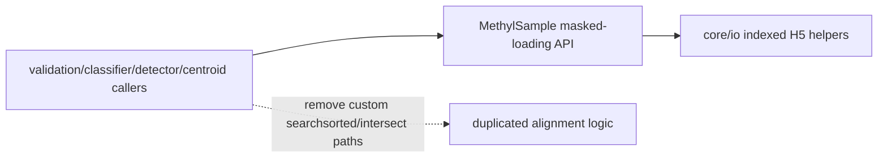

# MethylSample Masked-Loading Unification Plan

## Goal
Centralize masked sample loading/indexing in `MethylSample` (methylutils) and remove duplicated position-alignment logic across the monorepo, while preserving fast H5 subset reads and existing behavior.

## Current State Confirmed
- Masked extraction in model paths is currently driven by `MethylCentroidPair.extract_methylation_fractions` in [`/home/ubuntu/MethylPipeline/packages/methylutils/methyl_utils/methyl_centroid_pair.py`](/home/ubuntu/MethylPipeline/packages/methylutils/methyl_utils/methyl_centroid_pair.py), which directly calls low-level `load_from_h5(..., positions=...)` and does custom mapping.
- `MethylSample.load_from_h5(...)` exists in [`/home/ubuntu/MethylPipeline/packages/methylutils/methyl_utils/core/methyl_frame.py`](/home/ubuntu/MethylPipeline/packages/methylutils/methyl_utils/core/methyl_frame.py), but it is not the canonical entry point in those fast extraction paths and does not expose the full indexed-loading surface.
- Position lookup/index logic is duplicated in multiple packages (`methylvalidation/tabular_backend`, `methylclassifier/utils/data_loader`, `methyldetector/core/methyldetector`, `methylcentroid/methyl_centroid.py`).

## Implementation Strategy

1. Extend `MethylSample` API in [`/home/ubuntu/MethylPipeline/packages/methylutils/methyl_utils/core/methyl_frame.py`](/home/ubuntu/MethylPipeline/packages/methylutils/methyl_utils/core/methyl_frame.py) to be the explicit canonical surface for:
   - position-masked loading,
   - index-masked loading,
   - reference-order value lookup + availability mask.
2. Keep H5-performance primitives in [`/home/ubuntu/MethylPipeline/packages/methylutils/methyl_utils/core/io.py`](/home/ubuntu/MethylPipeline/packages/methylutils/methyl_utils/core/io.py), but route callers through `MethylSample` wrappers so low-level details are not reimplemented elsewhere.
3. Refactor shared extractor in [`/home/ubuntu/MethylPipeline/packages/methylutils/methyl_utils/methyl_centroid_pair.py`](/home/ubuntu/MethylPipeline/packages/methylutils/methyl_utils/methyl_centroid_pair.py) to consume new `MethylSample` APIs.
4. Replace duplicated lookup/alignment logic in highest-impact downstream hotspots first:
   - [`/home/ubuntu/MethylPipeline/packages/methylvalidation/methyl_validation/tabular_backend.py`](/home/ubuntu/MethylPipeline/packages/methylvalidation/methyl_validation/tabular_backend.py)
   - [`/home/ubuntu/MethylPipeline/packages/methylclassifier/methyl_classifier/utils/data_loader.py`](/home/ubuntu/MethylPipeline/packages/methylclassifier/methyl_classifier/utils/data_loader.py)
   - [`/home/ubuntu/MethylPipeline/packages/methyldetector/methyl_detector/core/methyldetector.py`](/home/ubuntu/MethylPipeline/packages/methyldetector/methyl_detector/core/methyldetector.py)
   - [`/home/ubuntu/MethylPipeline/packages/methylcentroid/methyl_centroid/methyl_centroid.py`](/home/ubuntu/MethylPipeline/packages/methylcentroid/methyl_centroid/methyl_centroid.py)
5. Add/expand tests in methylutils and package-level integration tests to ensure behavior parity (`empty_align` semantics, exact-position matching, NaN handling, performance-sensitive indexed path correctness).

## API Shape to Consolidate On
- `MethylSample.load_from_h5(path, positions=None, indices=None, ...)` as the public load entry point.
- `MethylSample.lookup_at_positions(reference_positions, min_coverage=...) -> (values, availability_mask)` for reusable feature extraction without custom `searchsorted` per package.
- Internal helpers (io-level) remain private implementation details.

## Behavior Guardrails
- Preserve current exact-position matching semantics.
- Preserve current extraction output conventions (missing values remain NaN until caller-imputation).
- Preserve compatibility with GPU workflows by keeping output types convertible via existing GPU pathways and avoiding package-specific GPU forks.
- Add explicit diagnostics for low-overlap cases to make `empty_align` causes easier to inspect without changing core results.

## Validation
- Unit tests for new `MethylSample` APIs (positions, indices, ordering, duplicates, unsorted-input edge cases).
- Regression tests for tabular/generative/model training pipelines to confirm unchanged metrics envelope and artifact schemas.
- Focused tests for previously duplicated call sites to ensure they now depend on methylutils shared API and no longer carry local alignment logic.
