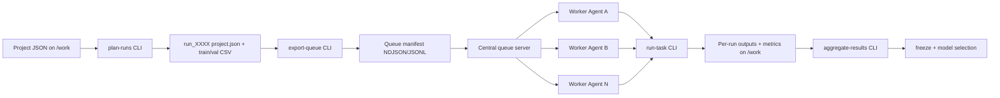

# MethylValidation CLI Extraction and Queue Execution Plan

## Goal
Transform the current sequential `methyl-validation` orchestration into:
- Small, deterministic CLI utilities that each perform one unit of workflow work.
- A queue-export mechanism that emits task commands/manifests for distributed workers on shared storage.

This keeps core scientific logic in place while enabling external orchestration for faster parallel execution.

## Current Baseline (What We Reuse)
- Workflow sequencing and subprocess execution: [/home/ubuntu/MethylPipeline/packages/methylvalidation/methyl_validation/pipeline_runner.py](/home/ubuntu/MethylPipeline/packages/methylvalidation/methyl_validation/pipeline_runner.py)
- Monte Carlo loop and mode entrypoints: [/home/ubuntu/MethylPipeline/packages/methylvalidation/methyl_validation/cli.py](/home/ubuntu/MethylPipeline/packages/methylvalidation/methyl_validation/cli.py)
- Per-run config/project generation: [/home/ubuntu/MethylPipeline/packages/methylvalidation/methyl_validation/project_gen.py](/home/ubuntu/MethylPipeline/packages/methylvalidation/methyl_validation/project_gen.py)
- Config model and validation: [/home/ubuntu/MethylPipeline/packages/methylvalidation/methyl_validation/config.py](/home/ubuntu/MethylPipeline/packages/methylvalidation/methyl_validation/config.py)
- Stability/freeze/model selection logic: [/home/ubuntu/MethylPipeline/packages/methylvalidation/methyl_validation/stability.py](/home/ubuntu/MethylPipeline/packages/methylvalidation/methyl_validation/stability.py)

## Target Architecture

## Track 1: Extract Small CLI Utilities

### 1) Split current monolith into explicit command groups
Implement subcommands under existing package entrypoint in [/home/ubuntu/MethylPipeline/packages/methylvalidation/methyl_validation/cli.py](/home/ubuntu/MethylPipeline/packages/methylvalidation/methyl_validation/cli.py):
- `plan-runs`: Generate all Monte Carlo run configs without executing pipelines.
- `run-task`: Execute exactly one run task (or one stage task) from a task descriptor.
- `aggregate-results`: Merge per-task outputs into stability metrics, distributions, and manifests.
- `freeze-model`: Keep existing freeze logic but consume aggregated artifacts from distributed runs.
- `select-best-model`: Keep existing model selection, reading distributed run results.

Rationale: preserve package surface (`methyl-validation`) and minimize migration risk.

### 2) Extract orchestration logic into reusable services
Refactor out pure functions from CLI argument handlers:
- `planner.py` (new): build deterministic run plans from `MonteCarloConfig`.
- `executor.py` (new): run a single task using wrappers already in `pipeline_runner.py`.
- `aggregator.py` (new): consolidate metrics/results and resume-safe statuses.

Reuse existing internals from:
- [/home/ubuntu/MethylPipeline/packages/methylvalidation/methyl_validation/project_gen.py](/home/ubuntu/MethylPipeline/packages/methylvalidation/methyl_validation/project_gen.py)
- [/home/ubuntu/MethylPipeline/packages/methylvalidation/methyl_validation/pipeline_runner.py](/home/ubuntu/MethylPipeline/packages/methylvalidation/methyl_validation/pipeline_runner.py)
- [/home/ubuntu/MethylPipeline/packages/methylvalidation/methyl_validation/stability.py](/home/ubuntu/MethylPipeline/packages/methylvalidation/methyl_validation/stability.py)

### 3) Define a stable task schema
Add JSON schema models (Pydantic) for task descriptors (new `task_schema.py`):
- Task identity: `task_id`, `run_id`, `stage`, `seed`.
- Inputs: `project_json`, `train_csv`, `val_csv`, paths remapped to `/work`.
- Runtime metadata: retries, owner worker, status, timestamps.
- Expected outputs: metrics file paths and artifact checksums.

### 4) Add deterministic idempotency and resume safety
- Each task writes `status.json` atomically in its run directory.
- `run-task` verifies required outputs before marking completed.
- `aggregate-results` tolerates partial completion and can be rerun safely.

## Track 2: Export Queue Commands for Distributed Workers

### 5) Build queue export command
Implement `export-queue` in `cli.py` (delegating to new `queue_export.py`) that emits:
- `queue_manifest.jsonl`: one line per task with command + args + expected outputs.
- `commands.sh` (optional): shell-ready commands for environments without API queue.
- `queue_summary.json`: counts per stage/run and estimated workload.

Manifest items should be executable by remote workers as:
- `methyl-validation run-task --task <task.json>`

### 6) Standardize shared-storage layout under /work
Emit artifacts in predictable structure:
- `/work/<project>/monte_carlo_runs/run_XXXX/` for per-run files.
- `/work/<project>/queue/` for manifest, claims, logs.
- `/work/<project>/queue/claims/` for lease files (if file-backed fallback is used).

Use existing path remap behaviors already supported in config loading from:
- [/home/ubuntu/MethylPipeline/packages/methylvalidation/methyl_validation/config.py](/home/ubuntu/MethylPipeline/packages/methylvalidation/methyl_validation/config.py)
- [/home/ubuntu/MethylPipeline/packages/methylvalidation/methyl_validation/cli.py](/home/ubuntu/MethylPipeline/packages/methylvalidation/methyl_validation/cli.py)

### 7) Queue backend compatibility strategy
Design `export-queue` output to be backend-agnostic:
- Primary artifact: manifest JSONL consumable by a central API queue.
- Fallback mode: file-based claim protocol on shared storage (atomic rename/lock files).

This allows immediate use with current infrastructure and later migration to Redis/RabbitMQ/other brokers without changing scientific task logic.

## Migration and Rollout

### 8) Backward compatibility
- Keep current monolithic flow available as legacy mode (`--legacy-sequential` or unchanged default).
- Add feature flag/new mode for queue-based execution.
- Ensure previous configs still load unchanged.

### 9) Verification matrix
Add tests to cover:
- `plan-runs` determinism with fixed seed.
- `run-task` single-run reproducibility and failure handling.
- `export-queue` correctness and command replay on a sample project JSON.
- `aggregate-results` correctness with complete and partial task sets.

Focus test placement in:
- [/home/ubuntu/MethylPipeline/packages/methylvalidation/tests](/home/ubuntu/MethylPipeline/packages/methylvalidation/tests)

### 10) Operational docs and examples
Update docs with distributed workflow examples using project config such as:
- `/home/ubuntu/Work/prostate-cancer/configs/project_Healthy_vs_PCa1-4-CG.json`

Document:
- How to generate run configs and queue manifests.
- How workers execute `run-task`.
- How to aggregate and freeze/select models.
- Failure recovery/resume procedures.

## Deliverables
- New modular CLI subcommands (`plan-runs`, `run-task`, `export-queue`, `aggregate-results`).
- Versioned JSON schema for queue tasks.
- Queue manifest + command export artifacts on shared storage.
- Updated tests and distributed execution documentation.

## Implementation Order
1. Extract planner/executor/aggregator internals (no behavior change).
2. Introduce `plan-runs` + `run-task` end-to-end locally.
3. Add `export-queue` output format and manifest validation.
4. Add `aggregate-results` + compatibility with freeze/model-selection.
5. Add tests, then update docs with worker/queue examples.