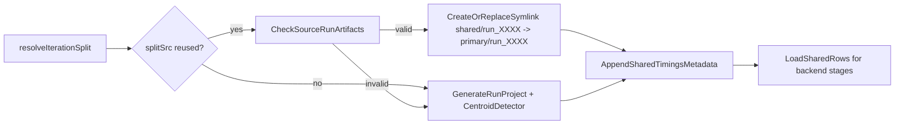

# Enforce Shared-Run Reuse in Model-MC

## Goal
Prevent unnecessary recomputation/storage by making model-MC shared stage prefer existing `monte_carlo_runs/run_XXXX` artifacts and only run centroid/detector when a reusable source run is unavailable.

## Confirmed Issue Pattern
- Shared-stage can still run expensive detector path even when source run artifacts exist.
- Reused shared entries can become inconsistent (e.g., partial directories instead of links), causing backend failures.
- ECDF logs can look misleading when run project wiring is stale or incomplete.

## Proposed Changes
- **Shared-stage reuse policy in** [`/home/ubuntu/MethylPipeline/packages/methylvalidation/methyl_validation/cli.py`](/home/ubuntu/MethylPipeline/packages/methylvalidation/methyl_validation/cli.py)
  - In `_build_model_mc_shared_runs`, after `resolve_iteration_split(..., split_src='reused')`, check if `primary_monte_carlo_runs_root/run_XXXX` contains required artifacts (`project.json`, `centroids/`, `detections/`).
  - If reusable, replace/create `model_mc/shared/run_XXXX` as a symlink to source run.
  - Import step-timing metadata from primary `step_timings.csv` into shared timings (or synthesize minimal detector-ok row when unavailable) so downstream shared-row loader accepts reused runs.
  - Only call `generate_run_project*` + `run_pipeline_for_iteration*` when source run is missing/unusable.

- **Shared-run integrity guardrails**
  - Ensure existing non-symlink `shared/run_XXXX` entries are replaced when choosing reuse path.
  - Keep resume semantics intact (delete future runs on resume, retain prior completed runs).

- **Tests in** [`/home/ubuntu/MethylPipeline/packages/methylvalidation/tests/test_cli_resume.py`](/home/ubuntu/MethylPipeline/packages/methylvalidation/tests/test_cli_resume.py)
  - Add test that verifies reusable source run leads to symlink creation and skips pipeline execution.
  - Keep/adjust backend-profile fixtures so model-mc-all backend selection tests remain stable.

## Data Flow (target behavior)

## Validation Plan
- Run targeted tests:
  - `pytest packages/methylvalidation/tests/test_cli_resume.py -q`
- Runtime smoke checks:
  - Run `--model-mc --model-mc-all` on project with existing `run_0001..run_0030`.
  - Confirm shared logs report reuse and that `model_mc/shared/run_XXXX` are symlinks.
  - Confirm no centroid/detector steps are executed for reused runs.

## Acceptance Criteria
- Existing stability runs are reused by default in shared stage via symlinks.
- Centroid/detector execute only for missing/incomplete runs.
- Shared-stage outputs remain consumable by all backends (`ecdf`, `tabular_sklearn`, `generative_hybrid`).
- No regressions in model-mc resume/reuse tests.