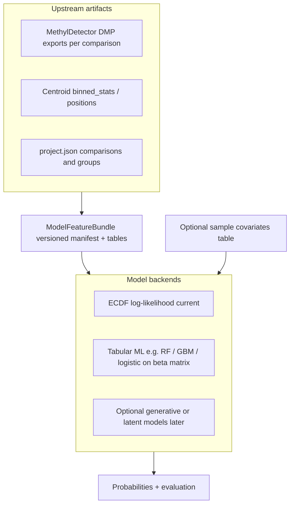

# Fresh approach for MethylValidation `--model`

## Current behavior (baseline)

- `[build_production_model](packages/methylvalidation/methyl_validation/stability.py)` calls `[run_pipeline_for_model](packages/methylvalidation/methyl_validation/pipeline_runner.py)`, which runs `**methyl-classifier` then `methyl-predictor**` only (no extra validation-specific modeling code).
- The probabilistic core is `[ECDFClassifier](packages/methylutils/methyl_utils/ecdf_classifier.py)`: per-DMP **PCHIP PDFs** from centroid **binned histograms**, **weights** (normalized effect_size from detector), **directions**, optional **contexts**, and **weighted mean log-likelihood** + temperature-scaled softmax—this is the “Bayesian-flavored” piece today (not a full generative model, but likelihood-based scoring).
- Multiclass / many comparisons (healthy vs each disease stage) are handled inside **methyl-classifier** via **OvR** wiring from project comparisons (`[project_resolver.py](packages/methylclassifier/methyl_classifier/project_resolver.py)` / multiclass bundle paths).
- MethylDetector already computes **effect_size** and related biology-oriented fields and exports **DMP CSVs** (unified vs dual discovery/classifier mode); detector config still states classifier export type `**ecdf` only** (`[methyl_detector/models/config.py](packages/methyldetector/methyl_detector/models/config.py)`).

So: much of what you want **partially exists** (per-position distributions via centroids + ECDF, effect_size as weights, multi-comparison structure). What is missing is a **single, explicit, consumable artifact spec** for “all evidence from comparisons,” and a **second model family** that can ingest that bundle plus optional covariates.

## Target architecture (conceptual)

**Design principles**

1. **Separate “evidence packaging” from “scoring algorithm.”** Detector + centroids already encode distributions; formalize a **ModelFeatureBundle** (directory layout + manifest JSON) listing comparisons, DMP coordinates, effect_size/weights, pointers to centroid histograms or pre-materialized matrices, and OvR group mapping.
2. **Keep ECDF as default backend** for backward compatibility and production parity with today’s `--model`.
3. **Add a backend interface** selected via `step_config.validation` or `step_config.classifier` (e.g. `model_backend: ecdf | tabular_sklearn | ...`) so `--model` can dispatch to `methyl-classifier` (current) or a new training path that writes a **different** serializable model + predictor hook.
4. **Storage format for bundle arrays:** use **HDF5** for dense or structured tables inside the bundle (e.g. materialized beta matrices, masks, optional covariate blocks), with **Zstd compression** where the stack already supports it—**Parquet is not a target format** here; manifest remains JSON for discoverability. Rationale: equivalence with Parquet for this use case is sufficient; HDF5 + Zstd matches existing sample/centroid artifacts and optimizes disk use. **Python I/O:** full filter support (including Zstd) requires importing **`hdf5plugin` before `h5py`** in any module/CLI that reads or writes these files—document this in the bundle spec and follow it in all new entrypoints.
5. **Covariates**: define a **sample_id–aligned** sidecar—**prefer HDF5** (same compression story); allow **CSV** only for small hand-edited tables—and a project JSON reference; merge at training/predict time **after** aligning methylation feature rows to sample IDs (no change to raw per-sample H5 layout required in v1).

## Concrete workstreams

### A. Inventory and spec (short, high value)

- Document **exact columns and files** produced in production freeze path: dual vs unified DMP exports, fixed panel columns, where centroid `binned_stats` live per chromosome/context.
- Write a **ModelFeatureBundle v1** spec (markdown in repo or docstring + JSON schema): required keys (`comparisons`, `dmp_index`, `weight_column`, `centroid_refs`, `class_labels`), optional (`context`, `chromosome`, `ovr_matrix`).
- Map **OvR multiclass** to this bundle so one row per sample can be joined to **K comparison scores** or a **flattened design matrix** for tabular models.

### B. MethylDetector / export enhancements (only what the bundle needs)

- Optionally add a **single consolidated export** per production run (e.g. `detection_model_bundle.json` + companion **`.h5`** for any large array columns) that **references** existing CSVs and centroid paths instead of duplicating data unnecessarily—use **Zstd-compressed HDF5** when materializing wide matrices; keep the manifest small.
- If you need **explicit “distribution difference” summaries** beyond histograms: add **derived columns or a small side table** (e.g. per-DMP delta_mean, overlap, optional per-bin contrast) in detector export—only fields that downstream backends will actually use (keep tight to avoid export creep).

### C. New model backends

- **Tabular baseline (recommended first alternative):** materialize an **n_samples × n_dmps** (or block-wise) matrix of methylation fractions + boolean/int mask; **persist training tensors in HDF5 (Zstd)** inside the bundle; train **sklearn** `RandomForestClassifier`, `HistGradientBoostingClassifier`, or **multiclass logistic** with class weights; save the fitted estimator with `skops`/`joblib` + small metadata JSON for predictor.
- **Generative / latent:** treat as **phase 2**—needs clear likelihood (e.g. VAE on subset of DMPs) and much more validation infra; the bundle spec should not block this but should not overfit to ECDF only.
- **Predictor integration:** extend `[methyl-predictor](packages/methylpredictor/methyl_predictor/core/predictor.py)` (or add a thin adapter) to load **backend-specific** artifacts when `metadata.model_backend` indicates non-ECDF.

### D. MethylValidation `--model` orchestration

- Extend `[run_pipeline_for_model](packages/methylvalidation/methyl_validation/pipeline_runner.py)` (or a sibling `run_pipeline_for_model_v2`) to:
  - build or refresh **ModelFeatureBundle** from production `project.json`;
  - invoke **selected backend** (subprocess or in-process Python);
  - keep **logging/timings** pattern used today (`model_summary.json`, logs under `production/logs`).
- Wire **CLI / `MonteCarloConfig`** with a small set of explicit flags or `step_config.validation.model_backend` to avoid silent behavior changes.

### E. Covariates

- Add optional `covariates_path` + column naming convention in project JSON; document merge rules (inner join on sample basename or explicit id column).
- For ECDF backend, define whether covariates are **ignored v1** or combined via a **two-stage** model (e.g. ECDF score + logistic on covariates)—simplest is **tabular backend only** for v1 covariate support.

## Suggested sequencing

| Phase | Outcome                                                                                    |
| ----- | ------------------------------------------------------------------------------------------ |
| 1     | Written **ModelFeatureBundle v1** spec + inventory doc; no user-visible change             |
| 2     | **Bundle builder** script/module run from production dir; still default ECDF               |
| 3     | **Sklearn tabular backend** + predictor path + one end-to-end test on tiny synthetic panel |
| 4     | **Covariates** join for tabular backend only                                               |
| 5     | Optional detector **summary export** columns; generative experiments behind a feature flag |

## Risks and constraints

- **OvR vs native multiclass:** RF/HGBM can use native multiclass labels; OvR binary comparisons encode a different inductive bias—document which training target the tabular backend uses (single multinomial label vs stacking OvR probabilities).
- **Scale:** full genome-wide stable panels → very wide matrices; may need **chunked training**, **feature screening** (already have effect_size), or **per-chromosome models** then fusion (similar to existing multi-chromosome ECDF paths in methyl-classifier).
- **Reproducibility:** version the bundle and pin sklearn/numpy in metadata.
- **HDF5 conventions:** document dataset names, chunking, and compression filter (Zstd) in the bundle spec so readers match writers across packages.
- **hdf5plugin import order:** readers/writers must **`import hdf5plugin` then `import h5py`** (or ensure an imported dependency does so first); otherwise compressed datasets may fail to open. List `hdf5plugin` as an explicit dependency where bundle I/O lives.

## What this plan does *not* prescribe

- A single chosen generative architecture (VAE, normalizing flows, etc.)—that should follow once tabular + bundle are stable.
- Replacing MethylDetector’s role in **biology-aware weighting**; new backends should **consume** detector outputs rather than re-derive them ad hoc.

