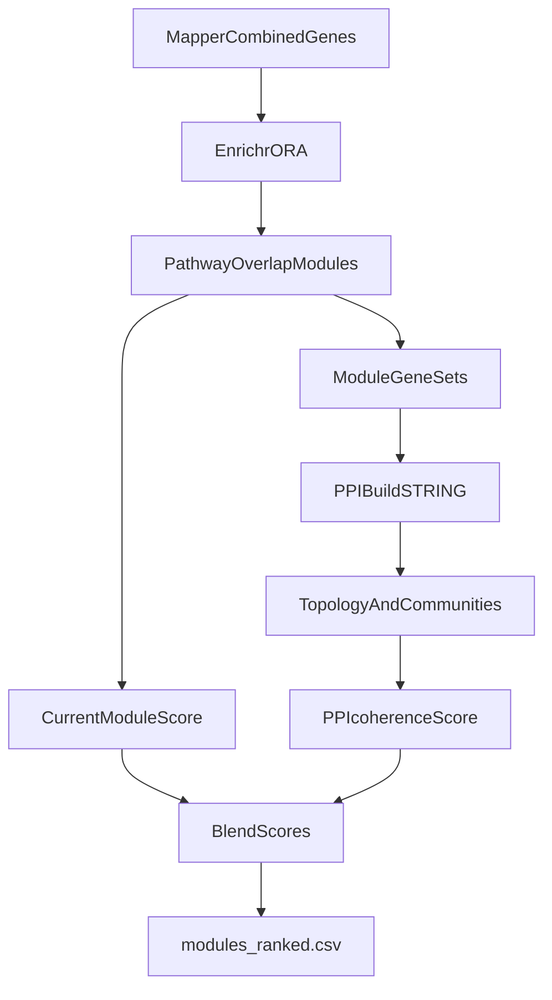

# Integrate NetMe Core Into MethylEnricher

## Goal
Add an optional **PPI network refinement** layer to `MethylEnricher` that complements current pathway-overlap modules with STRING-based topology evidence (hubs, centrality, community coherence), while keeping current outputs backward compatible.

## Scope (what to port vs not port)
- **Port now**
  - STRING network build from module genes or top enriched genes.
  - Core topology metrics: degree/betweenness/closeness centrality, hub ranking, connected components.
  - Community detection variants (Louvain default; optional walktrap/label propagation).
  - Module re-scoring with optional PPI coherence score.
- **Defer**
  - NetMe’s full utility API surface and notebook-style workflows.
  - STRING disease-term enrichment as a primary disease source.

## Existing code to extend
- Current enrichment + outputs: [/home/ubuntu/MethylPipeline/packages/methylenricher/methyl_enricher/enricher.py](/home/ubuntu/MethylPipeline/packages/methylenricher/methyl_enricher/enricher.py)
- Current module orchestration/output writing: [/home/ubuntu/MethylPipeline/packages/methylenricher/methyl_enricher/module_pipeline.py](/home/ubuntu/MethylPipeline/packages/methylenricher/methyl_enricher/module_pipeline.py)
- Current pathway graph clustering: [/home/ubuntu/MethylPipeline/packages/methylenricher/methyl_enricher/pathway_graph.py](/home/ubuntu/MethylPipeline/packages/methylenricher/methyl_enricher/pathway_graph.py)
- Current module scoring heuristics: [/home/ubuntu/MethylPipeline/packages/methylenricher/methyl_enricher/module_scorer.py](/home/ubuntu/MethylPipeline/packages/methylenricher/methyl_enricher/module_scorer.py)

## New design

### 1) Add optional network refinement stage
- Introduce config flag set in methylenricher config/CLI:
  - `network_refinement.enabled` (default false)
  - `network_refinement.source` (`string_api` or `local_edges`)
  - `network_refinement.score_threshold` (default 400)
  - `network_refinement.community_method` (`louvain`, `walktrap`, `label_propagation`)
  - `network_refinement.min_component_size`
  - `network_refinement.weight_in_final_score` (0..1)
- Keep current behavior unchanged when disabled.

### 2) Create a dedicated PPI integration module
- Add `methyl_enricher/ppi_network.py` containing:
  - ID normalization/mapping helpers (gene symbol -> STRING IDs, minimal robust path).
  - Edge retrieval abstraction (`fetch_string_edges` + `load_local_edges`).
  - Network constructor (`build_ppi_graph`) returning a consistent graph object.
  - Topology metrics (`compute_network_metrics`) and hubs (`rank_hubs`).
  - Community wrapper (`detect_communities`) with method switch.
- Keep this layer independent from enrichment IO so it can be tested in isolation.

### 3) Extend module scoring without breaking existing ranking
- Add PPI-derived features to scorer inputs:
  - module induced-subgraph density
  - average node centrality of module genes
  - largest connected component ratio
  - optional modularity contribution / within-module edge ratio
- Update `score_and_rank_modules` to include `ppi_coherence_score` and blended final score:
  - `final_score = (1 - w) * current_score + w * ppi_coherence_score`
- If network unavailable/empty, fallback to current score.

### 4) Expand outputs and reporting
- Add optional artifacts under enricher output dir:
  - `ppi_network_edges.csv`
  - `ppi_node_metrics.csv`
  - `ppi_module_coherence.csv`
  - `modules_ranked.csv` gains `ppi_coherence_score` and `blended_score` columns
- Keep old columns intact to preserve downstream compatibility.

### 5) CLI and docs integration
- Extend `methyl_enricher/cli.py` with `--network-refinement-*` flags.
- Document assumptions/caveats in:
  - [/home/ubuntu/MethylPipeline/packages/methylenricher/docs/IMPLEMENTATION.md](/home/ubuntu/MethylPipeline/packages/methylenricher/docs/IMPLEMENTATION.md)
  - [/home/ubuntu/MethylPipeline/docs/theory/chapters/08-methylenricher.qmd](/home/ubuntu/MethylPipeline/docs/theory/chapters/08-methylenricher.qmd)
- Explicitly state that disease evidence remains Enrichr/mapper-driven; PPI is structural support.

## Data flow

## Validation strategy
- Unit tests for `ppi_network.py`:
  - deterministic graph build from fixture edges
  - metric calculations and community method routing
- Integration tests for module pipeline:
  - disabled mode equals baseline outputs
  - enabled mode adds expected artifacts/columns
  - graceful fallback when STRING/network fetch fails
- Smoke test in `.venv` against a small fixture project.

## Risks and mitigations
- **STRING/API variability**: add local edge-file mode and caching.
- **ID mapping loss**: include mapping coverage metrics in output.
- **Score instability**: expose weight parameter and keep defaults conservative.
- **Performance**: gate expensive steps behind `enabled` and size thresholds.

## Rollout phases
1. Add scaffold/config flags + no-op pipeline wiring.
2. Implement network build + metrics + output files.
3. Implement blended scoring + tests.
4. Enable in docs/tutorial with one reproducible example.
