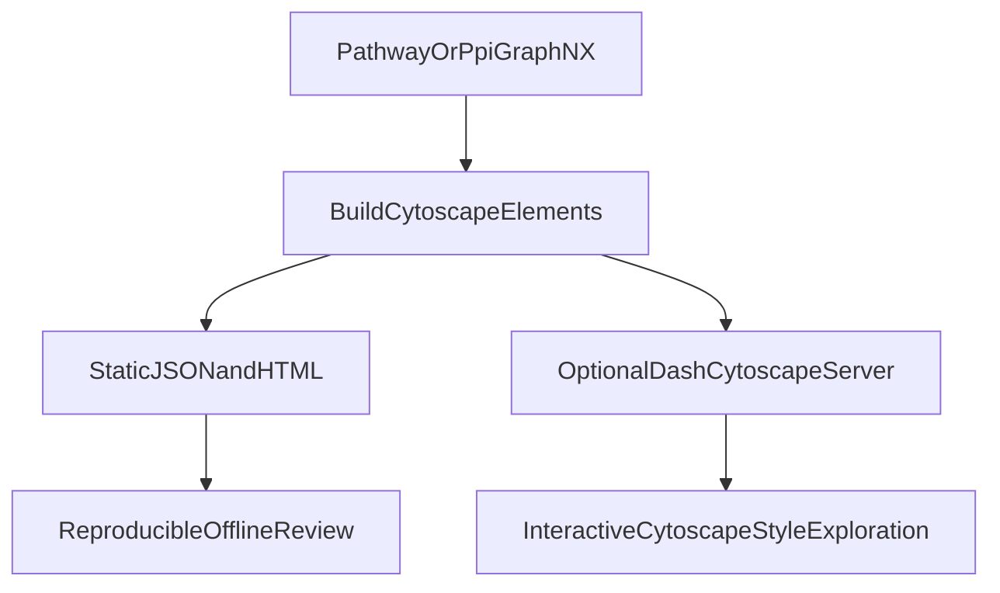

# Integrate NewNetMe Visualization Into Network Refinement

## Recommended direction
Adopt an **offline-first + optional Dash** design:
- Keep existing static exports (`pathway_network_cytoscape.json` + HTML) for reproducibility and CI friendliness.
- Add optional `dash_cytoscape` runtime viewer that reads the exact same element payload.
- Reuse NewNetMe ideas (Cytoscape styles/layout patterns) but avoid tight coupling to NewNetMe `NetworkPlot` internals.

## Why this fits
- NewNetMe’s visualization core in [/home/ubuntu/NewNetMe/NetMe/visualization/plot.py](/home/ubuntu/NewNetMe/NetMe/visualization/plot.py) is reusable conceptually (elements + stylesheet), but is coupled to igraph/centrality wrappers and server-only execution.
- Current MethylEnricher already produces Cytoscape-compatible node/edge JSON in [/home/ubuntu/MethylPipeline/packages/methylenricher/methyl_enricher/module_network_plot.py](/home/ubuntu/MethylPipeline/packages/methylenricher/methyl_enricher/module_network_plot.py), making integration low-risk.

## Implementation plan

### 1) Create a shared Cytoscape element builder
- Refactor `module_network_plot.py` to expose a pure helper (e.g., `build_cytoscape_elements`) that returns:
  - `elements` (nodes+edges),
  - reusable `stylesheet`,
  - optional metadata (module labels, counts).
- Use this helper for existing static Cytoscape HTML/JSON output to avoid behavior drift.

### 2) Add optional Dash viewer module
- Add new file: [/home/ubuntu/MethylPipeline/packages/methylenricher/methyl_enricher/module_network_dash.py](/home/ubuntu/MethylPipeline/packages/methylenricher/methyl_enricher/module_network_dash.py).
- Implement a lightweight app launcher that accepts prebuilt elements and stylesheet.
- Include basic controls mirroring NewNetMe value: module filter, node label toggle, edge-weight threshold, reset layout.

### 3) Extend CLI/config without breaking existing behavior
- In [/home/ubuntu/MethylPipeline/packages/methylenricher/methyl_enricher/cli.py](/home/ubuntu/MethylPipeline/packages/methylenricher/methyl_enricher/cli.py) and [/home/ubuntu/MethylPipeline/packages/methylenricher/methyl_enricher/config.py](/home/ubuntu/MethylPipeline/packages/methylenricher/methyl_enricher/config.py):
  - keep existing `network_plot` modes,
  - add `dash` mode and optional args (`dash_host`, `dash_port`, `dash_open_browser`).
- Default remains unchanged (`plotly` behavior when modules enabled and no explicit mode).

### 4) Wire network-refinement outputs into visualization
- In [/home/ubuntu/MethylPipeline/packages/methylenricher/methyl_enricher/module_pipeline.py](/home/ubuntu/MethylPipeline/packages/methylenricher/methyl_enricher/module_pipeline.py):
  - keep pathway-network plotting as-is,
  - optionally add a second Dash dataset for PPI artifacts (`ppi_network_edges.csv`, `ppi_node_metrics.csv`) so users can inspect refinement topology directly.

### 5) Add tests and docs
- Tests:
  - unit: element builder deterministic schema,
  - integration: `network_plot=dash` path builds app object and respects flags,
  - regression: existing static `cytoscape` output unaffected.
- Docs updates:
  - [/home/ubuntu/MethylPipeline/packages/methylenricher/docs/IMPLEMENTATION.md](/home/ubuntu/MethylPipeline/packages/methylenricher/docs/IMPLEMENTATION.md)
  - [/home/ubuntu/MethylPipeline/docs/theory/chapters/08-methylenricher.qmd](/home/ubuntu/MethylPipeline/docs/theory/chapters/08-methylenricher.qmd)
  - document optional dependency (`dash`, `dash-cytoscape`) and server-vs-offline tradeoffs.

## Data flow

## Risks and mitigations
- Optional dependency weight: keep Dash imports lazy and mode-gated.
- Runtime server complexity: keep offline output as default path.
- Behavior drift: single shared element builder used by both static and Dash outputs.
