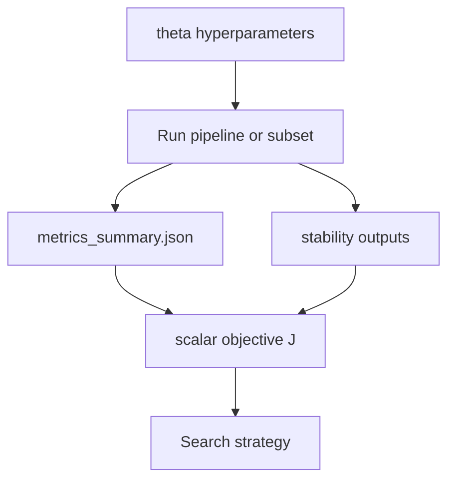

# Pipeline-wide hyperparameter optimization (design)

## Context

- **Per-run / aggregated metrics** already exist in MethylValidation: [packages/methylvalidation/methyl_validation/validator_metrics.py](packages/methylvalidation/methyl_validation/validator_metrics.py) (`SCALAR_KEYS` includes `balanced_accuracy`, `macro_f1`, `nll`, `brier_score`, `ece`, etc.), with `compute_summary` on `all_metrics.csv` and `metrics_summary.json` under each MC root.
- **Stability quality** is controlled by [packages/methylvalidation/methyl_validation/config.py](packages/methylvalidation/methyl_validation/config.py) fields such as `stability_dmp_freq`, `stability_gene_freq`, `stability_min_balanced_accuracy`, `stability_featurecuts_enabled`, `stability_target_balanced_accuracy`, `stability_min_selected_dmps`, tiering flags, etc.; outputs live under `monte_carlo_runs/stability/`.
- **Rollout / promotion-style multi-metric checks** (BA, macro F1, NLL, Brier, ECE) are already implemented in [packages/methylvalidation/methyl_validation/rollout.py](packages/methylvalidation/methyl_validation/rollout.py) (`evaluate_dual_run`), which is a good template for *constraints* on the objective rather than a single number.

**Research goal (progression) vs diagnostic goal (prediction)** are different: progression needs consistent biology across **stages**; prediction needs **holdout** quality for **new samples**. A single “one formula fits all” objective is possible but should be **explicitly staged** (see below).

## 1) Define the objective function J(θ)

Let θ denote the full vector of tunable parameters (across `step_config.validation`, detector, and optional post-model settings).

**Inputs to J (from a completed or partial pipeline pass):**

| Source | Example signals |
|--------|-----------------|
| `metrics_summary.json` (MC holdouts) | Median or mean of `balanced_accuracy`, `macro_f1`, with variance across iterations |
| Probabilistic metrics | `nll`, `brier_score`, `ece` (if predictor produces them) |
| Stability outputs | Count/size of stable DMP set, panel frequency distributions, optional tier choice |
| Failure / validity | Penalty if no metrics row, or stability panel empty, or `abort_on_step_failure` patterns |

**Practical scalarization (start simple, then generalize):**

- **Primary score** (e.g. maximize): weighted combination of *validation* performance, e.g.  
  `J = w1 * median_BA + w2 * median_macro_F1 - w3 * median_NLL - w4 * median_ECE` (normalize or standardize per experiment).
- **Constraints (filters)** (from rollout): require BA and F1 not worse than baseline by more than `balanced_accuracy_drop_max` / `macro_f1_drop_max`, and NLL/Brier/ECE “improvement” as in [rollout.py](packages/methylvalidation/methyl_validation/rollout.py). Candidates failing constraints get `J = -inf` (or a large penalty).
- **Stability terms**: add `+ w5 * f(n_stable_dmps)` with a **cap** to avoid the trivial optimum “keep everything” (e.g. reward up to a target panel size, then flat or negative penalty for excessive size).
- **Progression (multi-stage) extension**: for each disease stage *s*, compute the same or biology-specific metrics; aggregate with `J_progress = mean_s J_s` or a penalty for **inconsistent** module/gene sets across stages (define consistency via overlap Jaccard or rank correlation of pathway/module scores if those artifacts exist in your disease-progression package). This is a **second design phase** once a single-CV objective is stable.

**Recommendation:** implement J as a **pure Python function** that only reads `metrics_summary.json` + selected stability files + optional progression artifacts, so it is testable without rerunning the pipeline.

## 2) Hyperparameter set (search space) by layer

**Tier A – cheap, outer CV / discovery (MethylValidation [MonteCarloConfig](packages/methylvalidation/methyl_validation/config.py)):**

- `train_fraction`, `n_iterations` (or fixed budget with queue workers), `seed`
- `stability_dmp_freq`, `stability_gene_freq`, `stability_min_balanced_accuracy`
- FeatureCuts: `stability_featurecuts_enabled`, `stability_target_balanced_accuracy`, `stability_min_selected_dmps`

**Tier B – detector / classifier in project `step_config` (tune via JSON generation or project patches):** detector thresholds, DMP count limits, classifier architecture—whatever your project already exposes in JSON.

**Tier C – model backend ([MonteCarloConfig](packages/methylvalidation/methyl_validation/config.py) `model_backend`, `tabular_methods`, `generative_*`)):** use **nested** evaluation: only after Tier A is acceptable, or on a **fixed** stable panel from freeze.

**Rule:** *Grid search over the Cartesian product of all tiers* is intractable. Restrict GridSearch to **Tier A** (small grid), and use random search or BO on Tier B+.

## 3) Search methods (not only GridSearch)

| Method | When to use |
|--------|-------------|
| **Grid search** | Few discrete parameters, very small grid (e.g. 2–3 values of `stability_dmp_freq` x 2 of `stability_min_balanced_accuracy`) |
| **Random search** | First pass over mixed continuous/discrete; best cost/exploration tradeoff for expensive `methyl-validation` |
| **Successive halving / Hyperband** | If you can use **fewer iterations** as a “cheap run” and promote winners to full `n_iterations` |
| **Bayesian optimization (TPE, Gaussian process)** | Low-dimensional θ after you fix structure; use only if the objective is not too noisy (average over more MC iters) |

`sklearn`’s `GridSearchCV` / `RandomizedSearchCV` are **not** a drop-in fit: they expect in-memory estimators, while your “estimator” is a subprocess. Wrap each candidate θ in a function that: writes a temp MC config (or project patch) → runs `methyl-validation` (or the queue plan/run/aggregate path) → returns **one scalar** J(θ) from files.

## 4) Software shape (if you implement later)

- New module, e.g. [packages/methylvalidation/methyl_validation/optimization.py](packages/methylvalidation/methyl_validation/optimization.py) (or a separate `scripts/` driver): `objective_from_run_dir(monte_carlo_runs_root, weights, constraints) -> float`.
- Optional: Optuna / skopt for TPE, or a minimal loop for grid + random.
- **Tests:** golden JSON fixtures: fake `metrics_summary` + empty stability → J matches expected; constraint violations → `-inf`.

## 5) What not to conflate

- **Discovery MC** (stability / panel size) optima may **conflict** with **downstream** classifier calibration (ECE, NLL). Favor a **two-stage** search: (1) stability + panel utility under BA from detector, (2) post-freeze / model-mc for prediction metrics—or a single J with very careful weights and constraints.

- **N_iterations**: increasing iterations reduces **variance of the estimate** of J(θ) but is not a “hyperparameter” in the same sense; treat it as **compute budget** or set it from a power analysis / stability of median BA across a pilot grid.

## 6) Documentation and examples (optional)

- Add a short section to [packages/methylvalidation/docs/USAGE.md](packages/methylvalidation/docs/USAGE.md) or a dedicated `HYPERPARAMETER_SEARCH.md` with: objective formula, which JSON files are read, and an example 2×2 grid for `stability_dmp_freq` and `stability_min_balanced_accuracy` using a shared `/work` project (pattern already used for [DISTRIBUTED_QUEUE](packages/methylvalidation/docs/DISTRIBUTED_QUEUE.md)).

## Summary

- Build **J(θ)** as a file-driven scalar + **constraint checks** (reuse rollout tolerances for prediction metrics; add stability and optional progression terms).
- Search **only a small number of parameters per stage**; use **grid** for 1–2 discrete knobs, **random / BO** for larger spaces, **successive halving** when you can use partial MC.
- **Do not** wrap the entire pipeline in sklearn CV without a custom runner; use **out-of-process** evaluation and explicit result parsing.

This plan is **design-level**; implementation of `optimization.py` and drivers can follow in a follow-up change list.
