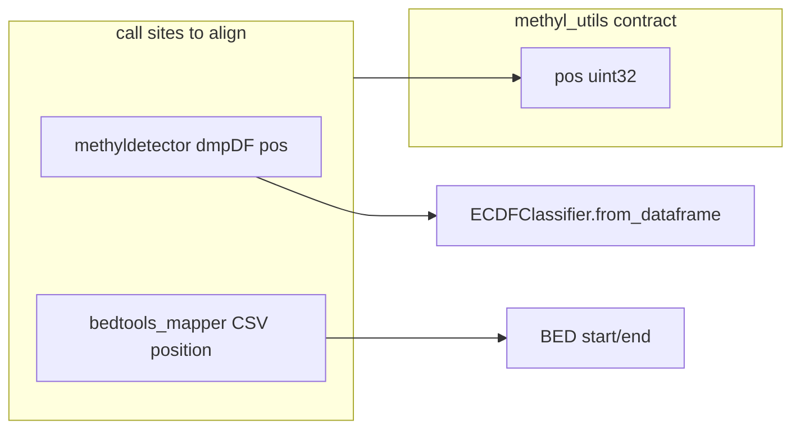

# Keep methylation positions 32-bit (uint32)

## Current contract (already correct)

- `[packages/methylutils/methyl_utils/__init__.py](packages/methylutils/methyl_utils/__init__.py)`: `METHYL_SAMPLE_DTYPE` and `METHYL_CENTROID_DTYPE` use `("pos", np.uint32)`.
- `[packages/methylutils/methyl_utils/core/methyl_frame.py](packages/methylutils/methyl_utils/core/methyl_frame.py)`: `COLUMN_DTYPES["pos"] = "uint32"`.
- `[packages/methylutils/methyl_utils/ecdf_classifier.py](packages/methylutils/methyl_utils/ecdf_classifier.py)`: constructor and `from_dataframe` coerce `positions` to `np.uint32` (lines 65, 385), so downstream is safe even if upstream DataFrames are wrong—but fixing upstream avoids wasted memory and misleading dtypes in `dmpDF`.

No Rust/other languages in the repo use i64/u64 for positions.

## Changes (genomic position only)

### 1. methyldetector — ECDF `dmpDF` column `pos`

`[packages/methyldetector/methyl_detector/core/methyldetector.py](packages/methyldetector/methyl_detector/core/methyldetector.py)`:

- Lines ~1090 and ~1238: replace `'pos': ...astype(np.int64)` with `astype(np.uint32)` (centroid self-check frame and `_build_ecdf_classifier`).

No behavior change: `ECDFClassifier.from_dataframe` already casts to `uint32`.

### 2. methylmapper — CSV/BED and DMP join

`[packages/methylmapper/methyl_mapper/bedtools_mapper.py](packages/methylmapper/methyl_mapper/bedtools_mapper.py)`:

- `csv_to_bed` (~322): `pos_series = ...astype(np.int64)` → `astype(np.uint32)` (or `np.int32` if you prefer signed for pandas; `uint32` matches the rest of the stack). Values are 1-based BED coordinates ≤ ~248M for chr1, still within `uint32`.
- `_build_dmp_name_series` (~583): `pos_int = ...astype(np.int64)` → same 32-bit integer dtype as above so the join key string matches `csv_to_bed`.
- `_join_with_dmp_weights` (~605): `astype('Int64')` on `position` → use a 32-bit path consistent with the name builder, e.g. `pd.to_numeric(..., errors='coerce')` then `.fillna(0).astype(np.uint32)` for the lookup copy **if** that matches how `_build_dmp_name_series` treats NaNs (it already uses `fillna(0)`). If you need to preserve “missing position” as distinct from 0 for debugging, use pandas nullable `**UInt32`** (`astype("UInt32")`) instead of `Int64`.

### 3. methylclassifier — `searchsorted` bucket index (optional / narrow)

`[packages/methylclassifier/methyl_classifier/utils/data_loader.py](packages/methylclassifier/methyl_classifier/utils/data_loader.py)` line ~440:

- `idx = np.searchsorted(...).astype(np.int64, ...)` is an **array index**, not a genomic coordinate; the user request targets **positions**. Replacing with `np.int32` (or dropping the cast and using `np.minimum(..., hi)` on the default `intp` output) saves width and is safe while `len(sp) < 2**31` (true for WGBS-scale slices). Include this only if you want “no 64-bit anywhere in the DMP alignment path”; otherwise omit to keep the diff minimal.

## Explicitly out of scope (not genomic bp positions)

These int64/uint64 uses serve other roles; changing them would not address “methylation positions” and may be wrong for large intermediates:

- **Coverage / count math**: e.g. `[methyl_frame.py](packages/methylutils/methyl_utils/core/methyl_frame.py)` `Sm+Su` as `uint64` for series export, `[centroid_builder.py](packages/methylutils/methyl_utils/core/centroid_builder.py)` / `[methyl_centroid.py](packages/methylcentroid/methyl_centroid/methyl_centroid.py)` `uint64` in Sc² accumulation, `[methyl_centroid_pair.py](packages/methylutils/methyl_utils/methyl_centroid_pair.py)` coverage/N as `int64` in comparisons.
- **Train/test and feature column indices**: `np.arange`, `subset_indices`, `extracted_to_dmp` in methyldetector (~1274, ~1477, ~1953).
- **Hyperparameter `k` grids**: methyldetector ~2095+.
- **Test-only label arrays**: e.g. `[test_basic.py](packages/methylclassifier/tests/test_basic.py)` `predictions` dtype.

## Verification

- Run targeted tests: `methyldetector` (ECDF/validation paths), `methylmapper` (BED conversion + join if covered), `methylclassifier` tests for `extract_sample_features`.
- Quick repo grep after edits: `position.*int64|astype(np.int64).*pos|'pos'.*int64` under `packages/` should be clean for **position** columns; allowlisted comments optional.

