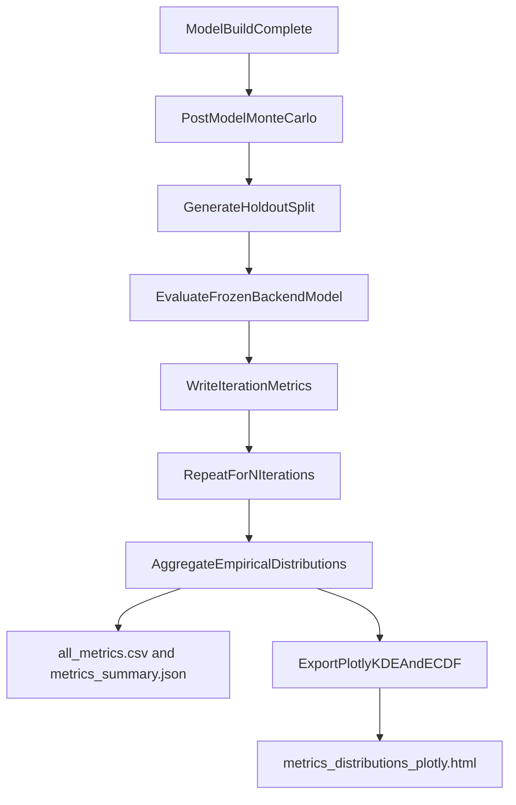

# Add Post-Model Monte Carlo Validation

## Goal
Introduce a first-class MethylValidation step after `--model` that runs repeated Monte Carlo holdout evaluation on the frozen production model and writes empirical distributions for metrics (Balanced Accuracy, Sensitivity, Specificity, F1, etc.) for `ecdf`, `tabular_sklearn`, and `generative_hybrid`.

## Implementation Plan
- Add a new CLI mode (e.g. `--post-model-validation`) in [`/home/ubuntu/MethylPipeline/packages/methylvalidation/methyl_validation/cli.py`](/home/ubuntu/MethylPipeline/packages/methylvalidation/methyl_validation/cli.py) that:
  - requires existing `production/project.json` and completed model artifacts,
  - reuses current MC split generation (`stratified_split*`, `generate_run_project*`),
  - runs a backend-aware evaluation-only loop over holdouts,
  - writes outputs to a dedicated namespace (e.g. `monte_carlo_runs/post_model_validation/`) to avoid collision with discovery/stability runs.
- Extend model execution plumbing in [`/home/ubuntu/MethylPipeline/packages/methylvalidation/methyl_validation/pipeline_runner.py`](/home/ubuntu/MethylPipeline/packages/methylvalidation/methyl_validation/pipeline_runner.py) + [`/home/ubuntu/MethylPipeline/packages/methylvalidation/methyl_validation/trainer_api.py`](/home/ubuntu/MethylPipeline/packages/methylvalidation/methyl_validation/trainer_api.py):
  - `ecdf`: call predictor-only evaluation against frozen classifier artifacts,
  - `tabular_sklearn` and `generative_hybrid`: add evaluation-only runner that loads frozen model artifacts and predicts on each MC holdout (no retraining),
  - normalize per-iteration metric payload so all backends feed one aggregator.
- Add metrics aggregation for this step using existing summary pipeline in [`/home/ubuntu/MethylPipeline/packages/methylvalidation/methyl_validation/validator_metrics.py`](/home/ubuntu/MethylPipeline/packages/methylvalidation/methyl_validation/validator_metrics.py):
  - keep scalar distribution summaries,
  - add/verify Sensitivity and Specificity fields are emitted consistently for multiclass (macro and per-class variants),
  - produce `all_metrics.csv`, `metrics_summary.json`, and run-level metrics under the new namespace,
  - export a final Plotly artifact (`metrics_distributions_plotly.html`) that shows KDE and ECDF views for every metric.
- Add robust guardrails and UX:
  - clear prerequisite errors when `--freeze`/`--model` artifacts are missing,
  - progress + ETA at step and iteration level (reuse recently added logging style),
  - explicit messaging that this is empirical post-model holdout distribution (descriptive MC).
- Add tests:
  - CLI mode routing and prerequisite checks,
  - backend-specific evaluation-only execution for all 3 backends,
  - output path isolation and summary generation,
  - regression tests that existing `--stability`, `--freeze`, `--model`, and `--predictor-only` flows remain unchanged.
- Update docs:
  - [`/home/ubuntu/MethylPipeline/packages/methylvalidation/docs/USAGE.md`](/home/ubuntu/MethylPipeline/packages/methylvalidation/docs/USAGE.md)
  - [`/home/ubuntu/MethylPipeline/packages/methylvalidation/docs/IMPLEMENTATION.md`](/home/ubuntu/MethylPipeline/packages/methylvalidation/docs/IMPLEMENTATION.md)
  - theory chapters under [`/home/ubuntu/MethylPipeline/docs/theory/chapters/`](/home/ubuntu/MethylPipeline/docs/theory/chapters/)
  - add the new phase in workflow diagrams and clarify distinction from pre-model stability MC,
  - document the Plotly KDE/ECDF export and interpretation guidance.

## Proposed Flow
