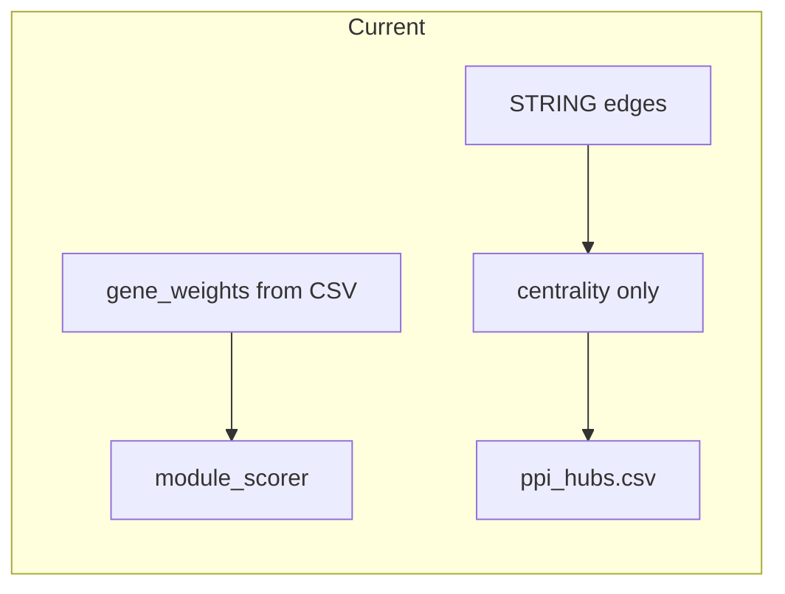
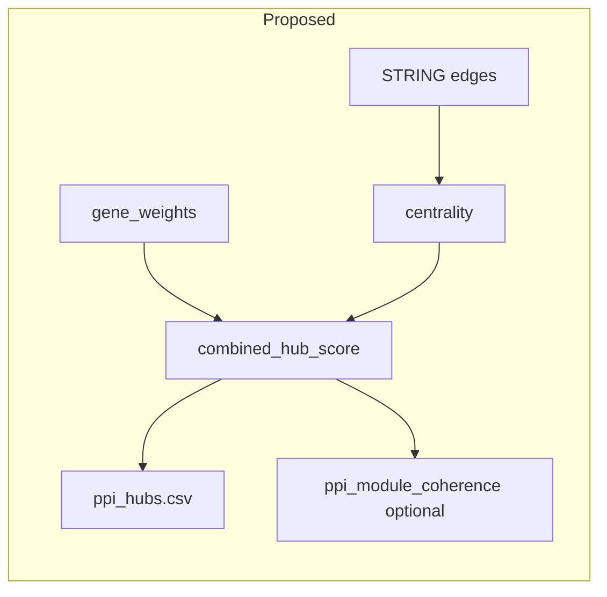

# Signal-weighted PPI hubs in MethylEnricher

## Problem (current behavior)

- In [`packages/methylenricher/methyl_enricher/ppi_network.py`](packages/methylenricher/methyl_enricher/ppi_network.py), [`compute_network_metrics`](packages/methylenricher/methyl_enricher/ppi_network.py) computes **only** graph metrics (`degree`, `degree_centrality`, `betweenness_centrality`, `closeness_centrality`) and sorts by those columns.
- [`rank_hubs`](packages/methylenricher/methyl_enricher/ppi_network.py) returns `node_metrics.head(top_k)` — **pure topology**, matching the “generic high-degree PPI hubs” issue you described.
- In [`module_pipeline.py`](packages/methylenricher/methyl_enricher/module_pipeline.py), [`gene_weights`](packages/methylenricher/methyl_enricher/module_pipeline.py) comes from [`EnrichmentAnalyzer.load_gene_list_with_weights`](packages/methylenricher/methyl_enricher/enricher.py) (`mean_effect_size`, `gene_importance`, etc.) and is used for module scoring, but **is not passed into** `compute_network_metrics` / `rank_hubs` / [`compute_module_coherence`](packages/methylenricher/methyl_enricher/ppi_network.py) (which uses `degree_centrality` only in `metric_lookup`).

## Target behavior

- **Hub list**: rank by a **combined score** = normalized topology × normalized methylation signal (and optionally a small disease-prior boost where `disease_genes` already exists in the pipeline).
- **Module PPI coherence**: optionally use the same signal-adjusted node metric when averaging inside each module subgraph (so modules dominated by weak signal genes do not get inflated PPI scores purely from graph shape).

## Implementation outline

### 1. Core functions in `ppi_network.py`

- **`_normalize_series(s)`**: robust min–max or rank-based normalization to `[0, 1]` on the **nodes present in the graph** (handle zeros, single-value edge cases).
- **`attach_signal_to_node_metrics(node_metrics_df, gene_weights: Dict[str, float])`**: add columns:
  - `methylation_weight` (lookup `gene_weights.get(gene, 1.0)` after upper-casing; document default)
  - `methylation_weight_norm` (normalized across graph nodes)
  - `topology_score` = configurable blend of existing columns (default: mean of `degree_centrality`, `betweenness_centrality`, `closeness_centrality` after each normalized), or keep a single primary column (e.g. `degree_centrality`) for backward compatibility
  - **`combined_hub_score`** = `topology_score * methylation_weight_norm` (or `sqrt(a)*sqrt(b)` for softer coupling); optionally multiply by a **disease boost** `(1 + alpha * 1[g in disease_genes])` when `disease_genes` is passed in
- **`rank_hubs(..., sort_column="combined_hub_score", fallback="degree_centrality")`**: sort by signal-adjusted column; if all weights are uniform, behavior matches today.
- **`compute_module_coherence(..., metric_lookup` source)**: extend to accept either the existing degree-centrality lookup or **`combined_hub_score` lookup** per gene so `ppi_mean_*` reflects signal, not only topology.

### 2. Wire-up in `module_pipeline.py` (network refinement block ~455–534)

- After `node_metrics_df = compute_network_metrics(ppi_graph)`, call the new attach function with **`gene_weights`** (already in scope).
- Pass **`disease_genes`** into attach only if non-empty (reuse same set used for module scoring).
- Write **extended** [`ppi_node_metrics.csv`](packages/methylenricher/methyl_enricher/module_pipeline.py) and [`ppi_hubs.csv`](packages/methylenricher/methyl_enricher/module_pipeline.py) including new columns.
- Pass updated `node_metrics` / metric column choice into `compute_module_coherence`.

### 3. Configuration (backward compatible)

Extend [`NetworkRefinementConfig`](packages/methylenricher/methyl_enricher/config.py) and flat CLI keys in [`cli.py`](packages/methylenricher/methyl_enricher/cli.py) (mirror existing `network_refinement_*` pattern), for example:

- `hub_ranking_mode`: `"topology"` | `"signal_weighted"` (default **`signal_weighted`** once implemented, or default **`topology`** for strict backward compat — pick one and document; recommendation: default **`signal_weighted`** with release note).
- `hub_topology_blend`: weights for degree / betweenness / closeness (defaults equal).
- `hub_disease_boost`: float, default `0.0` (no change if no disease prior).

Optional second phase (not required for first PR): **`ppi_string_seed_top_fraction`** — restrict `fetch_string_edges` to the top X% of genes by `gene_weights` to reduce noise into STRING (can shrink network; make opt-in).

### 4. Tests

- Add unit tests in [`packages/methylenricher/tests/`](packages/methylenricher/tests/) with a **small synthetic graph** and fixed `gene_weights`: verify hub order changes when weights change but topology is fixed.
- Extend [`test_module_pipeline_network_refinement.py`](packages/methylenricher/tests/test_module_pipeline_network_refinement.py) to assert new columns exist when refinement runs.

### 5. Documentation

- Short update to [`packages/methylenricher/docs/USAGE.md`](packages/methylenricher/docs/USAGE.md) and [`docs/theory/chapters/08-methylenricher.qmd`](docs/theory/chapters/08-methylenricher.qmd): explain hub columns, topology bias, and that **`combined_hub_score`** prioritizes genes that are both central **and** supported by the methylation input.

## Out of scope (future work)

- **Permutation null**: shuffle gene weights on fixed graph to flag topology-only hubs (useful but heavier; separate flag + N iterations).
- **Prostate-specific pathway priors**: would require curated gene sets or external databases, not just PPI topology.
