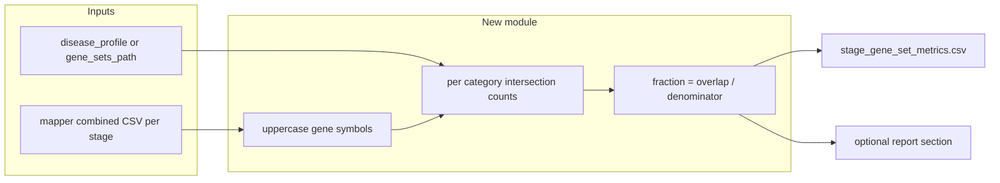

# Disease-aware gene-set fraction metrics in progression

## Goal

Add an **optional** post-enrichment step (inside or alongside [`run_progression_report`](packages/methyldiseaseprogression/methyl_disease_progression/progression.py)) that, for **each ordered stage**, computes **fraction of mapper genes** overlapping **named gene sets** (e.g. replication, DNA repair, AR pathway, metabolism), keyed by a **disease identifier** already present or addable to project config.

This addresses the quantitative “real test” discussed earlier: **trend checks across PCa1→PCa4** become **tabular and reproducible**, not only visual enrichment.

## Current baseline

- [`resolve_stage_specs`](packages/methyldiseaseprogression/methyl_disease_progression/progression.py) reads `step_config.progression` for stage order and locates per-comparison [`mapper_combined_csv`](packages/methyldiseaseprogression/methyl_disease_progression/progression.py) / enricher outputs.
- [`_build_gene_rows`](packages/methyldiseaseprogression/methyl_disease_progression/progression.py) already normalizes genes and scores per stage into `genes_long.csv`.
- Project JSON often includes **disease context** indirectly (`diseases.label`, batch notes, or free-text); there is **no** first-class `disease_id` field required today—so the feature should accept an **explicit** progression config key to avoid guessing.

## Proposed configuration (`step_config.progression`)

Add optional fields (names illustrative; align with existing snake_case style):

| Field | Purpose |
|--------|--------|
| `disease_profile` | String key, e.g. `prostate_cancer`, selecting a **bundled** gene-set bundle under the package or repo. |
| `gene_sets_path` | Optional path to **user JSON** overriding/supplementing bundled sets: `{ "replication": ["GENE", ...], "DNA_repair": [...], ... }`. |
| `gene_set_metrics_enabled` | `true`/`false` (default `false`) to keep backward compatibility. |
| `gene_set_denominator` | `all_genes` (default) vs `top_n` / `min_weight` to restrict which mapper genes count (reduces noise from low-weight tails). |

**Disease selection rule:** `gene_sets_path` wins if present; else `disease_profile`; else metrics **skipped** with a clear log line (no silent defaults for oncology).

## Computation design

- **Denominator:** start with **count of unique gene symbols** in mapper file for that stage (optionally filtered by weight quantile / top-N if config says so).
- **Numerator:** `|genes ∩ set_k|` per category; report also `n_genes_stage`, `n_overlap_*`.
- **Output:** `stage_gene_set_metrics.csv` (long or wide—wide is easier for plotting: one r